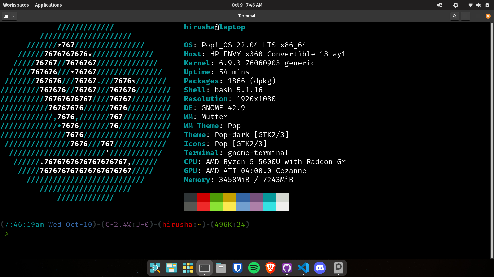

In short, I completed both practical papers, and they went well.  
On October 1st, I did Paper 02, and on October 8th, I did Paper 04.

### Paper 2

Went to the exam venue, which was at a school since it was a practical exam. I looked over a summary (will be uploaded soon) of my spreadsheets (physical) notes, but nothing was really needed; I remembered everything after practicing all the past paper questions about spreadsheets (from the prediction I made in [this](./2024-09-20-practical-analysis.md) blog post). Everything went smoothly. After many exam series, we finally had to use [`INDEX(MATCH)`](../docs/revision-notes/p2/spreadsheets/functions.md#indexmatch-combined-usage) together, as it was explicitly mentioned in the question and necessary for that situation.

The paper mainly focused on spreadsheets (using Microsoft Office), followed by a simple audio editing task (with Audacity). Fortunately, the sysadmins had installed a much more up-to-date version than the one mentioned in the email we received, eliminating a lot of the `.mp3` encoding issues that were fixed in version `3.X.X`. Then, there was a data dictionary task: a `*.csv` file was given, and we had to create a data dictionary from it. Anyone with a basic understanding of Microsoft Access and Input Masks (for the format column) could get it done easily.

### Paper 4

I was expecting the entire paper to be about Microsoft Access, as mentioned [here](./2024-09-20-practical-analysis.md#paper-4): "? Database ?? (or NONE if lucky)." Well, I got lucky, and the paper wasn’t about databases. There were 4 tasks.

The first task involved basic Microsoft Excel, with graphs/charts. I think the graphs/charts were worth about 5 or 9 marks. I didn’t specifically learn them, but I had accidentally practiced them in one of the Paper 4 past papers. In the exam, they even showed us what the final graph should look like, so a monkey with a keyboard and mouse could figure it out. It took me 5–8 extra minutes, but I eventually got what they asked for. There was also a what-if analysis, I think? I’m not exactly sure, but it probably cost me 1 or 2 marks in the first question. At this point, I’m not too concerned about losing 1–2 marks.

The second task was about Photoshop. It was a very basic and simple task, not aiming for photorealism. Interestingly, this was the first paper where they tested blend modes. They provided the source files, the final image, and step-by-step instructions in the question paper. It wasn’t a big deal; I’ve been using Photoshop since I was 10 years old.

The third task was about creating a simple animation—actually quite an interesting one. It was an animation of the Earth orbiting the Sun, with the names of several places along the orbit. I first used Adobe Flash CS6 when I was 12 after watching too many [Alan Becker](https://www.youtube.com/@alanbecker/videos) videos. I even bought a cheap graphics tablet from AliExpress and used it for a while. But I couldn’t remember much now, lol. So, I downloaded Adobe Flash Pro CC 2013—yeah, it’s outdated, but that’s what the exam center emailed us to use. I couldn’t find a safe and stable cracked version of Flash Pro CS6. Luckily, all the exam devices had Adobe Animate installed. It was a bit slow to open on those systems, but it worked. Adobe Animate is basically like Flash Pro CC 2013 but with support for `.svg` in the library, which was useful. I didn’t have to explore much, just made the animation as asked. All my “new” practice came from re-watching the [Alan Becker tutorials](https://www.youtube.com/watch?v=kHOQkooK0qY&list=PL-bOh8btec4D7n9gOqkIdmnPgOXKrqkfy) in 30 minutes to an hour, and everything in the exam was stuff I had already learned. It went smoothly.

Task 4 was a simple vanilla JavaScript-related question, focusing on basic DOM manipulation. The code they provided wasn’t the best design, but who cares? The main goal was to test beginner-level knowledge of DOM manipulation, and it went smoothly as well.

### YAY

Now that I don’t have to use Microsoft Office anymore, I can go back to using my Linux install (dual boot).

### Written Papers

The written papers are on October 11th and October 28th. I’ve made the digital notes for Paper 4, but I haven’t completed the physical "final revision note" yet. I’ll finish that after October 11th (Paper 1). October 11th is just two days away. Hopefully, everything will turn out fine.

That’s all for now.

Good luck, everyone!
