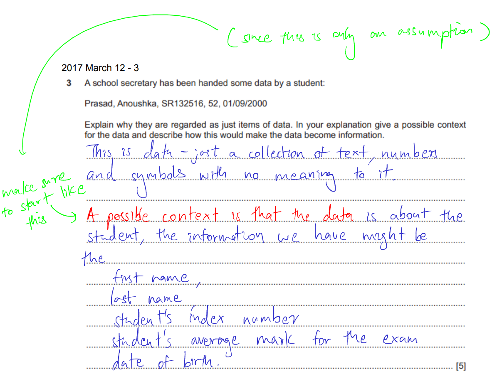
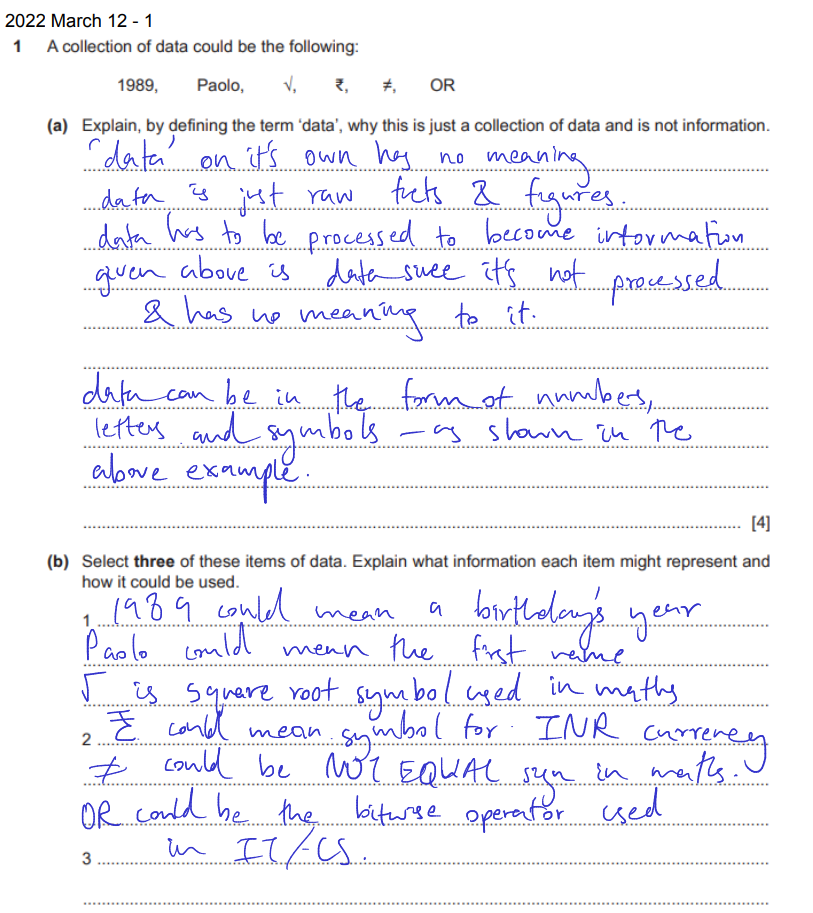
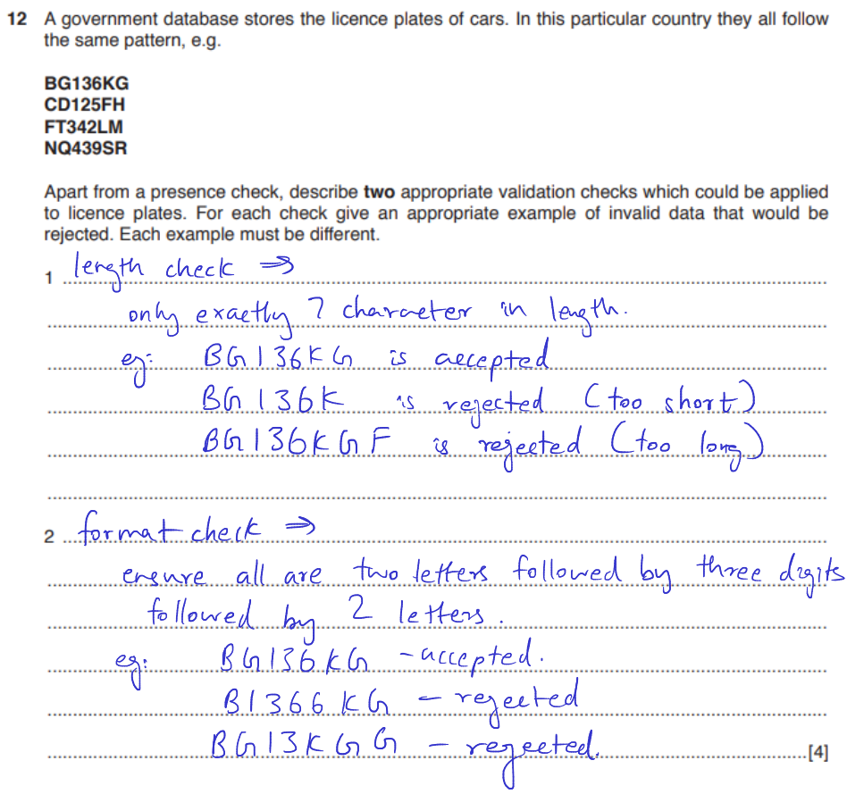
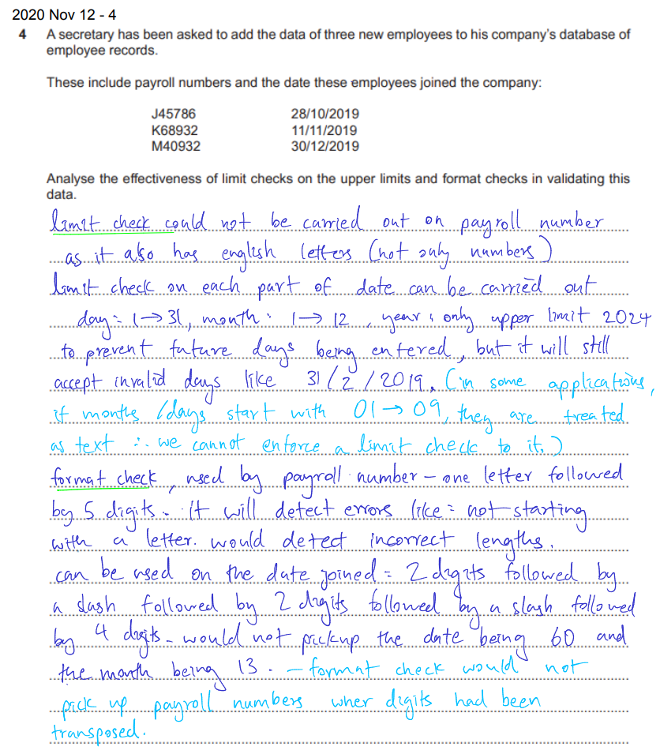
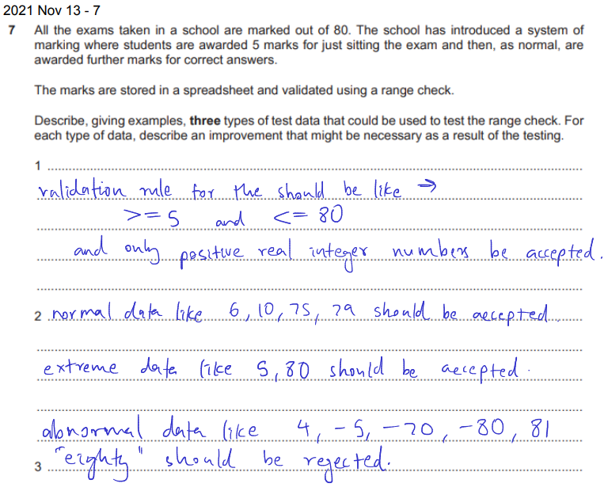
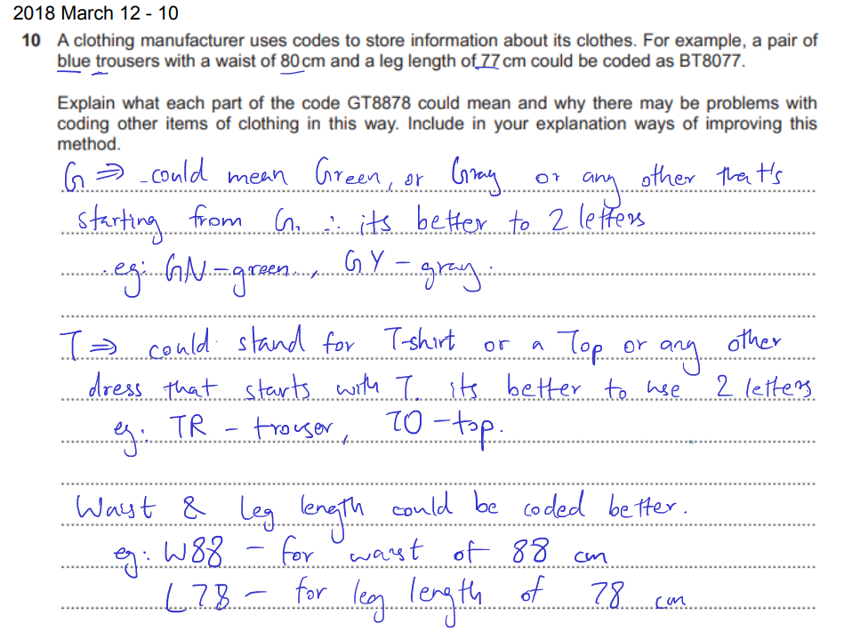
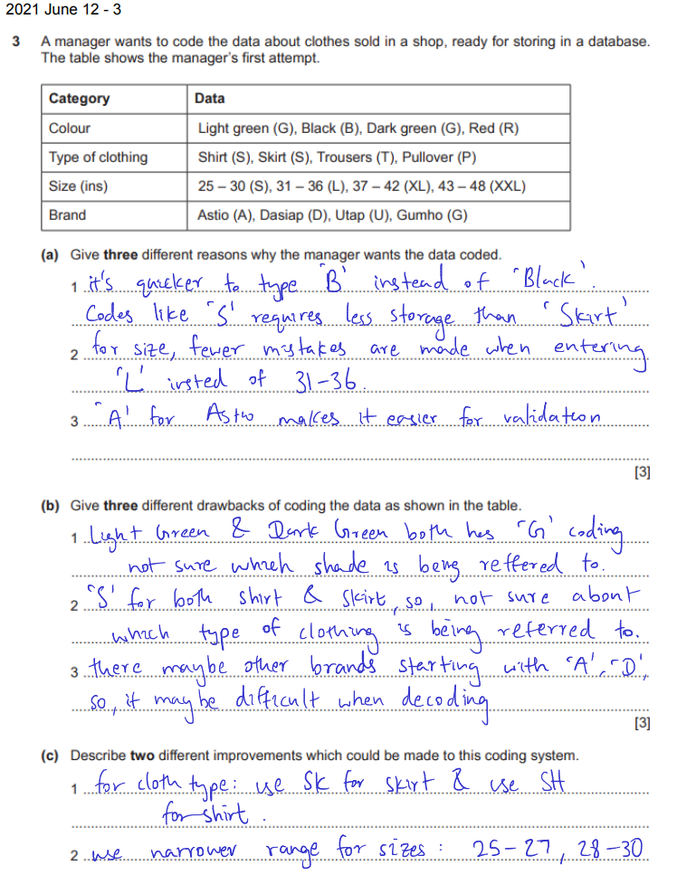
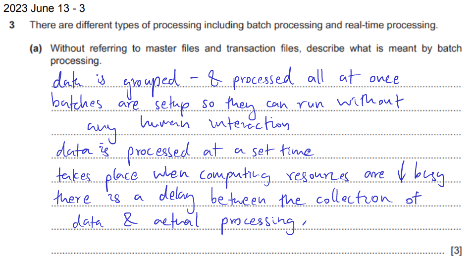
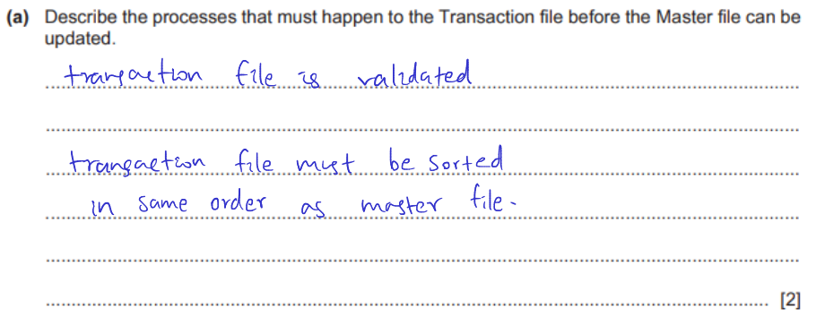
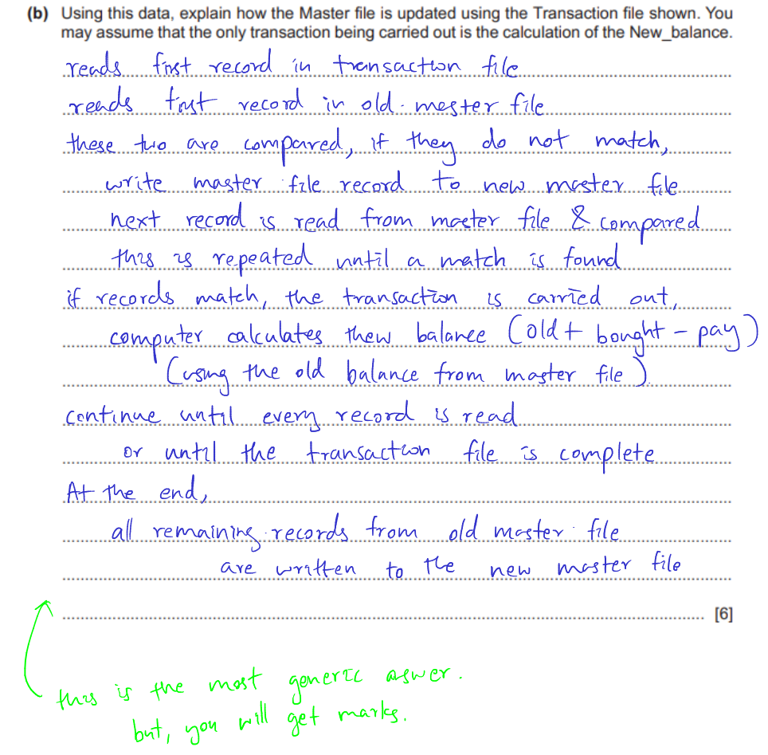

## Introduction

All Past Paper Questions: [Click here](https://drive.google.com/drive/folders/169hxE5eR4Hxhvmr3-AwoyhbqAcX-ahEW?usp=sharing)

## Data

### Introduction

- what
    - just a collection of text, numbers and symbols
    - with no meaning to it
    - cannot be interpreted until  it is organized
    - data must have context to become information
    - data cannot be interpreted until it has context
- long description
    - data on its own have no meaning
    - data consists of raw facts and figures
    - data can be in the form of characters, numbers, letters, signals, symbols, etc... 
    - when data is intepreted to have meaning, it's information
    - for data --> information
        - has to be processed
        - needs to have a context
    - information is what you get after a piece of data is processed & organized

- context
    - NOTE: 
        - "A possible context is that the data is about ###" 
        - "and the information we have might be ###, ###, ###, ###" 
    - example:
        - 
        - 

### Validation

- why?
    - cant gaurantee is data is accurate
    - checking is data is sensible
    - checks if data entered is reasonable
    - even if data is copied correctly
        - it might be in an invalid format
    - only "check digit" can check for transportation issues
    - cant find transcription errors
    - eg: format -> DOB should be as `nn/nn/nnnn` (where `n` is a real positive integer) 

- approaches
    - length check
        - check how many characters long
        - examples
            - X characters long

    - range check
        - check if data is given boundaries
        - data must be lower than upper limit and greater than lower limit
        - we should know the upper and lower limit
        - examples
            - between X and Y
            - dates
                - day: 1 -> 31
                - month: 1 -> 12
                - year: 1950 -> 2024 **(assumptions)**
                - but will also allow dates like: `31/02/2001`

    - check digit
        - can only be done on long strings

    - lookup check
        - be one of given values, like `typing.Literal` in python.

    - format check
        - check if data is in correct format
        - might not pickup transposition errors
        - check if a string follows a certian pattern
        - transposition errors will happen
        - examples
            - where `n` is any real, positive integer
            - 8 numbers: `nnnnnnnn`
            - dates 
                - `nn/nn/nnnn`
                - but will also allow dates like: `69/96/3000` (transposition errors)

    - consistency check
        - explain
            - check if data have internal conflicts
            - check if values are not in contradiction
            - related data items can be checked for consistency of their relationship
            - check fields to ensure the data in fields correspond to each other
            - error message appears if error
        - examples
            - date of birth
                - calculate age and check if it matches
    
    - type check
        - check if data is of correct type: character, letter, or numbers
        - this would not prevent accepting out of range numbers
        - eg:
            - no alpha to a numeric field

- examples
    - 
    - 

### Verification

- why
    - checks if data entered is copied accurately
    - helps to stop users from making mistakes
    - will pick up transportation errors
    - will pick up transcription errors
    - cant gaurantee is data is accurate
    - can find transcription errors
- methods
    - visual verification
        - compare data being entered to another copy
        - and check visually
        - done by human against a source document
        - printout of source document is used
        - detected mistakes are corrected by the checker (human)
        - unreliable: hard to deal with both paper and screen
        - doesnt always identify all errors
        - fast: data only needs to be entered once
    - double data entry 
        - usually 2 people entering the same data
        - each input compared against each other
        - stored and matched by the computer
        - it will alert if two inputs do not match and they can decide which version to keep
        - data should be entered in exact order
        - reliable: high chance of identifying errors
        - but, if both people made the same error, big oof
        - discrepencies (differences) highlighted as second copy is entered.
    - parity check
        - only when transferring data from computer to computer
        - when data is transferred, computer counts the number of 1s in each byte
        - each byte is checked individually
        - if no. of 1s is even, parity bit is set to 0
        - if no. of 1s is odd, pairty bit is set to 1
        - (the goal is to have an even number of 1s)
        - parity bits are sent along with data
        - if number of 1s is odd after adding the parity byte, it means an error


### Test Data

- to text validation and verification
- types
    - normal data
        - within given range
    - extreme data 
        - values at the border
    - abnormal data
        - not within given range
- examples
    - 

### Coding

- advantages
    - speed up data entry
    - more accurate
    - easy validation
    - reduce length of data
    - less space required
    - small DB size = faster search
- disadvantages
    - approximations is too general (for numerical values)
    - hard to use in calculations
    - coarserning of data
        - several data starting with same letter
        - eg: color `B` doesnt tell if its light or dark
        - uncertain (obscure) about the meaning of data
    - if codes are complicated, users might not enter correctly
    - it is possible to run out of code combinations
- questions
    - 
    - 


## Information

### Types

1. static information
    - description
        - sources are carefully checked for accuracy
        - because they are hard to change once stored
        - there is limited amount of information
        - after creating, it cannot be changed
    - examples
        - news paper
            - data that is unchanged is called static data
            - news paper has data that cannot be changed
            - as soon as news paper is printed, it cannot be changed
            - newspaper's information must be checked thoroughly before publishing
            - more reliable
            - less errors
            - since it cannot be updated, information in it becomes outdated quickly
        - history assignments
            - the history does not change
            - so, once written and confirmed and printed, we dont need to add information
2.  dynamic information
    - description
        - information updated quickly
        - so, usually upto date
        - there can be many contributors
            - eg: blog websites 
        - so, data is considered unreliable
        - data that is read from and not written back to a file
        - difficult to add information to static information source after it has been created
        - can have many contributors, so, inaccurate
        - eg: web page that is updated from time to time
        - data's state is never expected to be the same when re-input
        - eg: news websites, just when something new happens, the website is updated
        - data's state is never expected to be the same when re-input
- both
    - need analysis techniques
    - provides a mixture of both relevant and irrelevant information             

### Quality

- description
    - accuracy of collected information affects quality
    - extremely high detail affects the quality of information somtimes
    - irrelevant information affects quality
    - more complete it is, better the quality

- accuracy
    - meaning
        - information that is free from errors
        - is true
        - has been proven to be correct
    - factors affecting
        - info. must be accurate to be good quality
        - if data is inaccurate, info produced will be inaccurate
        - method of collection affects accuracy
        - if questions asked arent phrased properly
            - respondents will give inaccurate irrelevant responses
        - if data entered is inaccurate, information will also be inaccurate
- relevance
    - factors affecting
        - relates to the situation
        - information collected should be relevant to our need
        - it should not concentrate only on one aspect of the problem
        - it should not relate to different area of one being studied
        - should not have too much information
        - information should be complete to be useful
        - if information is incomplete
            - only some required information is present
            - hard to solve problems using the data

### Age

- need to be kept upto dat
- might change very soon
- updating soon will increase accuracy
- bussinesses using out of date information might make bad decisions
- can use upto-date information for future planning

### Level of details

- need correct level of information
- when solving company problems
- if too much information, hard to extract required info
- if less details, might not contain information we need

## Knowledge

- points
    - remebering a set of facts
    - use of information to solve problems
    - understanding that `25 = 5 x 5` requires knowledge
- how information and knowledge are linked
    - data consists of raw facts and figures
        - does not have any meaning
        - until its processed and given meaning
    - information is data that is given meaning
    - knowledge is know-how and learning contextualized information

## Data Collection

- you only have to gather as much or as little data as you need
- have full control over the method used to collect data
- has an oppotunity to sell data
- source of data is known exactly, making it easier to judge its reliability

###  Direct Data Sources

- meaning
    - data collected for specific purpose / task
    - by many methods: questionairres, data logging, etc...
    - gives data thats called "original source data"
    - gives upto date information
    - can gain qualitative and quantative data
- advantages
    - full control of how data is gathers
    - size of sample size can be as required
    - ensures data collected is relevant to the study
    - has an opportunity to sell the data
    - source of data is exactly know, so, more reliable
    - data is more utpo date
- diadvantages
    - expensive 
        - need to hire people/company to gather data
        - purchase equipment, like data loggers, printers, etc...
    - comparatively expensive
    - more time to gather data
        - (by the time the project is completed, the data maybe outdated)
    - small sample size  
        - less amount of data gathered
        - might not be enough
    - pollution, its affected by weather seaons... 
- inaccurate information
    - errors made when data entering
    - misconfigured/uncalibrated sensors
    - people used in study aren't very representative
    - if question is not clear / badly phrased, we get irrelevant answers
    - open ended questions will produce answers that aren't relevant
    - maybe too much information when processing documents
    - if MCQ, no enough choices for answers
- types
    - questionairres
        - stuff
            - distributed among people
        - may affect accuracy
            - people might not answer questions truthfully
            - people may be biased
            - questions maybe badly phrased
            - cant expand on what the question means
            - MCQs dont have sufficient number of answers
            - possibility of people collecting data making errors
        - disadvantages
            - not taken seriously by people, ignored.
    - interview
        - stuff
            - if question is not clear, we get irrelevant answers
            - more time consuming
            - as should interview everyone individually
        - may affect accuracy
            - can clarify the answer
            - can ask questions based on previous answers
            - includes open-ended questions
                - so, its hard to quantify
            - possibility of people collecting data making errors
        - advantages
            - ask questions based on previous answers
            - can aks more in-depth follow up questions
            - can interpret body language (eg: facial expressions)
            - tends to be taken more seriously by people
            - 
    - observation
        - might be inaccurate
            - people act different
            - because they know that they are being monitored

    - data logging
        - description (short)
            - sensors used to gather data that could be processed & interpreted
        - description (long)
            - automatic collection and storage of data
            - using a computer and sensors to collect data
            - this data is analyzed
            - results are output in the form of graphs/charts
            - data is collected over a period of time
                - continuously at regular intervals
            - analysis usually requires special software
            - examples of physical variables that can be logged:
                - temperature
                - sound
                - light
                - pressure, etc... 
        - sound level monitor
            - example: (in streets)
                - more noise = more traffic
                - less noise = less traffic

### Indirect Data Sources

- meaning
    - data obtained from third party
    - not necessarily related to our need
    - data collected for a particular reason, other that what its being used for
    - eg: population data can be collected from local government agencies
    - could collect data from local environmental groups
- advantages
    - can examine large set of data
    - gather data from subject who we dont have physical access to
    - large sample size
    - more confidence
    - low costs
    - less time taken
    - poorly written transcripts do not have to be read through to create data source by gatherer
    - data already grouped and collated (grouped) into meaningful categories
- diadvantages
    - data collected for a different purpose than the current use/research
    - more time to filter unwanted information
    - may have a sampling bias
    - inconsistent codings used in different sources
    - data is already coded, difficult to understand 
    - different data sources vary in reliablility
        - depending on
            - who collected the data
            - how old is the data 
    - may not be able to sell. it depends on the lisence.
- sources
    - census data
    - electoral register
        - what
            - list of adults who are entitled to vote in a national / national election
        - data might be out of date
            - address they live in
            - people new to area aren't included
            - new homes may have been built
            - people may have died
            - not all people who live at the same address are from the same family, eg: homestay 
    - customers in stores provide personal information when they buy products
    - a news paper
    - encyclopedia
    - medical records
    - meauseum arhives
- example
    - asking bussinesses for customer details to produce a mailing list

## Data Processing

### Batch Processing

- meaning (payroll)
    - data is grouped and collected
    - colecting data & processing it all at once
    - jobs setup to run without human interaciton
    - input data collected to batches & processed in whole
    - data is processed at a set time
    - batch processing happens when resources are less busy
    - batches stored (queued) in work hours and run at night
    - transaction file of input data is kept for later processing (hours worked)
    - master files with employee details updated only monthly
    - transaciton file used with master file to update master file at end of every month
    - exmamples
        - 


- advantages
    - dont always need resources (but others might require)
    - eg: payroll, runs only once a month / week
    - but realtime processing happens all the time
    - can be run in less busy time, eg: evening/night
    - hours worked (in payroll) is known at the end of the day
    - dont require immediate processing
    - dont need more complex computers
- disadvantages
    - time delay in collecting input data
    - information updates only after processing the transaction file
    - system errors only revealed during processing (night)
    - cannot toubleshoot until batch has finished processing
    - admins cant stop processing until it ends after it starts
- types of transactions
    - Create (/Add) record
        - eg: when a new worker joins the company
    - Update (/Change/Amend) record
        - eg: a worker changes department
    - Delete (/Remove) record
        - when a record is no longer needed
        - eg: employee quits

- uses
    - in printing of electricity bills
    - rocket scientists to moon
        - used by payroll department to pay wages
        - would be used if scientists had collected a very large amount of data offline & neeed to process all at once
        - transaction file of hours worked is kept
            - and used by master file to update the master file
        - jobs setup to run without human intervention
        - can use computer when its less busy

- process (generic, detailed)
    - before process happens
        - transaction file is validated
        - transaction file must be stored in the same order as master file
    - how transaction file is used to update the master file?
        - first record from transaction file is read
        - first record from master file is read
        - these two records are compared
        - if they do not match
            - computer writes master file record to new master file
        - if it matches
            - transaction is carried out
            - computer does the calculation
                - (tell what happens here)
                - (examples)
                    - calculates the rate of pay: pay * no. of hours worked.
                    - (using rate from master file and hours worked from transaction file)
            - processed record is written to new master file
        - next record from transaction file is read
        - and compared to the next reocrd of the master file
        - and so on...
        - this is done until last record of transaction file
        - then, at last: all remaining old master file records are written to the new master file.

- process (algorithm)
    ```
    READ first record in transaction file
    READ first record in master file
    WHILE not end of transaction file
        IF transaction file's record (ID) = master file's record (ID)
        THEN
            # processing
            TotalPay <-- HoursWorked*RateOfPay

            WRITE updated master file record
            READ next record in transaction file
        ENDIF 
        READ next record in master file
    ENDWHILE
    ```

- examples
    - 
    - 
        

### Realtime Processing

- stuff
    - requires immediate processing
    - ened more complex computers
    - always upto date
- uses
    - suitable for controlling a car park barrier
    - rocket scientists to moon
        - suitable for controlling rockets
        - causes a response within specified time constraints
            - (miliseconds latency - extremely fast)
        - inputs are processed and affects the output
            - which in turn affects the input
        - controlling rockets often involve the use of sensors & control systems
        - allows scientists to take immediate action
        - if rocket goes off track, computer would immediately fire engines to correct in 
    - rocket guidance
        - response time of computer is immediate
        - responses are in order of miliseconds
        - means that inputs are processed to produce and output
            - which in turn affects the input
        - processing for rocket guidance has to be continuous - should never end
        - eg:
            - if too much time is taken for the respone of the path
            - rocket might collide with a rock in space
    - for payroll (bad, unwanted)
        - constant use of resources (which might be needed for other tasks)
        - unncessary
        - hours worked known only at end of day
        - so, running at end of month/week is enough
        - realtime processing does not involve processing of large volumes of data, such as running a whole companies payroll


### Online processing

- data is processed as quickly as possible
- user is in direct communication with central CPU
- data is accurate and upto date all the time
- requires more hardware
- erros revealed immediately
- errors can be fixed immediately


### Interative processing

- meaning
    - computer deals with each input after short delay
    - gives realtime responses
    - delay is caused by the computer accepting the input
    - delay is too small - users cannot even notice
    - deals with one transaction at a time
    - once completed, the database is updated immediatley
    - booking systems acquires seat and updates it as booked
    - sends a message to the user to inform that the seat has been blocked
- for ticket booking, why interactive processing instead of batch processing
    - when DB is updated immediately, it wont overbook
    - seats can be booked at any time of the day, day or night
    - customers are able to retry to re-book if something went wrong the first time

## Other

### Proof Reading

- define
    - slow and methodical search for errors
    - careful reading and re-reading of a yet to be finally printed document
    - to detect any errors & mark corrections for
        - spelling errors
        - typrographical errors
        - grammatical errors, etc...
    - checking different elements in the layout like
        - headings
        - illustrations
        - colors, etc...
    - also check for amitted words and endings
- how
    - read carefully to find grammar/spelling mistakes
    - print a hard copy and screen (instead of using a screen)
    - read the essay out loud
        - to hear problems
        - that we may miss when reading
    - check issues in similiar sounding words
        - eg: its vs it's, their vs they're
    - read backwards, sentence by sentence
    - read forwards, to make sure subjects & verbs agree.
    - use a blank paper to cover lines below
        - to stop potentially skipping lines

### Electronic Funds Transfer

- describe how
    - chip is checked
        - make sure its not marked as stolen
        - is not expired
        - is valid
        - if error, show error
    - PIN entered by customer is compared in PIN on chip
    - if PIN is not verified
        - error appears
        - prompts user to re-enter the PIN
        - upto 3 attempts
        - if still fails
            - reject the transaction
    - if PIN is verified
        - transaction continues
        - computer connects to customer's bank to see if there's money
        - if has money
            - transaction is completed
            - amount deducted from customer's bank account
            - amount credited to supermarket's bank account
        - if has no money
            - insufficient funds
            - transaction is rejected

### Online Store

- how to buy
    - go to store website
    - choose goods category
    - select items to view more
    - add to card if you like it
    - at last, go to cart
    - click on Buy Now
    - proceed with the payment
    - confirm billing address
    - select payment method
    - enter credit card information + OTP when it asks
    - confirm the order

### Charts

- Pie chart
    -  how to improve
        - put labels pointing to sectors
        - attach percentages to sectors
        - attach number of X for each sector
        - use different colors for each sector (to easily identify)
        - have a chart legend 
            - eg: dashed lines files, dotted fill, solid fill, etc...
    - disadvantage
        - take more space
        - hard to read
            - as brain is bad at comparing angles
        - more difficult as more segments & colors are added
        - labels can be hard to fit, specialy to smaller segments

## Other (other)

### Coding (Other Types)

- encryption
    - points
        - scrambling of text in a message
        - encoding so only authorized people can access them
        - understood only if decrypted
        - can only decrypt with key
- codecs
    - are hardware/software needed to convert data
    - so it can be transmitted down communication lines
