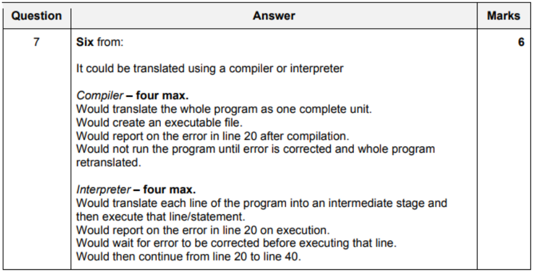
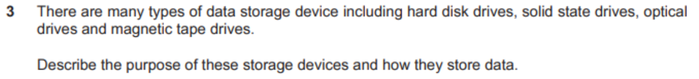
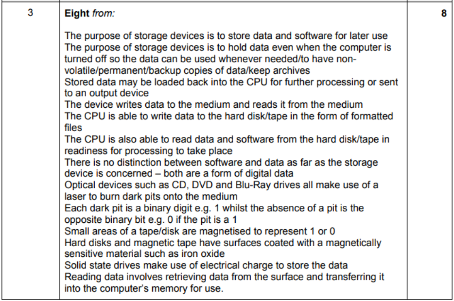
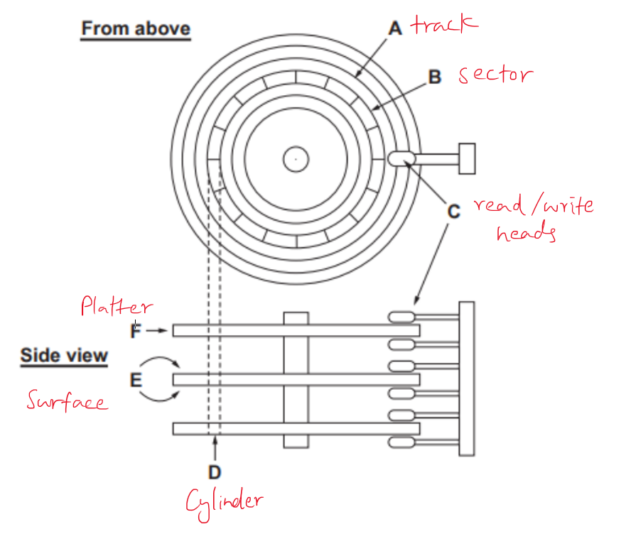

All Past Paper Questions: https://docs.google.com/document/d/1AjL53GAhZXb_fa4mALsTHMoJZlIfAlF35uHH96iPWQ4/edit?usp=sharing 

## Computers

- fault tolerance
    - both
        - whether computer will repair itself if an error occurs
        - a computer can operate even if components fail
        - without system downtime
        - computers operating quality can be reduce
            - but it does not fail completely
        - whether when a hardware component fails, is it hot swappable
    - super computer only
        - will run two copies of software
        - if one fails, the second copy will start

- heat maintainance
    - computers generate a lot of heat
        - due to quality and quantity of processors
    - it can be a problem when it overheats
    - to address this issue
        - good cooling systems are needed
            - can air cool with an AC - expensive
            - can water cool - cheap, efficient
            - build datacenter in a cold part of the world, eg: greenland.

### Mainframe Computers

- description
    - have hundreds of processor cores
    - all cores share one OS
    - mainframes use parallel processing
    - can process a large number of small tasks at same time

- advantages
    - have faster processing
        - can perform hunders of MIPS
    - have high value of MTBF (Mean Time Between Failures)
        - so, less downtime
    - have greater fault tolerance
        - can transfer processing from one core to another
        - so, hardware and software updrades can occur while the system is still running
    - they can run different OS
        - so, can handle different types of database
    - they are more secure than most other types of computer    
        - as they use complex encryption system

- disadvantages
    - very expensive to buy
        - some are using cloud instead of this
        - due to this being too expensive
        - maintainance
        - cost to people who manage this
        - software costs
        - cooling costs
    - need large rooms
    - generates a lot of heat,
        - need good, expensive and complex cooling systems   

- why used to produce census?
    - mainframes has a,
        - high speed of processing data
        - scalable
        - reliable 
    - amount of data to be processed is very large
    - as countries have a lot of people
        - it also keeps on increasing
        - census processes & produces more data
    - more poweful machines are needed as more data is added

- transcation processing systems
    - performance is meausured by the number of transactions it can process in a given period of time
    - must be continously available
    - must able to maintain integrity of data 
        - and overcome hardware and software problems
    - it must also be possible to individually upgrade hardware and software components without suhtting down the system
    - there should be controlled access, allowing only authorised users to use the system

- performance metrics
    - used to measure performance speeds of computers/processors
    - can be unreliable as the complexity of instructions can vary according to which benchmark program is used
    - MIPS are used for integers
        - Million Instruction Per Second
    - measured in millions
    - used when measuring performance of computers involved in running application software
    - do not take into account the input/output speeds

- RAS
    - Reliability, Accessibility and Serviceability
    - describes the robustness/durability of a mainframe computer
    - Realiability
        - chance of the system behaving as intended
    - Accessibility
        - mainframe being operational at all times
    - Serviceability
        - can be easily fixed within a short period of time
    - if there is a failiure
        - reliable 
        - will use alternative methods to carry out tasks
    - software is reliable
        - highly tested
        - and updates are made quickly to fix problems
    - MTBF (Mean Time Between Failures) is long for mainframes
        - mainframes give months/years of systemd owntimes
    - when unavailable (due to failiure)
        - mainframe is unavailable for a very short time
    - spare components (CPUs) are inlcuded in mainframes
        - if one fails, nother takes over
    - mainfram can determine why failiure occured
    - enables hardware and software components to be replaced without affecting mainframe's operations
    - can be serviced while the system is still running

### Super Computers

- description
    - can have more than 100,000 processing cores
    - use massively parallel computing
    - each core has it's own OS
    - use more than one GPU

- effectiveness / features
    - have a limited lifespan of just a few years
    - and will need replacing / repairing
    - carries out complex calculations
    - can use complex maths formulae
    - can handle a large amount of items of data at same time
    - fasted data processing computers
    - most expensive to buy
    - each processor has it's own operating system
    - use massively parallel processing
    - more powerful compared to mainframes
        - can be upto 1000 times faster
    - can include scientific rules
    - some tasks do not require super computers
    - overheats, hard to keep it cool 
    - as the task is not complex, so, it would be a waste of time

- performance metrics
    - used to measure performance speeds of computers/processors
    - can be unreliable as the complexity of instructions can vary according to which benchmark program is used
    - (M) FLOPS are used for real/floating point numbers
        - Floating Point Operations Per Second
    - measured in quadrillions and higher
    - used where complex (scientific) calculations need to be carried out
    - to not take into accuont the CPU's clock speed, bus speed and RAM available

- weather forecasting
    - powerful enough to carry calculations required
    - can process huge amounts of data
    - based on use of very complex/scientific computer models
    - a advanced three-dimentional model of earth has to be created
    - and large number of complex calculations are carried
    - but first, data should be collected
        - records of previous weather conditions
            - weather measurements from weather stations
            - observations from satellites
            - information from ships & aircrafts

- climate research
    - many variables are collected
        - using sensors, eg:
            - rainfall, temperature, humidity, etc...
    - large quantity of data is processed
    - complex calculations are carried out
    - shows historical trends of different variables over a long time period
    - complex maths formulae are used to describe how different parts of climate works
        - computer models based on these are used to predict how the climate will change
        - these models will include several scientific formulae
    - model will give you the best guess  

### Cloud Computing

- cloud storage
    - advantages
        - paying a low monthly fee
        - has no physical precense, so, takes no space
        - can backup data automatically
        - syncing ensure files are automatically updates across all devices connected
    - disadvantages
        - data is in hands of third party
            - so, less secure
        - providers can be transient
            - resulting in possible data loss
        - only as reliable as the user's internet connection
        - some may charge a cheap initial fee, but may increase prices later
        - users are at risk of not having data stored in compliance with government regulations if the physical storage location resides in a different country

## Software

- Software are programs used to direct the operation of a computer and related hardware

FULL DIRAGRAM IMAGE HERE

## System Software

- directly operates the computer hardware
- both compiler and interpreter converts high level programming language to a lower level instructions
- designed to run a computers hardware and application programs
- managed computer hardware
- provides a platform the application software to run
- general purpose
- takes care of memmory management of the system

- Question

### Compilers

- features
    - translates the whole porgram as one complete unit
    - creates an executable file
    - is able to report on a number of errors in the code after compilation
    - does not need to be present in order to run the program (compiled executable)
    - can optimize source code to run as fast or as efficiently as possible
    - often produces a seperate object code program
    - converts high level instructions to machine language
    - entire file is compiled before execution
    - list of errors is created after the compiltation process
    - compiled program is directly executed using the machine code
    - has to be recompiled even if the smallest change is made
    - difficult for hackers to modify compiled code

- advantages
    - once compiled, translation software is no longer needed
    - runs faster (fast execution)
    - quicker process than interpreting 
    - improve security for programmers
        - making it harder to copy code
        - fewer risks of copyright infringement

- disadvantages
    - can only be used in one OS
        - target audience may run many OS
        - might need to use an interpreter
    - has to be recompiled even if the smallest change is made

- usually, compiles with native compiler
- to run in another platform
    - can cross compile
    - will run more slowly
    - produces more errors and mistakes

### Interpreters

- how it works?
    - translates each line of source code inito an intermediate stage and then executes that line / statment
    - translation happens line by line (one instruction at a time)
    - reports on errors as lines of source code are processed
    - an interpreter has to be resident in memmory in order for the program to run
    - only a few lines of the program need to be in memory

- features
    - translates each line of source code inito an intermediate stage and then executes that line / statment
    - reports on errors as lines of source code are enetered
    - only a few lines of source code needs to be in memory at any one time
    - some interpreters execute code within a virtual machine
    - these have been designed to disallow code from directly accessing the data computer
    - converts high level instructions to an intermediate form (called "object code")
    - translates one statment at a time
    - stops translating after the first error
    - interpreter has to be in memmory for the program to run
    - can be modified at runtime (changing functions)

- advantages
    - when need to run on many OS
        - can maintain one version of the source code
    - less time will be spent on maintainance
        - when updates are needed
    - easier to debug the program
        - as errors are highlighted
    - it can use up less memory than a compiler
        - as only a few lines of source code are in memory at given time
    - less likely to crash the computer
        - as the code can run in a virtual machine (like JVM for java)
- disadvantages
    - translation software may need to be kept upto date
    - interpreted programs run slower than compiled programs
        - as they have to be interpreted every time they are run
    - interpreting a program is much slow process than compiling
        - as it stpos every time an error is encountered
    - source code is easier to convert by fraudulent users
    - makes it much easier to copy the program

### Linkers

- a linker takes one more more object files and combines them into a single executable file

- advantages
    - programs can be written in modules
        - requires less RAM
        - saving cost of memmory
    - whole program and compiler dont need to be in memory at the same time
        - requires less RAM
        - saving cost of memmory
    - several programmers can work on seperate modules
        - saves time (compared to one person writing the whole code)
    - if there is an error, only that module has to be fixed

- disadvantages
    - variable names can cause problems
        - the same variable may have been given different variable names in different modules
    - documentation has to be more detailed
        - so takes longer to write 

### All

- why we need all of these?
    - many programming languages allow the wiritng of different peices of modules seperately
    - programming tasks are simplified as large programs can be broken into smaller manageable pieces
    - the linker is used to put all the modules together
    - without the comiler, the linker would have no object files to combine

### Operating systems

- tasks carried out / purpose
    - allocates memmory to software
    - sends instructions to printers
    - recognizes and responds to input devices
    - opens and closes files on devices
    - does file management
    - multi-programming systems allocate equitable processing time to each task
    - sends error messages if an error
    - hanldes user logins
    - handles file permissions
    - provides the interface between a user and the computer
    - manages hardware resources
    - responsible for handling errors

- purpose
    - multi-processing OS is when system has more than one processor
    - multi-tasking OS allows more than one program to run at a same time
    - multi-tasking OS allocates sufficient processor time to each program
    - multi-threading OS allows different parts of a single program (process) to run at the same time
    - real-time OS allo the computer to respond to input instantaneously
    - distributed OS allows data to be stored on a number of computers in different locations

### Device drivers

- purpose
    - it controls a device attatched to the computer
    - without required device driver, corresponding hardware device fails to work
    - it is the interface between OS and hardware device
    - tells the OS how to communicate with hardware device
    - upon installation, it detects and identifies peripheral devices
    - handles translation of requests between device and computer
    - ?? defines where outgoing data must be stored before it can be sent ??
    - different OS may send different instructions, driver translates them to what printer can understand

## Utility Software

- programs that help maintain the computer
- performs a very specific task, usually, managing system resources
- OS can contain a number of these utilities out of the box
- why it is needed?
    - to keep computer free from viruses
    - to make files contiguous
    - ?? needed to improce performance by allocating memmory ??

### Anti Virus Software

- note: viruses are also a type of software
- to remove viruses
- scans computer for viruses
- software used to prevent, detect and remove malicious software (called 'malware' for short)
- can protect from: 
    - malicious browser helper objects, 
    - browser hijackers, 
    - ransomware, 
    - keyloggers,
    - backdoors,
    - rootkits,
    - trojan horses,
    - worms,
    - adware,
    - spyware, 
    - etc...
- signature based detection
    - compares the contents of  file
    - to its database of known signatures
- heuristic-based detection
    - detects malware vased on characteristics typically used in known malware code
- behavourial based detection
    - based on behavourial fingerprint of the malware at runtime
    - is only able to detect malware after they have start malicous actions
- sandbox detection
    - based on behavourial detection
    - but it doesnt detect behavourial at runtime
    - it executes the programs in a virtual environment
        - logging the actions performed by the file
- gives the user options to delete or qurantine the files
- does backgroudns cans of downloads and attatchements
- prompt the user to scan newly plugged in 

### Data Compression

- to reduce storage file size of a file
- encoding information using fewer bits than the original representation
- two types
    - lossless compression
        - reduces the number of bits
            - by identifying repeated patterns
            - and encoding them in special ways
                - eg: Run Length Encoding (RLE), Huffman Encoding
        - same quality
        - information is not lost
    - lossy compression
        - reduces the number of bits 
            - by identifying unncecessary information
            - and removing them
        - reduced quality 
        - information is lost
    

### Disk Defragmentation

- removes non-contiguous spaces on disk
- organizes contents of the disk into smallest number of contiguous blocks
- it is re-arranging the files stored on the disk
- attempts to create larger regions of free space using compaction
- some defragmentation utilities try to keep smaller files within a single directory together
- the movement of the hard drive's read/write heads over different areas of the disk when accessing fragmented files is slower
    - compared to accessing the entire contents of a non-fragmented file sequentially
- will make the data retrieval easier and quicker

### Disk Formatting

- prepares a data storage device for initial use
- organizes the tracks on a disk into sectors
- a new disk medium is fully prepared in order to store files
- the first stage is low-level formatting followed by
    - partitioning which makes the data storage device visible to an OS
    - followed by high-level formatting which generated a new file system
- low-level formatting divides disk surface into tradcks, secors and cylinders
    - done by magnetising disk areas using write heads
    - tracks are numbered s tarting from 0
    - when the head goes from one treack to next, it leaves a gap
    - each track is organized into numbered sectors, starting at 1 and seperated by gaps
    - the purpose of low level formatting is to prepare the disk surface to reveive data
- high level formatting
    - creates a file system on the disk
    - this allows the OS to use the disk space to store data and access files

### Backup Software

- to make copies for future use 
- creates additional copies of all data in the computer
- backed up data is available incase of data loss, eg:
    - lost to a ransomware
    - accidental deletion
- can use copies to restore original contents
- asks use to enter type of backup
    - full
    - incremental
    - differential
    - etc...
- can backup automatically, on scheduled time, set by user
    - backup process will consume disk resources
    - making the computer slow
    - so, should make backup at convenient time
    - eg: night time
- taking backups regularly
    - will prevent the chance of data loss
- asks if you wish to restore the backup
- asks if you wish to verify the backups
- asks frequency of backups (how often they should take place)
- ask which medium the user wishes to store
- select where to save the backup 
    - target location
    - it should be secure
- can also encrypt the backup
    - provides more security

### File Copying

- creation of new files, which has the same contents as an existing file

### Deleting Files

- removing a file from the computer's file system
- most OS keeps track of where files are on hard disk using pointers
    - each file and folder on a hard disk has a pointer that tells the OS
    - where the file's data ends and begins with
- when a file is deleted, 
    - OS deletes pointers
    - marks secotrs containing that file as available
- its considered that files are no longer present in hard disk (considered as free space)
- uses a file allocation table (FAT) to store the location of files on the disk
- the delete utility just deletes the reference of the index in the FAT
- until OS writes new data, deleted files are still recoverable
- recovery programs can scan for deleted files and restore them
- if file is partially overwritten, can only recovery half of that file
- file recovery pointers work by reinstating pointers
    - reinstating the index in FAT

## Application Software

- group of software designed for the end user
- uses computer to perform specific tasks
- not required to run the system
- its user specific
- interface between user and system software
- eg: spread sheet software, word processing software, database software, animation software, video editing software, etc...

## Off the Shelf Software

- description
    - software that is ready-made and already exists
    - it is available to all bussiness and companies
    - it is owned by a company that created it
    - has to adapted to fit the bussiness that has purchased it

- advantages
    - cheaper, as mass produced
    - available straight away
    - testing can be righteously carried out by developers, so, less bugs
    - many sources of support
        - web forums
        - comminity support
        - wiki's
        - includes helplines with operators who have already dealth with many problems, so, experienced
    - will have been used many times before companies buy it, so any bugs will have been identified/reported and fixed

- disadvnatages
    - difficult to adapt to particular use required by the school
    - has bloated, distracting, unwanted extra features
    - may not be compatible with current systems and infrastructure
    - some very specific functions may not be available
    

## Custom Written Software

- description
    - software that is specially developed for a specific company
    - it is made to accomodate that customer's particular preferences and needs
    - written by programmers to solve specific problems
    - owned by the bussiness that commisions it
    - is it made from scratch

- what
    - software created for defined purposes
    - does not need to be adapted for use
    - any built in settings can be changed
    - programmer will ensure device compatibility
    - if software doesnt meet companies requirements
        - programmers with have everything fixed
        - eg: ability to copy software to several devices
    - they will not have unncecessary bloated features
        - the usually takes less space than off the shelf software
            - so, less expensive storage costs
    - *company will own the custom written software, so, they can sell it to others*

- advantages
    - designed specifically for client's requirements
    - there will be no unncessecary features
    - it does not have to be adapter for use
    - programmers are available to make any changes required
    - programmers will ensure the software is compatible with company devices and infrastructure

- disadvantages
    - costs more to pay programmers to write more
    - testing is limited to only what programmers think is required
        - based on how they think the software will be used
        - not thoroughly tested
        - so, can have a lot of bugs
    - support is limited to team of programmers only
    - can take a long time to develop the software

### Mental Model

- explanation?
    - based on bliefs, not facts
    - what user will describe as what they need
    - deisgner must produce UI to match user's thoughts
    - model of what users know/think about a system
    - users create mental models very quickly (even before using any software)
    - comes from prior experience of user
    - designers should stick with this, or it will be hard for users
    - user will take less time to learn (if product is similar to his mental model)
    - will provide the user with transferrable skills
    - training can be changed to fit user's mental model
        - to fit the design of the interface

### Conceptual Model

- actual model that is given to the user
    - through the user interface
    - of the product

### User Interface

- What to consider when creating a custom user interface?
    - how color is to be used 
        - (color palettes)
        - choosing color combinations
    - layout
        - positioning elements
        - to ensure readability
        - increase font size to emphasize importance of certain elements
    - only display information the user needs
    - decide which controls will be required
    - which navigational aids are required
        - navigation bar (top)
        - side bar
        - breadcrumb 

## User Interfaces

- CLI & GUI
    - more accurate & reliable
    - user must be sitting infront and controlling it
    - require actions to deliberate

- GBI & Dialog Interface
    - for handicapped users (physical disabilities) who cannot use keyboard and mouse
        - or control their limbs accurately
    - more expensive to develop
    - for reasons of hygene, not even a doctor is allowed to touch the device
        - then, use gestures or dialog to control device
    - not suitable for safety related stuff
        - if in emergency
            - (GBI) gesture might not get registered 
            - (DI) 'stop' like words might not be identified properly 

### CLI

- Command Line Interface
- prompt appears in screen
- after which the command is typed
- used by advanced computer users
- less likely to change over time
- uses less memmory
- requires user to learn many commands
- processing is faster than others
- doesnt require graphics or high-resolution monitor

- disadvantages
    - user should learn many commands
    - can be slowed to input, for new users
    - long lines of text needs to be entered, instead of a few mouse clicks
    - commands can be more difficult to edit
    - more difficult to multi task
    - very basic, and can be more of a strain to user's vision
    - more likely to make mistakes when typing commands 

### GUI

- Graphical User Interface
- involves the use of WIMP
    - Windows, Icons, Menus, Pointers
- layout
    - sensible use of white space
    - information that needs attending to immediately should always be displayed in prominent position
    - a consistent use of screens
    - must not overload the user with information
    - should follow the house style of the company using it
    - information should flow in a logical order to the user

### Dialog Interface

- Dialog Interface
- stuff?
    - requires a microphone
    - can speak into a microphone to control the device
    - requires training session with user
    - unreliable when there is a background noise
    - gives hands free control
        - can use when driving, can use voice instead of driving with one hand

### GBI

- Gesture-Based Interface
- stuff?
    - can perform a gesture to control the device
    - quicker way of initating a response from a device
    - less effective when several users or with background movement
    - gestures can be taught through manuals
    - unreliable when used in the dark
    - bad when driving, will have to drive with one hand while doing gestures with the other hand
    - unintentional gestures might be registered
    - very reliable as most users have similar gestures for communicating
    - requires a line of sight (unlike dialog interface)

## Hardware

- Another name for physical parts of the computer
- collection of physical components

### CPU

- parts
    - Arithmetic Logical Unit (ALU)
    - Control Unit (CU)
    - Memmory
    - tends to be contains on an intergrated circuit chip called a microprocessor

- function
    - CU fetched instrctions from main memmory
    - decodes instructions
    - executes instructions
    - all input data are transferred via CPU's memmory
    - memmory stores instrctions as well as data
    - data is stored in the CPU memory, whilst a calculation or instruction is being carried out
    - input data are transferred to the ALU for processing
        - ALU makes use of 4 basic functions: +, -, *, /
        - ALU uses certian logic operations such as comparisons, selections and matching

### Mother Board

- description
    - the main printer circuit board of a computer
    - connects the main components of a computer
    - contains
        - mass storage interfaces
        - serial and parallel ports
        - usb ports
        - network ports
        - expansion slots (PCI, PCIe)
        - controllers required to control standard peripheral devices
        - southbridge
        - connections for attatching additional boards
        - bios
        - CPU socket
        - RAM slots

### Sound Card

- description
    - manipultate and output audio
    - manipulate sounds stored on disk
    - recieve sound from input from a microphone
    - output sound trhought speakers connected to the bord
    - nearly all sound cards upport MIDI, a standard for represeting audio electronically

### Input Devices

- Touch Pad
    - used to simulate the behvaiour of a mouse when using a laptop

- Keyboard
    - or 'number pad' - whats used in supermarkets
    - type in values
    - advantages
        - experiences users can enter data more quickly
    - disadvantages
        - difficulty of entering amounts other than selecing numbers using a mouse
        - data is slow to enter (compared with DDE)
    - using the keyboard
        - can use CTRL + other keys to save, print, copy, paste, cut, etc... (keyboard shortcut)
        - can use arrow keys to navitage through text
        - can use tab key to indent, delete key to delete forwards, backspace to delete backwards
        - can use the alphbetic keys and number keys to type content
    - in a shop, if product bar code is damaged, it cannot be input

- Touch Screen
    - both input and an output device
    - could be used to eneter amounts
    - quicker to enter data than using a mouse
    - may cause screen to be stained and make viewing difficult

- RFID reader
    - reader can be used to enter details from passport / bank card
    - quicker than manually entering data
    - readers are expensive to buy initially

- in Bank Cards (credit cards / debit cards)
    - uses a chip reader to read cards
    - reliable than reading a magnetic stripe
    - quicker than typing details from the card
    - contactless card readers speed up transactions as no PIN is required
        - in many countries, there is a maximum amount of money allowed to be charged with this.
    - chip and pin-reader
        - reads details from bank cards
        - more secure
        - more reliable than rading magnetic stripe
        - quicker than typing details from the card

- Bar Code Scanner
    - used to read bar codes from products

### Output Devices

IMAGE HIERARCHIAL

- Monitor
    - results are produces instantly
    - graphs / diagrams / figures are represented more accurately
    - scroll through results easily (instead of turning pages)
    - need to be infront of monitor to view the output

- Printers
    - easier to annotate printouts taken
    - printouts can be transported and viewed anywhere
    - may skim on whats on-screen.
        - so, more likely for errors to occur

    - Dot Matrix Printer
        - not very clear comparatively
        - uses continous stationery
        - slow to print 
            - if busy, will cause queues of people waiting to print
        - less risk of this running out of paper
        - will have 'noise' in print (bad)
        - cheaper to run 
            - ink ribbon is cheaper than catridges or toners
        
        - advantages
            - can use carbon copy paper (requires less filling of the sheet feeder)
            - could use continuous stationary
                - which would require less human interction
                - doesnt run out of paper very quckly
            - ink ribbon lasts longer and is cheap
            - when ink runs out, print gets fainter, but is still legible

        - disadvnatages
            - striking of heads cause a lot of noise
                - distracting in office envrionments
            - quality of output is not very good
                - 240dpi, but inkjet does 1200dpi
            - slow output
            - to buy a dot matrix printer is very expensive
            - has a more limited character set
             
    - Inkjet Printer
        - high quality tickets
        - slow to print 
            - (all copies, including the first copy)
            - if busy, will cause queues of people waiting to print
        - will need to change catridges more frequently
        - when ink runs out, prinout is less legible
        
    - Laser Printer
        - quiality of print will be good
            - can see it clearly
        - takes time to produce the first copy
        - does not have tio change toner as often as inkject catridges

### Storage Devices

- Exam Question:

#### Primary

- quicker than secondary
- ROM content is sometimes copied to RAM and subsequently read from RAM
- very fast access times
- no moving parts
- stores data in use and stores data for later user

- RAM
    - Random Access Memmory
    - stored information for short term usage
    - volatile: data is deleted once power is lost
    - stores active program data
    - ?? faster than ROMs ??
    - used by computers for storing data during computing processes
    - stores active program data
    - can both read and write

- ROM
    - Read Only Memmory
    - cannot be changed, only read
    - non volatile: data is retained even when power is off
    - stores permanent computer instructions
    - (to store bootup instructions) contains instructions for the computer to start up when it is turned on again
        - stores bootup instrctions - that will activate the hard disk
    - to store software that is unlikely to need frequent updates

#### Secondary

IMAGE HIERARCHIAL

- portable
- non volatile
- stores data for later use
- CPU can both read from and write to data 

- Optical Drive
    - uses laser to burn dark pits into medium
    - each dark pit is a binary digit
        - if there is a pit: 1, else: 0 
    - Advantages
        - faster data access times (comapred to tape)
        - more viable when theres large variations of temperature
    - Disadvantages
        - not very portable (compared to tape)
        - more suspectible to damage when handling
    - types:
        - CD
        - DVD
            - stored upto 8.7GB max (DVD - Double Side - Double Layer)
        - Blu Ray Disk
            - single blu-ray stores upto 128GB max
                - can store high quality videos
            - more expensive
            - costs less to buy per unit memmory
        - note:
            - BR drives can read DVDs
            - DVD drives cannot read BR dicsts 

- Magnetic Media
    - aka Tape 
    - small areas of tape are magnetized to represent 1/0
    - have surfaces coated with magnetically sensitive material such as iron oxide
    - Advantages
        - costs less per unit storage
            - so, more cost effective (for large companies)
        - stores more data
        - appropriate for server backups
        - less suspectible to damage when handling
            - because its completely encased
        - hardest to hack into
    - Disadvantages
        - costs more per tape
        - gets curropt if placed near a magnetic field
        - slower access speed
            - as data is stored sequentially
            - when getting data, should start at beginning and start finding
            - not very silent
                - it also has moving parts

- Hard Disk Drives (HDDs)
    - have surfaces coated with magnetically sensitive material such as iron oxide
    - Advantages
        - higher storage capacitie
        - cost less per gigabyte
        - lasts longer
    - Disadvantages
        - consists of various moving parts
            - more suspectible to damage and shock / more prone to failiure
            - more pront to mechanical failiure
        - access speed is limited
            - depends on how close the data is to the read/write heads
        - loud, have whirring sounds due to moving parts
        - high power consumption

    - How it works? & Parts:

        

        - HDDs consists of several platters, which are individual disks
        - each surface of a platter has it's own read/write head
        - the read/write heads move across the platters
            - stoppping only read data from or write data to the surface
            - it never touches the surface
        - each surface is divided into several tracks, which are in the same position on each disk
        - the track on the top platter together with the tracks exactly below it, form a cylinder
        - each track is divided into sectors

- Solid State Drives (SSDs)
    - uses electric circuits (NAND flash)
    - stores data with an electrical charge
    - Advantages
        - have faster transfer rate
        - have quicker boot ups
        - can have almost instantaneous data access ()
        - all parts of SSD can be accessed at once
        - use less power at peak load
        - energy efficiency can deliver longer battery life in laptops
        - no moving parts, so, SSDs run silently
        - data can be accessed at once (specially thanks to the DRAM cache)
    - Disadvantages
        - low storage capacities
        - costs more per gigabyte
        - doesn't last long
            - NAND flash used in SSDs can only be used for a finite number of writes
        - choices and availability is limited

- HDDs vs SSDs

| **Feature**               | **HDD**                                 | **SSD**                                        |
|---------------------------|-----------------------------------------|------------------------------------------------|
| **Storage Capacity**      | Higher storage capacities               | Lower storage capacities                       |
| **Cost per Gigabyte**     | Costs less per gigabyte                 | Costs more per gigabyte                        |
| **Durability**            | Lasts longer                            | Doesn't last as long                           |
| **Shock Resistance**      | More susceptible to damage and shock    | No moving parts, so more shock-resistant       |
| **Access Speed**          | Limited access speed                    | Faster transfer rate, quicker boot ups         |
| **Noise**                 | Loud, with whirring sounds              | Runs silently                                  |
| **Power Consumption**     | Higher power consumption                | Uses less power at peak load                   |
| **Energy Efficiency**     | Lower energy efficiency                 | Better energy efficiency, longer battery life  |
| **Availability**          | Widely available with more choices      | Limited choices and availability               |
| **Lifespan**              | Consists of various moving parts        | Finite number of writes due to NAND flash      |

- Pen Drives
    - used to store data that is to be transferred
        - from one computer to another
        - because of ease of portability

---

## Other

---

- Pg 39 - 2019 March 12 - 1 (to Database)

## Software Stuff (to Database)

- **NOTE: THIS BELONGS TO THE 'DATABASE' PART OF P1**

- generic file format
    - description
        - one which will be recognizable to most software packages
        - if a software packages does not recognize, file is  update to load
    - examples
        - .txt (text): can be loaded by most word processing software
        - .csv (command seperated values): can be loaded by most spreadsheet software
    - why use text file instead of using word processed file? 
        - file size is smaller
            - takes less storage space
            - so, has small processing time
        - text format doesnt need to buy license / software
            - eg: of word processing software
        - can be opened by more applications
        - data can be exchanged among different OS / Computers
        - word processing software has many versions
            - one may not support documents made with another verison
        - its human readable and easy to edit manually
        - disadvantages
            - no distinction between text and numeric values
            - documents will have no formatting
            - cant embed images / graphics / videos
            - cannot have tables
            - resulting layout may make it difficult to read

- propietrary software
    - software that is owned by an individual or a company (usually the one that developed it)
    - there are almost always major restrictions on its use
    - a software vendor delineates the specific terms of use in an end-user license agreement
    - its source code is almost always kept secret
    - usually covered by copyright which provides a legal basis for its owner to establish exclusive rights
    - usually created by a company
        - with secret (proprietary) encoding scheme
        - so, it can be decoded only using software of company

- open source file formats
    - description
        - can be used and implemented by anyone
        - an open source file format can be used by both propietrary and FOSS
        - also called free file formats if they are not covered by any copyrights
        - so that anyone may use them at no monetary cost for any desired purpose
        - can be opened by most types of software
        - there is a published speicifcation for storing digital data, 
            - usually maintained by a standards organization
        - can sometimes be amended without violating of copyright laws  
        - provides a standard file type
        - can work with different software without the need to have the same software
    - why need this
        - not everyone can afford proprietary software
        - when transferring from one device to another, 
            - other devices may not have compatible software
        - archived proprietary files maybe difficult to read by new software

## Web Conference (to Digital Divide)

- **NOTE: THIS BELONGS TO THE 'DIGITAL DIVIDE' PART OF P1**

- how to setup 
    - answer 1
        - send emails to every person being invited informing them of the conference
        - he sends log in details to users
        - uploads any necessary documents for the meeting
        - sends a link to the website
        - enter his username and password (obtained from the provider)
        - select a start time and end time
        - in the meeting area, type an agenda
        - using the software select participants
        - select appropriate meeting space/room
        - select those participants who can enter the room
        - choose those who can be presenters
            - and who can manage the meeting
            - limit participation of participants, 
            - disable messaging, 
            - disable camers
    - answer 2
        - setup equipment and software 
        - agree a date and time
        - send reminder to participants before they start
        - send invitation link, with meeting password
        - adjust webcam so that can be seen
        - create and enter virtual rooms
        - share documents with appropriate software
        - upload any necessary documents for the meeting
        - sends a link to the website
        - enter his username and password
        - using the software, select participants to accept in to the meeting
        - select appropriate meeting space/room
        - select those who can enter the room
        - limit the participation of participants, mute, disable messaging / camera, etc...
        - communicate by speaking into a microphone and looking at the webcam

- hardware required
    - server to handle video conferencing software
    - laptops/devices for each participant
    - microphone to speak to (sound - input)
    - speakers to hear (sound - output)
    - large monitor to see all participants
    - cameras/webcams to input pictures
    - router to connect to internet / network

## Web Authoring (no idea yet)

- using web authoring software instead of html?
    - advantages
        - do not have to spend time learning html
        - do not need to have web development knowledge/skills to make a functional website
        - can make websites with basic clicking and typing
        - writing html takes much longer
        - most are WYSIWYG editors
    - disadvantage
        - limits the users options as a designer
        - they only rely on templates with limited options
        - depening on what web authoring software package you use
            - they might not even different features
        - software may make user reliant to it
            - if software breaks, can no longer develop the site
        - learning html means sites can be built from any environment with basic text editing software
            - eg: notepad (most basic) to intelliJ webstorm ide (advanced) 

## Encryption (to Security)

- **NOTE: THIS BELONGS TO THE 'SECURITY' PART OF P1**

- how encryption stores data stores on a hard disk?
    - can use either symmetric or asymmetric encryption
    - can be through the use of public and private keys
    - causes data to be scrambled
    - requires an encryption key to encrypt
    - requires a descryption key to decrypt
    - resusls in data which is not understandable
        - even if read by someone else, it will have no meaning

## Inference Systems (to Expert Systems)

- **NOTE: THIS BELONGS TO THE 'EXPERT SYSTEMS' PART OF P1**

- how inputs are used to prodice diagnoses
    - finds possible diagnoses by using a form of reasoning 
    - the inference engine uses the data or facts in knowledge base (to reason through the symptoms)
    - the reasoning involves forward chaining, backward chaining, or a combination of both
    - compares symptoms to those in the knowledge base
    - uses the rules base of IF...THEN... rules
    - *also, write the description of forward chaining and backward chaining* 
    

