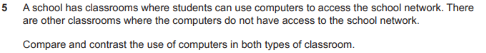
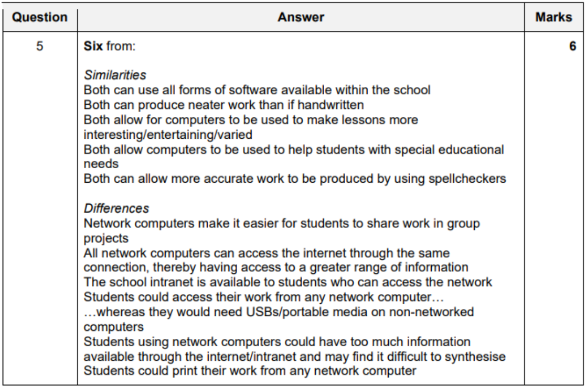

## Networks

- Question

### Computer Networks

- Advantages
    - easier to share files in group projects
    - easier for teachers to monitor students when working
    - easier for network manager to roll out new software
    - can access internet more easily
    - school intranet would become available to all students more frequently
    - can share peripherals
- Disadvantages
    - easier for students to share work
        - which could lead to copying
    - bigger server maybe required when more clients added to network
    - extra network points needed, so, expensive
    - if server breaks, it might be unaccessible
    - viruses can transmit easily (worms)

### Mobile Networks

- how it works? how it enables transmission?
    - phones connect to cell towers (base stations)
        - divided into thousands of overlapping goegraphic areas
    - typical mobile network is like a mesh of hexagonal cells
    - each cell has its own base station at the centre
    - base station provides cell with nerwork coverage
        - which can be used for transmission of voice + data
    - cells overlap at edges to ensure user is always connected (within range of a base station)
    - RF signals transmitted by individual phone to a base station
    - RF signals re-transmitted from base station to another base station
    - transmitting and recieving are done over different frequencies
    - base stations connected to one another via central switching centres
    - the central switching centres track calls and transfer them from one base station to another as caller moves between cells
    -  mobile phone is a two way radio containing both lower-power transmitter and a reciever
    - a cell typically uses different set of frequences from neighbouring cells

- Advantages
    - more coverage than WiFi
    - forces users to depend upon hotspots in each area visited
    - 4G offers a coverage of 30 miles 
        - and more and with overlapping networks
        - high ranges means connectivity all the time
    - mobile devices can be used out in the field
    - portability
    - big problemts with wifi networks in online security
- Disadvantages
    - more expensive
    - quality can be poor if you are not close
        - could go 2G, 3G, etc..
    - power consumption issues on devices powered by batteries
    - mobile VPNs are unsafe to connect to

- 3G vs 4G
    - similarities
        - mobile networks
        - allows phone to be used as SATNAV 
        - allow smart phones to access WWW
            - allow video calling on phones
            - allow emails to be sent by phone
            - allow music/videos to be downloaded to phone
    - differences
        - 4G is faster than 3g
            - 4G gives smoother browsing experience
            - 4G allows video/music to be played without buffering
        - battery lasts longer on 3G than 4G
        - 3G data allowance is cheaper than 4G

### Topologies

- LAN
    - covers smaller geographical area
    - does not always need a router to connect computers togethers
    - uses L1, L2, L3 devices
    - high rate of data transfer
- WAN
    - made by connecting many LANs through a router/modem
    - covers larger geographical area
    - uses L3 devices only
    - private WANs used by organizations to connect to LANs 
        - by leasing telephone lines (PSTN)
        - or private fiber optic cable (purely for their own use)
        - these can be VPNs (Virtual Private Networks)
        - or, using a telecommunications network will make data rate slow
- Comparisons
    - LAN vs WAN
        - similarities
            - both are used to connect computers togethers
            - providing all advantages of a computer network
            - both can be connected using a copper cable or fiber optic cable
            - both are used to share files
        - differences
            - faster data transfers in LAN
            - fewer errors in data transfers occur in LANs
            - WANs cover a larger  geographical area than LAN 
            - LAN is more secure, as not connected to outside
            - WANs are more complex
                - so, less fault tolerant
            - LAN shared information needed by each branch wheras WAN shares the information needed by all branches 
             

### Connection Types

#### Client-Server Networks

- more secure than P2P networks
- servers will handle authentication and authorization to accessing resources
- if a client crashes/disconnects, it doesnt affect other clients or the server

- Advantages
    - centralized database of user information makes it more secure
    - users do not need to worry about making backups
    - upgrading is easier (only have to upgrade the server)
    - easier for user to access, with alternate devices
    - easier for the end-user in many ways...
    - as new information is uploaded in a database, each computer need not to have its own storage capacity increased
- Disadvantages
    - if server goes down, whole network is affected
    - need a IT Staff
        - need to pay salaries 
        - eg: network manager 
    - servers expensive to setup and maintain
    - many servers trying to access data from server can cause overload

#### Peer to Peer Networks

- can communicate and share files with every other computer on the network
- Advantages
    - cheaper (no need to buy servers)
        - does not servers
        - as files accessed from inidividual's workstations
        - no need to pay IT staff (System Administrator, Network Technicians)
        - overall cost of setting up is cheaper
    - very redundant
        - if one computer fails, it will not disrupt anything
        - everything else will continue    
- Disadvantages
    - files and folders are difficult to recover as they cannot be centrally backed up
    - more difficult to share
        - with magnets and torrent descriptor files
    - less security than permissions
    - system is not cntralised, hard to administrate
    - more expensive security, all devices should have its own anti-virus
    - diificult to have more than a few users
    - peers should have good storage too
    - when peer being accessed by other peers, it might slow the computer down

#### Comparison

| Aspect                         | Client-Server Network                                      | Peer-to-Peer Network                                      |
|-------------------------------|------------------------------------------------------------|-----------------------------------------------------------|
| **Resource Pooling**          | Resources centralized on one server                        | Resources pooled by all peers                             |
| **Communication**             | Clients communicate with the server                        | Peers communicate directly with each other                |
| **Availability**              | Server crash affects entire network                        | Peer crash does not affect other peers                    |
| **Security**                  | Server controls network security                           | Each peer responsible for its own security                |
| **Backup**                    | Data backed up by server                                   | Each peer must back up its own data                       |
| **Setup Complexity**          | Requires specialist knowledge                              | Easier to set up, no specialist knowledge needed          |
| **Management**                | Easier to administer and manage                            | Difficult to manage due to decentralization               |
| **Performance**               | Server handles tasks without affecting client performance  | Performance can be slower as peers may perform multiple roles |
| **Virus Protection**          | Centralized virus protection                               | Each peer needs its own virus scanner                     |
| **Upgrading**                 | Easier to upgrade the server                               | More difficult to upgrade, each peer needs attention      |
| **Cost**                      | Higher due to server and IT staff                           | Cheaper, no need for servers or dedicated IT staff        |
| **Redundancy**                | Single point of failure if server goes down                | High redundancy, peer failure does not disrupt network    |

Summary

- **Client-Server Network:**
  - **Advantages:** Centralized security and backups, easier upgrading and management, better performance.
  - **Disadvantages:** Single point of failure, higher setup and maintenance costs.

- **Peer-to-Peer Network:**
  - **Advantages:** Cheaper setup, high redundancy, easy to set up.
  - **Disadvantages:** Decentralized management, each peer needs its own security and backups, potential performance issues.

## Internet

- meanining
    - global system of interconnected computer systems
    - uses TCP/IP to link devices
    - network of networks linked by an array of electronic, wireless and optical networking technologies
- there is a danger of accessing inapproprate / insure websites
- for communication
    - advantages
    - disadvantages

- for a bussiness / having precense on internet
    - Benefits
        - wider audience
        - low cost advertising
        - opens opportunity for staff working from home
            - save office costs (rent)
        - enables companies to share knowledge quickly & easily
        - product information can be accessed anytime & anywhere
        - quicker bank transfers with online banking
            - customer payments recieved quickly
            - payments can be gauranteed
            - can send orders to other companies
    - Drawbacks
        - works can get distracted by other stuff
        - employees can steal company data + infect machines
        - customers can post reviews easily
            - if bad review posted about company, it cannot be removed
        - loose face-to-face human interaction

        
### Services

- e-mail
    - electronic mail
    - email is a message that may contain text, files, images or other attatchments
    - sent through a network to an individual or a group of individuals
    - can be sent with somebody copied in without the other recipients knowing

- WWW
    - world wide web
    - description
        - system of internet servers
        - that support formatted HTML documents
        - tends to be upto date
        - has vast amounts of information
    - how it works?
        - invented by Tim Berners Liee in 1989
        - can be accessed via the internet
        - accessed using web browsing software
        - HTML is a markup (formatting) lanuage for WWW
            - web pages are text documents formatted and annotated using HTML
        - uses URL (Uniform Resource Locator) 
            - an address thats unique to identify the web page
        - HTTP allows retireval of linked resources across the web
        - HTTPS provides secure websites
        - web pages may contain images. video, etc...
        - hyperlinks allow users to navigate between web pages
        - comporises websites made up of a number of web pages
        - is basically a system of web servers (serving HTML documents)

- video conferencing services
    - to conduct conferences between two or more participants
    - at different sites
    - by using computer networks to transmit audio and video
    - video codecs used to transfer data
        - requires digital compression of audio and video streams (in real time)
        - hardware/software that performs compression is called a codec
        - compression ratios of 50:1 are achieved
        - digital stream is subdivided into data packets
            - which are transmitted through digital network
        - each packet has a 'header' that identifies its contents
        - protocol used is usually determined by the need to have reliable or unreliable communications
        - TCP is a protocl designed for error free transmission of data 
            - when delivery needs to be assured
            - will retransmit missing packets when data is lost
            - can cause delays and reduced throughput
        - UPD is a less reliable protocol
            - if data is lost, its not retransmitted
        - video conferencing should use UDP over TCP
            - because packets arrived late would ruin the conference
    - how video codecs are used?
        - short form of coder-decoder 
        - used to encode/decode digital data stream
        - used to compress data to reduce transmission bandwidth
        - the decoder reverses the encoding for playback
    - impact on
        - general people
            - more people able to use this
                - as its cheaper now
                - as hardware is powerful now
            - availability of freeware makes it highly accessible
            - enables more people to stay in contact with friends/family
            - deaf people can talk with sign language
            - can result in loss of physical social interaction
        - medicine (doctors, nurses, patients)
            - patients who are bed ridden can contact nurses and doctors
            - can discuss with doctors remotely
            - can use in rural areas
            - doctors can teach students
                - observe surgical procedure
        - education (teachers, students)
            - opportunity to learn content from other regions
            - lectures made available world wide
            - ill students can still study
            - diverse community can learn about each other
            - can virtually visit meuseums, educational facilities, etc...
            - several campusus can collaborate and share lectures. 

- VoIP
    - Voice over Internet Protocol
    - delivery of voice communications 
    - and multimedia sessions over IP networks

- instant messaging
    - to communicate vis messages in real time over the inertnet
    - service similar to SMS provided over the internet

- video streaming
    - video is sent to viewer in real time

- file transfer
    - transmitting files over a computer network like the internet

### Internet vs WWW

- Internet
    - international network of networks of computers
    - refers to the physical connection between networks of computers
    - consists of hardware
        - consists of computers, cables, routers, switches, repeaters
        - physical layer on which protocols are in use to carry data all around the world
- WWW (World Wide Web)
    - WWW uses hypertext to access the information in internet
    - this is only one of the services provided by the internet
    - accessed through web browsers
- Other
    - Instant messaging uses the internet without WWW
    - IP Phones (calling over internet) have their own VoIP protocols and no need WWW

The internet is the 

The world wide web is /users browsing

## Intranet

- private networked used within one organization
- can only be accessed by workers within organization
- based on TCP/IP protocls
- used to share information within the organization
- tends to be a LAN
- private computer network within one organization
- can only be accessed by workers
- need user IDs and password to prevent outsiders (authorization and authentication)
- based on internet technologies like TCP/IP
- there is a client-server relationship
- used to share information within organization
- tends to be a LAN
- has greater security
- contains forms for workers. eg: claiming expenses

- how to extend an intranet to an extranet?
    - extranet is a means of extending an organization's intranet for use by selected people
        - if staff is working remotely,
        - they can access it using a VPN
    - extranet is a setup 
        - by providing a secure link
        - to the intranet
        - using the internet 
    - examples:
        - employees to work from home using the internet
        - students to submit asstesments
        - hospital giving access to booking system for doctors
        - company giving access to supplier for inventory management

## Extranet

- website that allows controlled access to authorized users to an organizations network
- usually only allows access to a subset of information on the organizations intranet
- provides access to specific services without granting access to organizations entire network
- operates within VPN framework
- operated over public telecommunications protocls

- purpose
    - An extranet is a controlled private network that allows access to authorised customers.
    - grants access to some resources of organization (sometimes with authorization)
    - All of a company's ordering can take place via a secured private network.
    - more stuff:
        - Extranets allow companies to integrate operations with external stakeholders.
        - Suppliers are able to communicate with the business.
        - Customers can use it to place orders.
        - Customers can access information such as support information.
        - Any interaction with suppliers occurs in real time.
        - A companys clients/customers can upload documents, ask questions whenever they have the time to do so.

## Connection Types

- IEEE 802.11
    - specifications for MAC (media access control) and PHY (physical layer)
    - to implement WLAN (wireless local area network)
    - specifies an over-the-air interface between two clients
    - used in the 900 MHz and 2.4, 3.6, 5, and 60 GHz frequency bands
    - used in homes and SOHO (smal office home office)
    - Created and maintained by the Institute of Electrical and Electronics Engineers (IEEE) LAN/MAN Standards Committee (IEEE 802).

- ADSL
    - explanation
        - Asymmetric digital subscriber 
            - type of DSL broadband communications technology
            - used for connecting to the internet
        - more data can be sent in copper cable than (existing) telephone lines
        - microfilter allows the use of both ADSL and telephone line simultaneously
        - need special ADSL modem.
        - data rates:
            - downstream: 1.5 to 24 Mbps
            - upstream: 16 to 640 Kbps

    - asynchronous digital subscriber line
    - bandwdith and bit rate is greater toward the subscriber
    - ISPs usually provide ASDL as a service 
        - to recieve internet acces
        - in a relatively passive mode
    - video conferencing would stutter due to low speeds
- SDSL
    - synchronous digital subscriber line
    - bandwdith and bitrate in the downstream direction
    - aimed at bussiness customers
    - more expensive
    - high bandwdith
        - can use for video conferencing
- ISDN
    - integrated services digital network
    - allows simultaneous digital transmission of voice, video, data
        - over PSTN (Public Switched Telephone Network)
    - Circuit swicthed telephone network system
        - also provides access to packet switched networks
        - results in better quality
            - than an analgue phone can  
    - extremely expensive
    - HD videos conferencing achievable
        - with PRI (Primary Rate Interface)
        - alsmost similar qualities like when using SDSL

## VPNs

- Virtual Private Networks

- Meaning
    - is not physically a private network
    - uses internet other than WAN to transmit data
    - data remains encrypted throughout transmission
    - data is only decrypted at destination computer
    - this process is called tunneling
        - as it uses secure means to tunnel
        - through a publicly accessible network
    - uses public telecommunications system
    - normally consist of LAN that maybe remote to each other
        - like different branches of an organization
    - enables organizations to communicate over a large area
    - cheapter than creating conventional WAN
    - the security used consists of firewalls, encryption, the use of IPSec - IP Security 

- Purpose
    - enable organizations to communicate over a large area securely
    - enable employees to transmit data securely
    - enable employees to access company data remotely
    - to restrict which external users are able to use company's network
    - to restrict the resources the external user is permitted to use

- How it works?
    - this process is called tunnelling
        - as it uses secure means to tunnel through a publicly accessible network
        - it uses encryption
            - involves the use of private and public keys
            - scrambles data so that only the key holder can understand it
            - data remains encrypted throughout transmission and is only decrypted at the destination computer
        - it can use IPSec
            - is a network protocol suite that encrypted packets of data ent over a network
            - protects data flows between a pair of hosts
        - it uses a firewall
            - which controls the incoming and outgoing network traffic
            - establishes barrier betweena trusted, secure internal network and another outside network or computer
        - it uses authentication, authorization and accounting
            - AAA server is a program that handles user requests for access to resources
            - AAA server intercts with network access and and gateway servers
        - uses asymmetric encryption to establish the session
        - and then, symmetric encryption for the main conversation  

- Advantages
    - offer a much higher level of secure communication when compared to other methods
    - every file coming into a computer or going out from a computer is encrypted
    - so, no unwanted user will be able to open the files and understand it
    - can be used to work automatically as part of logging on
- Disadvantages
    - company may not permit him to use other third party software on his computer
        - in order to safegaurd the integrity of their VPN connection
    - use of mobile device to iniate access to VPN can cause security issues
    - if local wireless network is insecure, or using public wifi
    - packet loss will be higher with the VPN and cause data to be lost and need to be retransmitted
    - increasing time taken to recieve documents
    - connection depends on ISP, so, performance can be variable
    - will need to install extra anti-malware tools to ensure his PC is clean
        - to meet the company's security standards

## Search Engines

- lack of experience of developer might lead to bad search engine optimization

## Security

- encryption protocols can be used
- all major web browsers currently in use support TLS
- client-server applications use SSL/TLS to prevent eavesdropping
    - by using encryption protocols
    - so, technically, can secure carry out bank transactions
- are used in web browsing, email, internet faxing, messaging, VoIP, etc...

- SSL
    - secure sockets layer
    - is old technology
- TLS
    - transport layer security
    - successor to SSL

- how TLS/SSL is used in client-server networks?
    - TLS is used for applications that require data to be securely exchanged
        - eg: browser sessions, file transfers, etc..
    - server sends digital certiciate to client
        - to open a TLS connection
        - client needs to obtain the public key
        - public key is found in digital certiciate
        - digital certificate authenticates the server to the client
            - client checks if certiciate was issued from a trusted CA
            - check whether the server is legitamate owner of public & private keys
    - client does TLS handshake
        - client tells server what version of SSL/TLS it uses
        - and lsit of encryption protocols its able to use
        - client tells the server it wants to setup a communication channel
        - handhsaking occurs before the transfer of data can take place
        - server tells the client the type of encryption it has chosen from the client's list

## Packet Switching

Using TCP (Transmission Control Protocol) with IP (Internet Protocol). UDP (User Datagram Protocol) is also used instead of TCP sometimes.

- how data is sent?
    - data divided to packets
    - packets are whats being sent in network
    - each pakcet has header that identifies the contents
    - protocol used (TCP or UDP) determined on use case
        - TCP is a protocol which we can transmit data
            - used for error free transmission of data
            - when delivery of data needs to be assured
            - will retransmit missing packets when data is lost
            - can cause delays and reduced throughput
        - UDP
            - is less reliable
            - data lost in transmission is not retransmitted
        - eg: 
            - UDP suites best for video conferencing
                - as data arriving late would spoil the conference

## Safety (for Digital Divide)

- health issues
    - arise from **long term use** of computers
    - issues
        - RSI
        - carpal tunnel syndrome
        - lower back pain
        - eye strain
        - headaches
        - upper back pain
        - neck pain
        - shoulder pain
        - etc...
    - can be caused by
        - typing at a keyboard continuously
        - gripping a mouse and repetitive clicking
        - sitting in the same position (with a bad posture) the whole day
        - staring at a computer screen all day
        - glare from screen
- safety issues
    - arise from suddent accident
    - can result in serious injury
    - issues
        - fire hazards
        - electrocution
        - personal injury
    - can be caused by
        - overloading sockets (causing overheating)
        - overheating of computers
        - water split into live wires
        - handling bare wires
        - trailing cables can cause users to trip up
        - heavy objects falling off tables

- other issues
    - *in the form of:*
        - Issue
            - Prevention
    - overloading sockets causing overheating
        - CO2 file extinguider in room
        - seperate sockets for each plug
    - water split into live wires & cause electrocution
        - do not allow food and drinks into the computer room
        - ensure all wires are properly insulated
    - trailing cables can cause users to trip up and injure themselves
        - ensure proper trunking is in place
    - heavy objects can all off tables can cause injury
        - use strudy stable desks
        - dont place heavy objects in the corner of desk        

## Online Shopping (for Digital Divide)

- disadvantages for developing countries
    - Some people in developing countries have no actual postal address making the delivery of goods which are purchased online difficult (1) 
    - Many people in developing countries have no access to broadband so speed of purchase is slower (1)
    - Many people in developing countries have no PCs/Iaptops/smartphones/tablet computers so need to borrow a PC/go to a library (1)
    - In developing countries power outages can mean that connection is lost during the process and so have to start again/lose the sale (1)
    - Many people in developing countries do not have bank accounts and credit cards so have to organise for someone else to buy the product on their behalf (1)
    - In many developing countries, goods bought using the internet are not covered by consumer-protection laws so people have no protection from unscrupulous sellers (1)