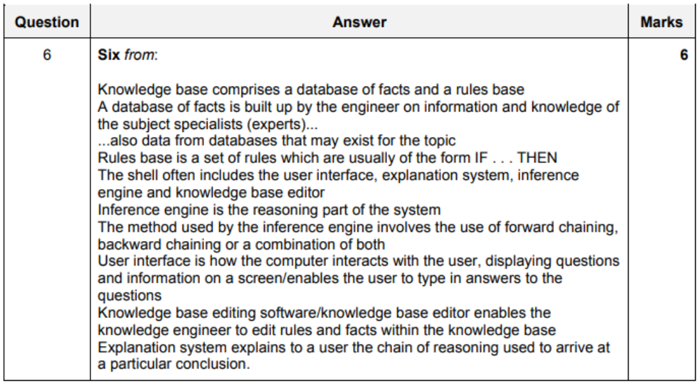

All Past Paper Questions: https://docs.google.com/document/d/14POvsigutX83XWY9ESokphmqd_9j19Bf3Z7973Wkm_A/edit?usp=sharing

## Expert Systems

- Components of an Exper System

## User Interface

- used for both input and output
- how computer interacts with the user

## Knowledge base

- comprises of database of facts
    - and a rules base 
- built up by the engineer on information 
- knowledge of subject specialists

### Knowledge base editing software

- enabled the knowledge engineer to edit rules and facts
    - of the knowledge base

### Knowledge engineer

- employeed to create an expert system

## Rules base

- set of rules 
- in the form: 'IF...THEN'

## Inference Engine

- reasoning part of the system

### Forward Chaining

- starts with available data
    - uses inferenece rules to extract more data
    - until a goal is reached
- use is to search the inference rules
    - until it finds a rule
    - then, uses the 'THEN' part
    - to cause addition of new information
- this is iterated repeatedly
    - until a goal is reached
- this is 'data-driven'

### Backward Chaining

- starts with a list of goals
    - and works backwards
- would search inference rules 
    - until it finds one
    - which has a 'THEN' part that matches a desired goal
- if the IF part of the rule is not false,
    - then it is added to the list of goals
- because the list of goals determines which rules are selected and used
- this is 'goal-driven'

## Explanation system

- explains to a user the chain of reasoning
- used to arrive at a particular conclusion

