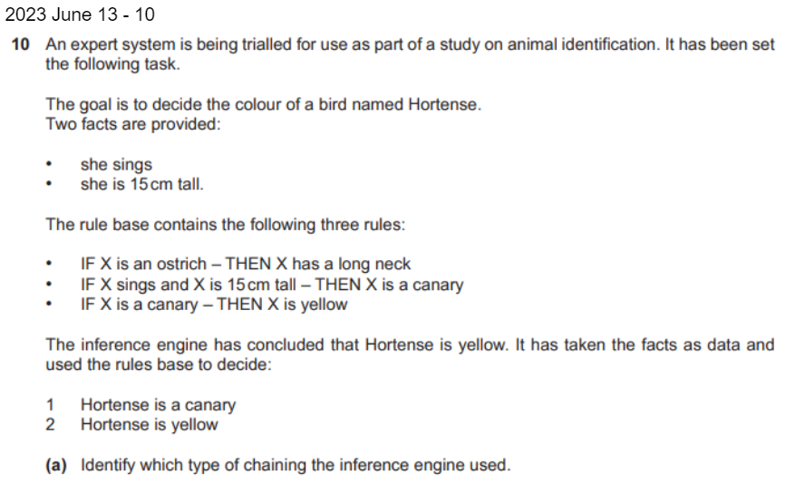
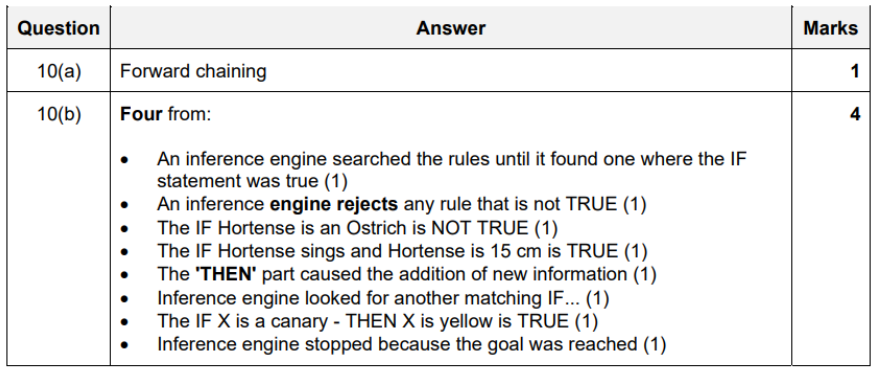

All Past Paper Questions: https://docs.google.com/document/d/14POvsigutX83XWY9ESokphmqd_9j19Bf3Z7973Wkm_A/edit?usp=sharing

## Expert Systems

- Components of an Expert System
    - knowledge base
        - has a database of facts and rules base
        - facts is built up by the engineer
            - on information and knowledge of the subject specialists
            - also from database that may exist for topic
        - rules base if a set of rules in the form: 'IF...THEN'
    - shell includes
        - user interface
        - explanation system 
            - explains the user
                - the chain of reasoning
                - used to arrive at a particular order
        - inference engine
        - knowledge base editor
            - enables knowledge engineer to edit rules and facts
                - of the knowledge base
    - inference engine does the reasoning
        - uses forward chaining
        - backward chaining
        - or both
    - user interface is how the computer interacts with the user
        - displaying questions
        - information on screens
        - enables user to type in answers

### Uses

- general answer
    - UI asks questions (about illness)
    - patient types in symptoms
    - rules base is a set of rules
    - the inference engine 
        - uses data/facts from knowledge base
        - is able to find possible diagnoses
            - by using a form of reasoning
            - uses forward reasoning or backwards chaining or both
        - compares symptoms to whats in knowledge base
            - uses rules base of 'IF...THEN'
    - knowledge base editor 
        - enables knowledge enginner to edit 
    - possible diagnoses output to user-interface
    - explanation system 
        - produces reasons for suggestions
        - and outputs to user-interface

- scheduling system to route vehicles
    - store locations of each distribution point
    - store type of vehicles being used 
    - store working hours
    - scheduler would type in destinations
    - system would match those against available types of vehicle
        - match against locations
    - suggest how many drivers would be needed
    - suggest vehicle needed for each driver
    - suggests allocation of orders to each vehicle
    - ?? suggest list of goods in reverse order ??
        - ?? so that, each vehicle had the first order loaded on to the vehicle last ?? 
    - system would take into account the fuel and time
    - outputs the most efficient rule 

## User Interface

- used for both input and output
- how computer interacts with the user
- description
    - allows user to enter problems
    - questions output by system
    - allows user to input answers to questions
    - further questions are output to the UI
        - based on previous answers
    - outputs suggestions of possible solutions
        - and explanation of findings

### Techinician

- Enters data using an interactive user interface
- questions based would be asked from techinician
- answers are entered to questions
- techinician would see probabilities of diagnoses output from the system

## Knowledge base

- comprises of database of facts
    - and a rules base 
- built up by the engineer on information 
- knowledge of subject specialists
- description
    - holds database of facts
    - that the interface engine searches
    - contains rules base
    - which consists of 'IF...THEN' constructs

### Knowledge base editing software

- enabled the knowledge engineer to edit rules and facts
    - of the knowledge base

### Knowledge engineer

- employeed to create an expert system
- responsible for maintaining the system
- edits facts in knowledge base
- edits rules in rules base part of knowledge base
- deleted unused rules from the rules base

### Rules base

- set of rules 
- in the form: 'IF...THEN'

## Inference Engine

- reasoning part of the system
- description
    - compares data to whats held in knowledge base
    - uses rules base, in the form of 'IF...THEN'
    - produces suggestions
    - uses explanation system to produce explanations
        - as how to solutions were arrived at 

### Forward Chaining

- starts with available data
    - uses inferenece rules to extract more data
    - until a goal is reached
- use is to search the inference rules
    - until it finds a rule
    - then, uses the 'THEN' part
    - to cause addition of new information
- rejects any rule that is not true
- this is iterated repeatedly
    - until a goal is reached
- this is 'data-driven'

### Backward Chaining

- starts with a list of goals
    - and works backwards
- would search inference rules 
    - until it finds one
    - which has a 'THEN' part that matches a desired goal
- if the IF part of the rule is not false,
    - then it is added to the list of goals
- this is 'goal-driven'
    - because list of goals determines which rules are selected and used

## Explanation system

- explains to a user the chain of reasoning
- used to arrive at a particular conclusion

## Managment Information Systems

- description
    - helps with decision making
    - help with project managment
    - gather and information about various aspects, like
        - personnel
        - sales
        - inventory
        - production
    - to create reports
    - to evaluvate company's performance
    - to compare reports (daily, weekly, monthly, anually)
    - to spot trends in revenue / growth / profit
    - to assist them in making predictions about company
