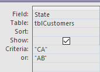
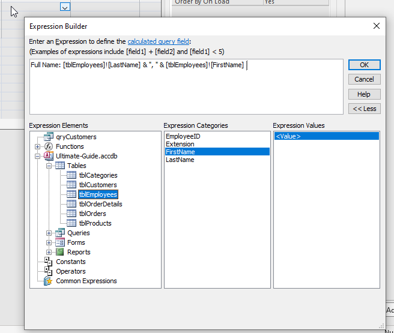
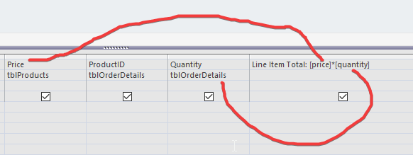
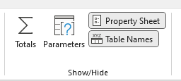
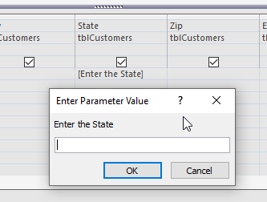
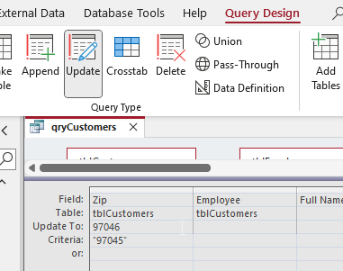

## Criteria

- NOTE: not case sensitive
- `"6969"` (exact match)
- `Like "6*"` (wild card)
- `"ABC" Or "CAD"` 
    - or, you can also do this:
    - 
- everything in the same row is "AND"
- `Like "[a-g]*"` (everything starting from a/A to g/G (inclusive) )

- right click on Field -> Build
    - 
    - then, add all the tables used
    

- can also mention others
    - 
    - anything before `:` (colon)
        - text / title
    - anything after `:` (colon)
        - calculation / what to display

- 
    - Property Sheet to format stuff
    - Table Names to manage what tables to choose from
    - Totals to get the Group By thing

- `[]`
    - 
    - get custom user input to query dynamically on runtime
    - whats `[` inside `]` is the prompt 

- Criteria: `Like "*" & [Enter Company Name (partial ok)] & "*"`
    - basically `*XXX*` where XXX is the user input

- Criteria: `Between [Enter start date] and [Enter end date]`
    - prompt user to input start date and end date
    - return everything between dates
    - (inlcusive)

- can change Query Type
    - to do all kinds of things
    - append:
    - 

## Reports

- Report Header/Footer
    - at front page and last page
- Page Header/Footer
    - at top and bottom on every page

## Input Mask

- `LLL0000`
    - `L` means letter
    - `0` means number 
