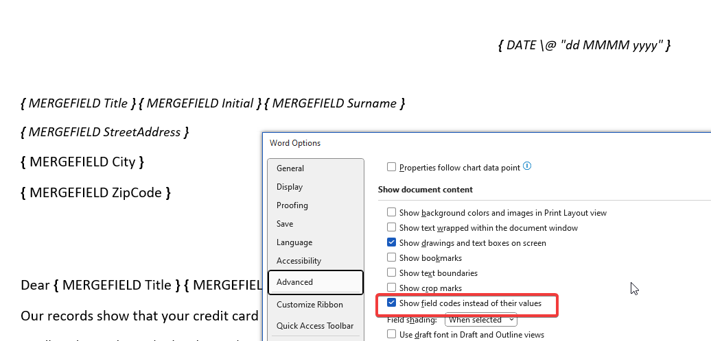
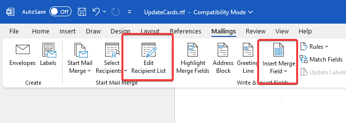
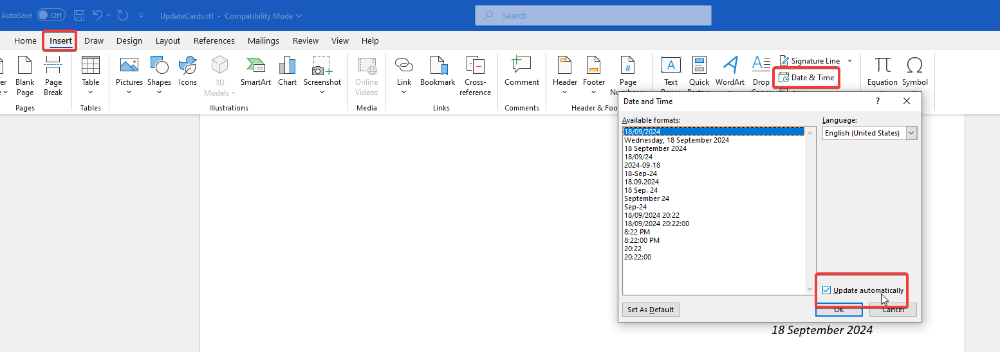

enable this in word to have this nice easy syntax:

basically, export stuff as an excel file from MS access using a custom query

select recipients and then insert merge fields

when inserting date (with auto update)

