## SUM

Learn more:

<iframe width="560" height="315" src="https://www.youtube.com/embed/1jakUHLzL6M?si=e3RMoz3fXtxT2KAj" title="YouTube video player" frameborder="0" allow="accelerometer; autoplay; clipboard-write; encrypted-media; gyroscope; picture-in-picture; web-share" referrerpolicy="strict-origin-when-cross-origin" allowfullscreen></iframe>

### `SUM`

Syntax: `=SUM(cell1:cell2)`

Summary: Sum/total of everything in range from cell1 to cell2. 

Paramaters:

- `cell1:cell2` 
    - is called a cell reference.

### `SUMIF`

Syntax: `=SUMIF(range, criteria, [sum_range])`

Summary: Sum if the given one criteria is met. 

Paramaters:

- `range` 
    - where your criteria sits
- `criteria`
    - what to search for
    - eg: `32`, `"32"`, `">32"`, `"Sales"`
- `[sum_range]`
    - optional
        - not used if we are going to sum the criteria range
        - eg: when comparing numbers. 
    - numbers to sum if condition met, from same table.

Examples:

`=SUMIF(c1:c9, ">1500")`

- sum salaries
- if salary is more than `1500`

`=SUMIF(c1:c9, "<1500")`

- sum salaries
- if salary is less than `1500`

`=SUMIF(a1:a9, "Sales", c1:c9)`

- explanation 1
    - `a1:a9` is job descriptions
    - if job description is `"Sales"`
    - then, sum `c1:c9`
- explanation 2
    - `a1:a9` is job descriptions
    - `c1:c9` is their salaries
    - sum the salaries of people in Sales

### `SUMIFS`

Syntax: `=SUMIF(sum_range, criteria_range1, criteria1, [criteria_range2, criteria2], ...)`

Summary: Sum if multiple conditions are met

Paramaters:

- `sum_range`
    - range of cells to sum from 
    - if conditions are met
- `criteria_range1`
    - where to look for the first condition
- `criteria1`
    - first condition
- `criteria_range2`
    - where to look for the second condition
- `criteria2`
    - second condition
- can have as many `criteria_rangeX` and `criteriaX` as possible

Examples:

- `a1:a9` is job descriptions
- `b1:b9` is gender
- `c1:c9` is salary

`=SUMIFS(c1:c9, a1:a9, "Sales", b1:b9, "Female")`

- sum salaries in `c1:c9`
- if person in Sales (if "`Sales`" in `a1:a9`) and
- if person is Female (if "`Female`" in `b1:b9`)
- (sum of salaries of every female working in Sales)

`=SUMIFS(c1:c9, a1:a9, "Sales", b1:b9, "Female", c1:c9, ">1500")`

- sum salaries in `c1:c9`
- if person in Sales (if "`Sales`" in `a1:a9`) and
- if person is Female (if "`Female`" in `b1:b9`) and
- if person's salary is greater than 1500 (if `c1:c9` is `>1500`)
- (sum of salaries of every female working in Sales who earns more than 1500)

## COUNT

Learn more:

<iframe width="560" height="315" src="https://www.youtube.com/embed/5RFLncJuMng?si=SPXGME1CrXWE_aGz" title="YouTube video player" frameborder="0" allow="accelerometer; autoplay; clipboard-write; encrypted-media; gyroscope; picture-in-picture; web-share" referrerpolicy="strict-origin-when-cross-origin" allowfullscreen></iframe>

### `COUNT`

Syntax: `=COUNT(range, [range2], ...)`

Summary: Count the number of cells with numbers only

Parameters:

- `range`
    - a cell range reference
    - eg: `c1:c9`
- `[range2]`
    - other ranges to count from

Examples:

`=COUNT(c1:c9)`

- the number of cells with numbers in range `c1:c9`
- 
- not 9, its 7
- two cells are not counted
    - 2nd cell: empty
    - 5th cell: has text (not a number)

### `COUNTA`

Syntax: `=COUNTA(range, [range2], ...)`

Summary: Count the number of cells with both numbers and letters (alpha characters) only. Bascially alpha-numeric.

Parameters:

- `range`
    - a cell range reference
    - eg: `c1:c9`
- `[range2]`
    - other ranges to count from

Examples:

`=COUNTA(c1:c9)`

- the number of cells with both numbers and letters 
    - in range `c1:c9`

- only one cell is not counted
    - 2nd cell: empty
- the 5th cell is counter, because its alpha-numeric (has letters).

`=COUNTA(c1:c9, b1:b9)`

- the number of cells with both numbers and letters 
    - in ranges `c1:c9`
    - and range `b1:b9`

- answer is `17`
    - `9` (from `b1:b9`)
        - everything is counted
    - \+ `8` (from `c1:c9`)
        - only the empty cell is not counted
        - everything else is counted
    - `9 + 8 = 17`  

### `COUNTBLANK`

Syntax: `=COUNTBLANK(range)`

Summary: Count the number of empty/blank cells.

Parameters:

- `range`
    - a cell range reference
    - eg: `c1:c9`

Examples:

`=COUNTBLANK(c1:c9)`

- the number of blank cells
    - in range: `c1:c9`

- only the cell is 2nd row is empty

### `COUNTIF`

Syntax: `=COUNTIF(range, criteria)`

Summary: Count the number of cells that meets the given condition from the given range

Parameters:

- `range`
    - a cell range reference
    - eg: `c1:c9`
- `criteria`
    - the condition to meet to count

Examples:

- `a1:a9` is job descriptions
- `b1:b9` is gender
- `c1:c9` is salary

`=COUNTIF(c1:c9, ">1500")`

- count number of cells (people)
- that earns more than "`>1500`"

`=COUNTIF(b1:b9, "Female")`

- count the number of cells (people)
- if gender is "Female"
- basically, the number of female employees

### `COUNTIFS`

Syntax: `=COUNTIFS(range, criteria, [range2, criteria2], ...)`

Summary: Count the number of cells that meets the given condition from the given range

Parameters:

- `range`
    - a cell range reference
    - eg: `c1:c9`
- `criteria`
    - the condition to meet for `range`
- `range2`
    - a cell range reference
    - eg: `b1:b9`
- `criteria2`
    - the condition to meet for `range2`
- can have as many `rangeX` and `criteriaX` as possible

Examples:

- `a1:a9` is job descriptions
- `b1:b9` is gender
- `c1:c9` is salary

`=COUNTIFS(b1:b9, "Female", c1:c9, ">1500")`

- count of cells (people)
- where gender is Female
- where salary is greater than 1500 
- basically, females who earn more than 1500

`=COUNTIFS(a1:a9, "Sales", b1:b9, "Female", c1:c9, ">1500")`

- count of cells (people)
- where job description is Sales
- where gender is Female
- where salary is greater than 1500 
- basically, females working in Sales who earn more than 1500

## AVERAGE

Learn more:

<iframe width="560" height="315" src="https://www.youtube.com/embed/QROdEqL1T3E?si=q397Zb8SZEf_vlWC" title="YouTube video player" frameborder="0" allow="accelerometer; autoplay; clipboard-write; encrypted-media; gyroscope; picture-in-picture; web-share" referrerpolicy="strict-origin-when-cross-origin" allowfullscreen></iframe>

### `AVERAGE`

Syntax: `=AVERAGE(range, [range2], ...)`

Summary: Average of everything in the selected range(s). 

Paramaters:

- `range` 
    - range to calculate average of.
    - eg: `c1:c9`
- `[range2]`
    - other ranges to calculate average of

Examples:

- `a1:a9` is job descriptions
- `b1:b9` is gender
- `c1:c9` is salary
- `d1:d9` is bonus

`=AVERAGE(c1:c9)`

- average of all numerical values in range `c1:c9`

`=AVERAGE(c1:c9, d1:d9)`

- average of all numerical values 
    - in range `c1:c9`
    - and range `d1:d9`

### `AVERAGEIF`

Syntax: `=AVERAGEIF(range, criteria, [average_range])`

Summary: Average of everything in the selected range(s). 

Paramaters:

- `range` 
    - is called a cell reference.
    - eg: `c1:c9`
- `criteria`
    - condition to check in `range`
- `[average_range]`
    - optional
        - not used if we are going to sum the criteria range
        - when comparing numbers
    - numbers to average if condition is met, from same table.

Examples:

- `a1:a9` is job descriptions
- `b1:b9` is gender
- `c1:c9` is salary
- `d1:d9` is bonus

`=AVERAGEIF(c1:c9, ">1500")`

- calculate average of salaries
- if salary is greater than 1500

`=AVERAGEIF(c1:c9, ">1500", d1:d9)`

- calculate average of bonuses
- if person's salary is greater than 1500

`=AVERAGEIF(a1:a9, "Sales", c1:c9)`

- calculate average of salaries
- if person works in Sales

### `AVERAGEIFS`

Syntax: `=AVERAGEIFS(average_range, criteria_range1, criteria1, [criteria_range2, criteria2], ...)`

Summary: Average if multiple conditions are met

Paramaters:

- `average_range`
    - range of cells to average from 
    - if conditions are met
- `criteria_range1`
    - where to look for the first condition
- `criteria1`
    - first condition
- `criteria_range2`
    - where to look for the second condition
- `criteria2`
    - second condition
- can have as many `criteria_rangeX` and `criteriaX` as possible

Examples:

- `a1:a9` is job descriptions
- `b1:b9` is gender
- `c1:c9` is salary
- `d1:d9` is bonus

`=AVERAGEIFS(c1:c9, a1:a9, "Sales", b1:b9, "Female")`

- average salaries in `c1:c9`
- if person in Sales (if "`Sales`" in `a1:a9`) and
- if person is Female (if "`Female`" in `b1:b9` )
- (average of salaries of every female working in Sales)

`=AVERAGEIFS(c1:c9, a1:a9, "Sales", b1:b9, "Female", c1:c9, ">1500")`

- average salaries in `c1:c9`
- if person in Sales (if "`Sales`" in `a1:a9`) and
- if person is Female (if "`Female`" in `b1:b9`) and
- if person's salary is greater than 1500 (if `c1:c9` is `>1500`)
- (average of salaries of every female working in Sales who earns more than 1500)

## MIN

### `MIN`

Syntax: `=MIN(range, [range2], ...)`

Summary: Get the minimum value of everything in the selected range(s) with numerical values. 

Paramaters:

- `range` 
    - range to find minimum value of.
    - should only have numerican data values
    - eg: `c1:c9`
- `[range2]`
    - other ranges with numerical vata to find minimum value of

Examples:

`=MIN(c1:c9)`

- minimum numerical value in cell range `c1:c9`

`=MIN(c1:c9, d1:d9)`

- minimum numerical value 
    - in cell range `c1:c9`
    - and `d1:d9`

### `MINA`

No idea about this.

### `MINIFS`

Syntax: `=MINIFS(min_range, criteria_range1, crtieria1, [criteria_range2, crtieria2], ...)`

Summary: Get the minimum value of everything in the selected range(s) with numerical values if given conditions are met. 

Paramaters:

- `min_range`
    - cell range to select minimum value from
- `criteria_range1`
    - where to look for first condition
- `criteria1`
    - first condition
- `criteria_range2`
    - where to look for the second condition
- `criteria2`
    - second condition
- can have as many `criteria_rangeX` and `criteriaX` as possible

Examples:

- `a1:a9` is job descriptions
- `b1:b9` is gender
- `c1:c9` is salary
- `d1:d9` is bonus

`=MINIFS(C1:C9, A1:A9, "Tech")`

- minimum value in range `C1:C9`
- if department is Tech (`A1:A9` vale in Tech)
- (minimum salary of a Tech employee)

`=MINIFS(C1:C9, A1:A9, "Tech", D1:D9, ">1500")`

- minimum value in range `C1:C9`
- if department is Tech (`A1:A9` value in Tech)
- if bonus is greater than 1500 (in range `D1:D9`)
- (minimum salary of a Tech employee if bonus is greater than 1500)

## MAX

### `MAX`

Syntax: `=MAX(range, [range2], ...)`

Summary: Get the maximum value of everything in the selected range(s) with numerical values. 

Paramaters:

- `range` 
    - range to find maximum value of.
    - should only have numerican data values
    - eg: `c1:c9`
- `[range2]`
    - other ranges with numerical vata to find maximum value of

Examples:

`=MAX(c1:c9)`

- maximum numerical value in cell range `c1:c9`

`=MAX(c1:c9, d1:d9)`

- maximum numerical value 
    - in cell range `c1:c9`
    - and `d1:d9`

### `MAXA`

No idea about this.

### `MAXIFS`

Syntax: `=MAXIFS(min_range, criteria_range1, crtieria1, [criteria_range2, crtieria2], ...)`

Summary: Get the maximum value of everything in the selected range(s) with numerical values if given conditions are met. 

Paramaters:

- `min_range`
    - cell range to select maximum value from
- `criteria_range1`
    - where to look for first condition
- `criteria1`
    - first condition
- `criteria_range2`
    - where to look for the second condition
- `criteria2`
    - second condition
- can have as many `criteria_rangeX` and `criteriaX` as possible

Examples:

- `a1:a9` is job descriptions
- `b1:b9` is gender
- `c1:c9` is salary
- `d1:d9` is bonus

`=MAXIFS(C1:C9, A1:A9, "Tech")`

- maximum value in range `C1:C9`
- if department is Tech (`A1:A9` vale in Tech)
- (maximum salary of a Tech employee)

`=MAXIFS(C1:C9, A1:A9, "Tech", D1:D9, ">1500")`

- maximum value in range `C1:C9`
- if department is Tech (`A1:A9` value in Tech)
- if bonus is greater than 1500 (in range `D1:D9`)
- (maximum salary of a Tech employee if bonus is greater than 1500)

## MAX

## ROUND

### `ROUND`

Syntax: `=ROUND(number, num_digits)`

Summary: Rounds the decimal places of a number by the specified number

Paramaters:

- `number`
    - a number 
    - a cell reference containing a number
- `num_digits`
    - number of decimal places
    - to round off to

Examples:

- `c1` has 14.7261

`=ROUND(c1, 2)` or `=ROUND(14.7261, 2)`

- result: `14.73`
- `num_digits` is 2, so, rounds off to 2 decimal places

### `ROUNDUP`

Syntax: `=ROUNDUP(number, num_digits)`

Summary: Rounds a number up.

- `number`
    - a number 
    - a cell reference containing a number
- `num_digits`
    - number of decimal places
    - to round up to

Examples:

- `c1` has 14.7261

`=ROUNDUP(c1, 1)` or `=ROUNDUP(14.7261, 1)`

- result: `14.8`
- `num_digits` is 1, so, rounds up to 1 decimal places

For easy understanding, consider the set of examples below:

- `=ROUNDUP(13.9, 0)` ---> `14`
- `=ROUNDUP(14.0, 0)` ---> `14`
- `=ROUNDUP(14.1, 0)` ---> `15`
- and
- `=ROUNDUP(14.1, 1)` ---> `14.1`
- `=ROUNDUP(14.11, 1)` ---> `14.2`
- `=ROUNDUP(14.12, 1)` ---> `14.2`
- ...
- `=ROUNDUP(14.19, 1)` ---> `14.2`
- `=ROUNDUP(14.2, 1)` ---> `14.2`
- `=ROUNDUP(14.21, 1)` ---> `14.3`
- ...
- `=ROUNDUP(14.13, 2)` ---> `14.13`
- `=ROUNDUP(14.131, 2)` ---> `14.14`

### `ROUNDDOWN`

Syntax: `=ROUNDDOWN(number, num_digits)`

Summary: Rounds a number down

- `number`
    - a number 
    - a cell reference containing a number
- `num_digits`
    - number of decimal places
    - to round down to

Examples:

- `c1` has 14.7261

`=ROUNDDOWN(c1, 1)` or `=ROUNDDOWN(14.7261, 1)`

- result: `14.7`
- `num_digits` is 1, so, rounds down to 1 decimal places

For easy understanding, consider the set of examples below:

- `=ROUNDDOWN(13.9, 0)` ---> `13`
- `=ROUNDDOWN(14.0, 0)` ---> `14`
- `=ROUNDDOWN(14.1, 0)` ---> `14`
- and
- `=ROUNDDOWN(14.1, 1)` ---> `14.1`
- `=ROUNDDOWN(14.11, 1)` ---> `14.1`
- `=ROUNDDOWN(14.12, 1)` ---> `14.1`
- ...
- `=ROUNDDOWN(14.19, 1)` ---> `14.1`
- `=ROUNDDOWN(14.2, 1)` ---> `14.2`
- `=ROUNDDOWN(14.21, 1)` ---> `14.2`
- ...
- `=ROUNDDOWN(14.13, 2)` ---> `14.13`
- `=ROUNDDOWN(14.131, 2)` ---> `14.13`

## Data Checking

Learn more: 

<iframe width="560" height="315" src="https://www.youtube.com/embed/HbnCagPSi3w?si=-ug9Ybedkkkjp7Ah" title="YouTube video player" frameborder="0" allow="accelerometer; autoplay; clipboard-write; encrypted-media; gyroscope; picture-in-picture; web-share" referrerpolicy="strict-origin-when-cross-origin" allowfullscreen></iframe>

Examples: 

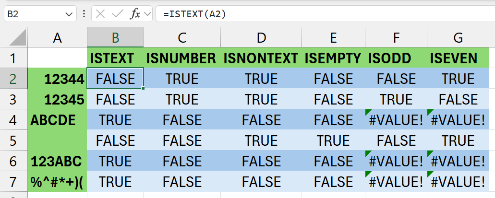

### `ISTEXT`

Syntax: `=ISTEXT(value)`

Summary: TRUE if it only has text, else FALSE 

Parameters:

- `value`
    - a cell reference or a hard coded value
    - this is what will be checked

### `ISNUMBER`

Syntax: `=ISNUMBER(value)`

Summary: TRUE if it only has numbers, else FALSE 

Parameters:

- `value`
    - a cell reference or a hard coded value
    - this is what will be checked

### `ISNONTEXT`

Syntax: `=ISNONTEXT(value)`

Summary: Check if a value is not text. Blank cells are not text. Returns TRUE or FALSE accordingly.

Parameters:

- `value`
    - a cell reference or a hard coded value
    - this is what will be checked

### `ISBLANK`

Syntax: `=ISBLANK(value)`

Summary: TRUE if its blank, else FALSE 

Parameters:

- `value`
    - a cell reference or a hard coded value
    - this is what will be checked

### `ISODD`

Syntax: `=ISODD(value)`

Summary: TRUE if it the number is odd, else FALSE 

Parameters:

- `value`
    - a cell reference or a hard coded value
    - this is what will be checked
    - must be a number

### `ISEVEN`

Syntax: `=ISEVEN(value)`

Summary: TRUE if it the number is even, else FALSE 

Parameters:

- `value`
    - a cell reference or a hard coded value
    - this is what will be checked
    - must be a number

## Text Manipulation

Learn more:

<iframe width="560" height="315" src="https://www.youtube.com/embed/tcineQX2xyM?si=5V2aWtlR3Yh1qRat" title="YouTube video player" frameborder="0" allow="accelerometer; autoplay; clipboard-write; encrypted-media; gyroscope; picture-in-picture; web-share" referrerpolicy="strict-origin-when-cross-origin" allowfullscreen></iframe>

### `CONCAT`

Syntax: `=CONCAT(text, ...)`

Summary: Concatenate/Join values together but with no seperation in middle. (like `print(*args, sep="")` in Python) 

Parameters:

- `text`
    - any cell references
        - ranges
            - but will get no space at middle (sep)
        - individual cells
    - hardcoded characters
    - anything...

Examples:

`=CONCAT(a15, " ", b15)`

- 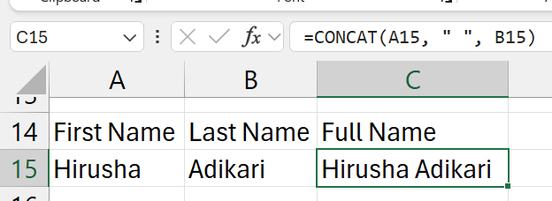
- contents of `a15` + `" "` contents of `b15`

### `LEFT`

Syntax: `=LEFT(text, [num_chars])`

Summary: Get the left most characters of a selected value.

Parameters:

- `text`
    - a single cell reference or a hard coded value
    - to extract the characters from
- `num_chars` 
    - the number of characters to extract
    - start counting from 1 (not from 0, like in programming languages)

Examples:

- assume `a1` has ABCD1290

`=LEFT(a1, 4)`

- would result in: `ABCD`

### `RIGHT`

Syntax: `=RIGHT(text, [num_chars])`

Summary: Get the right most characters of a selected value.

Parameters:

- `text`
    - a single cell reference or a hard coded value
    - to extract the characters from
- `num_chars` 
    - the number of characters to extract
    - start counting from 1 (not from 0, like in programming languages)

Examples:

- assume `a1` has ABCD1290

`=RIGHT(a1, 4)`

- would result in: `1290`

### `LEN`

Syntax: `=LEN(text)`

Summary: Count the number of characters. Like the `len()` function in Python.

Parameters:

- `text`
    - a single cell reference or a hard coded value
    - to count the number of characters of
    - if this cell
        - has a text
            - no. of characters in text is counted
        - has a number
            - no. of characters in number is counted
        - has a formula
            - no. of characters in the result is counted

Examples:

`=RIGHT(a2, LEN(a2)-3)`

- 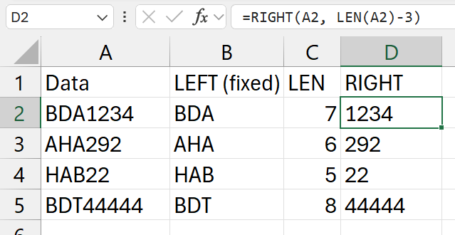
- in this example
    - the length of numeric part changes
    - so, to get the `RIGHT` part of it
    - we use the `LEN` function
- stages
    1. `LEN(a2)-3` -> `7-3` -> 4
    2. `=RIGHT(a2, 4)` -> get the right most 4 characters

### `FIND`

Syntax: `=FIND(find_text, within_text, [start_num])`

Summary: Find for something and return it's index.

Parameters:

- `find_text`
    - what character / set of characters to search for
- `within_text`
    - where to search
- `start_num`
    - optional
        - defaults to 0 (from very first character)
    - which charater to start counting from
    - if 0, and starts with "` `", it will return 1
    - if 1, and starts with "` `", it won't find it

Examples:

`=FIND(" ", a2)`

- 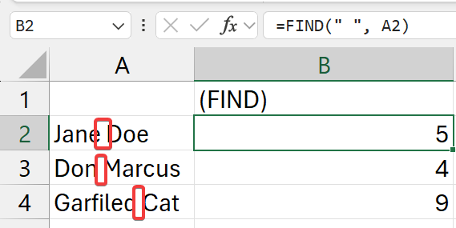
- find for a "` `" (space) in value in cell `a2`

`=LEFT(A2, B2)`

- 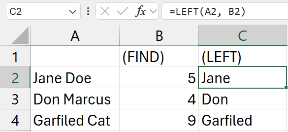
- get the first name
- `b2` is the cell with the index of the "` `" (space)

`=RIGHT(A2, LEN(A2)-B2)`

- 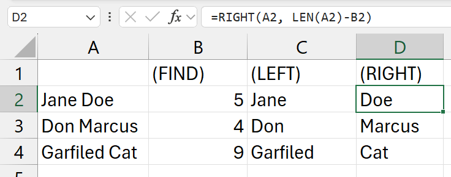
- get the last name
- similiar to the example of the [`LEN function`](#len)

### `MID`

Learn more: 

<iframe width="560" height="315" src="https://www.youtube.com/embed/MPqxvmI6zF4?si=JbXm77GLj9PuUsCa" title="YouTube video player" frameborder="0" allow="accelerometer; autoplay; clipboard-write; encrypted-media; gyroscope; picture-in-picture; web-share" referrerpolicy="strict-origin-when-cross-origin" allowfullscreen></iframe>

Syntax: `=MID(text, start_num, num_chars)`

Summary: Returns characters from the middle, given a starting position and length

Parameters:

- `text`
    - source text to use
    - can be a single cell reference or a hardcoded value
    - works with both numbers and strings
- `start_num`
    - index of the character to go to
    - bring the pointer here (from left)
    - value at his index is inclusive to our selection/stripping
- `num_chars`
    - and move the pointer this many times to the right (from left)

Basically, `num_chars` characters starting from the `start_num` index of `text` (from left to right, as usual)

Examples:

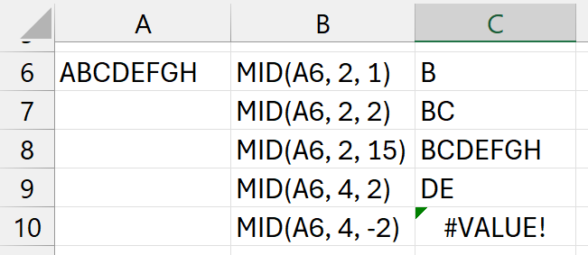

- `num_chars` being negative 
    - doesn't mean it will 
    - go from right to left
    - it will error out (eg: `C10`) 

### `UPPER`

Syntax: `=UPPER(value)`

Summary: Converts a text string to all uppercase letters. Numbers will remain as it is. 

Parameters:

- `value`
    - a cell reference or a hard coded value
    - this is what will be converted

Examples: Mentioned in the example with [`LOWER` function](#lower)

### `LOWER`

Syntax: `=LOWER(value)`

Summary: Converts a text string to all lowercase letters. Numbers will remain as it is. 

Parameters:

- `value`
    - a cell reference or a hard coded value
    - this is what will be converted

Examples:

`=UPPER(A11)` and `=LOWER(A11)`

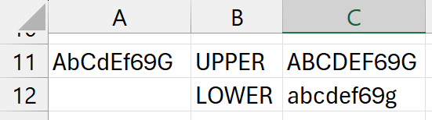

### `EXACT`

Syntax: `=EXACT(text1, text2)`

Summary: Checks whether two values are exactly the same and returns TRUE or FALSE accordingly. This is case sensitive. 

Parameters:

- `text1`
    - first value to compare
- `text2`
    - second value to compare

Examples:

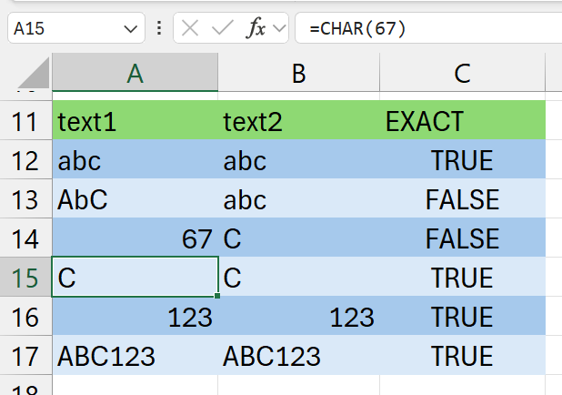

## Lookup (Basic)

### `LOOKUP`

### `VLOOKUP`

### `HLOOKUP`

### `XLOOKUP`

## Lookup (Advanced)

### `INDEX`

Syntax: `=INDEX(array, row_num, [col_num], ...)`

Summary: Get the value in a selected cell range using an index for columns and rows. Value from Index

Parameters:

- `array`
    - cell reference range
    - either one dimentional (only a row or a column)
    - or two dimentional (a table)
- `row_num`
    - number of row 
    - start countng from 1
- `col_num`
    - optional
        - only if `array` is two dimentional (a table)
    - number of column 
    - start countng from 1

Examples:

`=INDEX(b2:b10, 6)`

- 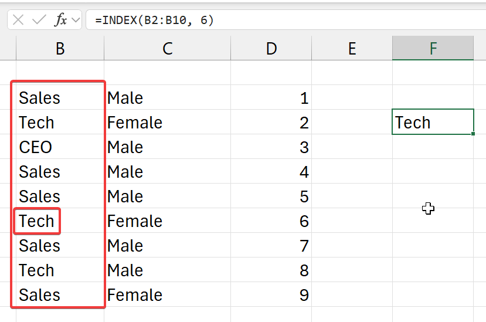
- from the top left corner (of selected row)
    - go 6 cells down (rows)
- and get its value

`=INDEX(b2:d4, 2)`

- 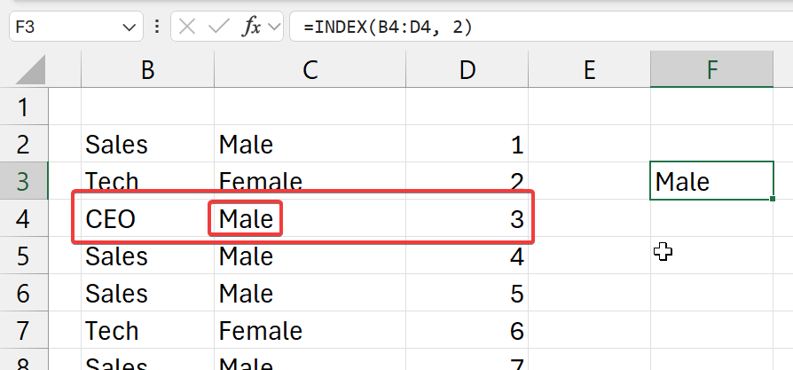
- from the top left corner (of selected column)
    - go 2 cells right (columns)
- and get its value

`=INDEX(b2:d10, 3, 2)`

- 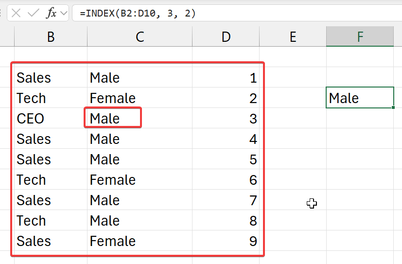
- (this proves that it doesn't count from A1)
- from the top left corner (of selected array of cells)
    - go 3 cells down (rows)
    - go 2 cells right (columns)
- and get the value at that index
- from this selected table

### `OFFSET` (Basic)

Syntax: `=OFFSET(refernce, rows, cols)`

Summary: Get the value at an offset of rows and columns from a selected cell. Value from Index

Parameters:

- `array`
    - cell to start moving from
- `rows`
    - number of rows to go down
- `cols`
    - number of columns to go right

Examples:

`=OFFSET(b3, 3, 1)`

- 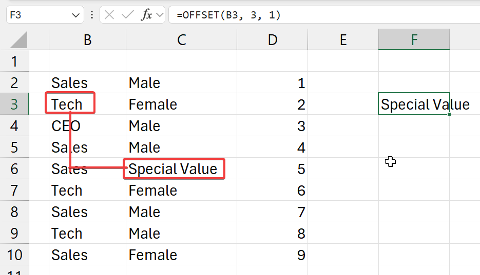
- start from cell `b3`
    - go 3 cells down (rows)
    - go 1 cell right (columns)
- and get that value

### `OFFSET` (Advanced)

Syntax: `=OFFSET(refernce, rows, cols, [height], [width])`

Summary: Get the value at an offset of rows and columns from a selected cell. Value from Index

Parameters:

- `array`
    - cell to start moving from
- `rows`
    - number of rows to go down
- `cols`
    - number of columns to go right

Examples:

`=OFFSET(b3, 3, 1, 3, 2)`

- 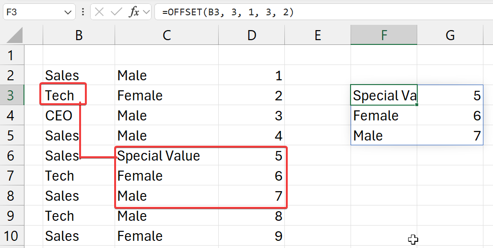
- start from cell `b3`
    - go 3 cells down (rows)
    - go 1 cell right (columns)
- and get values
    - of 3 rows
    - and 2 columns

Compound usage: these functions are used with another function most of the time.

`=SUM(OFFSET(b3, 3, 1, 3, 2))`

- 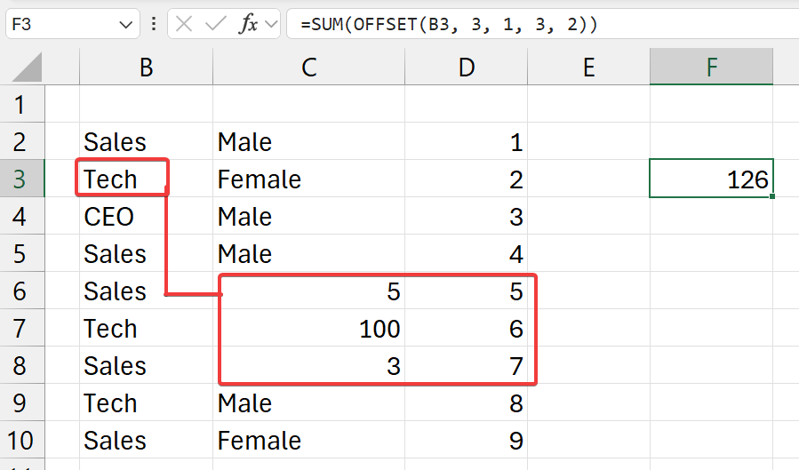
- start from cell `b3`
    - go 3 cells down (rows)
    - go 1 cell right (columns)
- and get values
    - of 3 rows
    - and 2 columns
- and `SUM` all of it

### `MATCH`

Syntax: `=MATCH(lookup_value, lookup_array, match_type)`

Summary: Get the index of a value in the specified cell reference range. Index from Value 

Parameters:

- `lookup_value`
    - what to search for 
    - index of this will be returned
- `lookup_array`
    - where to search for
- `match_type`
    - values
        - `1`: Less than
        - `0`: Exact match
        - `-1`: Greater than

Examples:

`=MATCH("CEO", b2:b10, 0)`

- 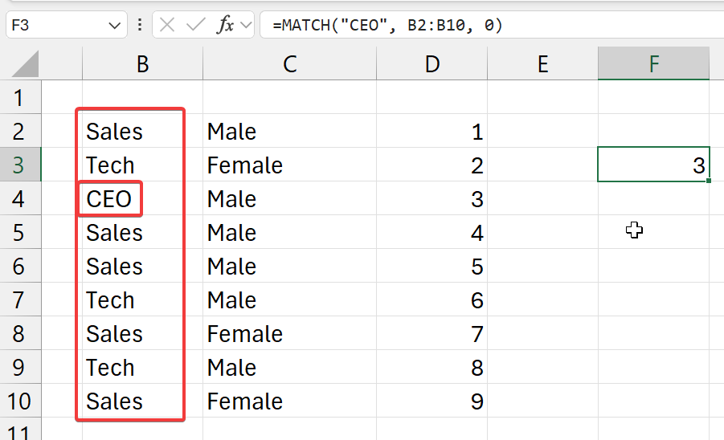
- select an exact match (`0`)
- from the selected cell range (column) (`b2:b10`)
- and get the index of where `CEO` is to be found 

`=MATCH("Tech", b2:b10, 0)`

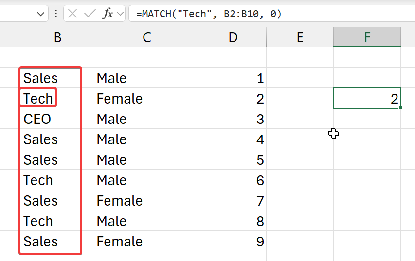
- select an exact match (`0`)
- from the selected cell range (column) (`b2:b10`)
- and get the index of where `Tech` is to be found 
- NOTE:
    - can be found 3 times
    - only the index of first time is given 

### `INDEX(MATCH)` Combined Usage

Example:

`=INDEX(A1:D7, MATCH($G$2, B1:B7, 0), 3)`

- 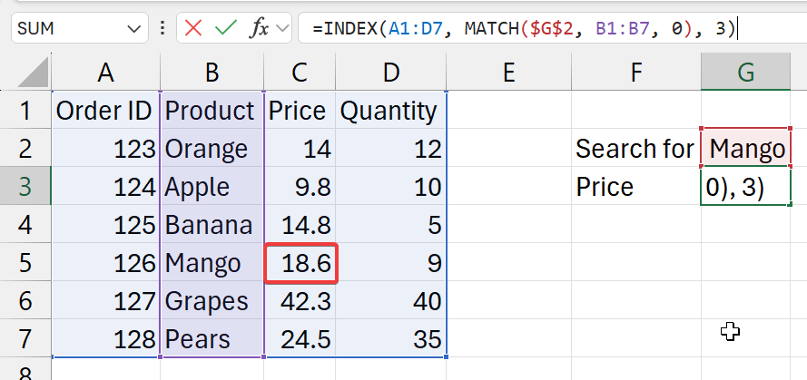
- where
    - `$G$2` is the search field (set with absolute cell referencing)
    - `A1:D7` is the full table (with data), **including titles**
    - `3` is the column with the pricing information
- functions breakdown
    1. `MATCH($G$2, B1:B7, 0)`
        - get (input) value from G2 cell
        - look for and exact match for this (input) value 
        - in `B1:B7` cell range
            - as the selected table also includes titles
            - make sure select he titles here as well
        - and get it's index
    2. `=INDEX(A1:D7, XXX, 3)`
        - in the table `A1:D7`
            - go `XXX` number of cells down (from stage 1) (rows)
            - then, 3 cells to right (columns) 
        - return its value

BUT, in the above example, we hardcode the column index ourselves. It's hard to find it and we will have to change stuff if the column order is changed in the table. Also, we can lookup for other stuff (like Quantity) easily without having to write new formulas. So, we will get the column index dynamically. 

`=INDEX(A1:D7, MATCH($G$2, B1:B7, 0), MATCH($G$1, A1:D1, 0))`

- 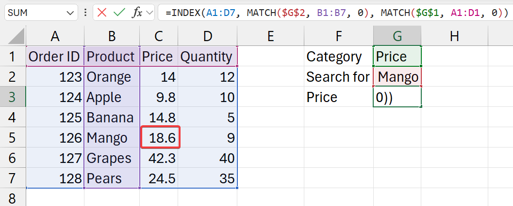
- where
    - `$G$1` is the catgeory field (set with absolute cell referencing). This mentions to catgeory to return from result.
    - `$G$2` is the search field (set with absolute cell referencing). This mentions what to search for.
    - `A1:D7` is the full table (with data), **including titles**
    - `3` is the column with the pricing information
- functions breakdown
    1. `MATCH($G$2, B1:B7, 0)`
        - get (input) value from G2 cell
        - look for and exact match for this (input) value 
        - in `B1:B7` cell range
            - as the selected table also includes titles
            - make sure select he titles here as well
        - and get it's index
    2. `MATCH($G$1, A1:D1, 0)`
        - get (input) value from G1 cell
        - look for and exact match for this (input) value 
        - in `A1:D1` cell range (titles row)
    3. `=INDEX(A1:D7, XXX, YYY)`
        - in the table `A1:D7`
            - go `XXX` number of cells down (from stage 1) (rows)
            - then, `YYY` cells to right (from stage 2) (columns) 
        - return its value

## CS Data Types Stuff

Examples: 

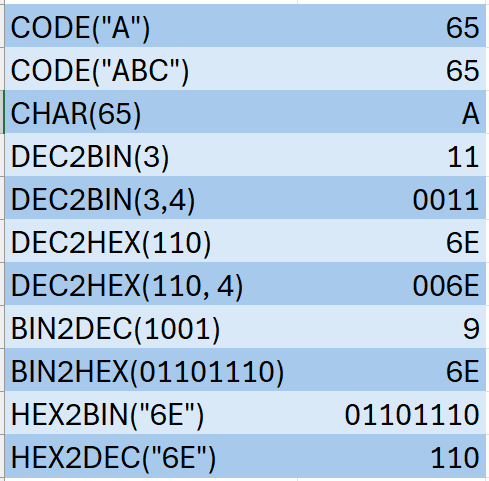

### `CODE`

Syntax: `=CODE(value)`

Summary: Returns the numeric code for the first character in a text string. Numeric code will be from the character set used by the computer.

Parameters: 

- `value`
    - a single cell reference or a hard coded value
    - if it has many characters
        - only the first character is considered/used

### `CHAR`

Syntax: `=CHAR(value)`

Summary: Returns the character specified by the code number from the character set of your computer.

Parameters: 

- `value`
    - a single cell reference or a hard coded value

### `DEC2BIN`

Syntax: `=DEC2BIN(number, [places])`

Summary: Convert a decimal number to binary form.

Parameters: 

- `number`
    - a single cell reference or a hard coded value
    - a number
    - this number is what will be converted
- `places`
    - like the word length
    - add zeros to the front 
    - to get the binary number to the required length

### `DEC2HEX`

Syntax: `=DEC2HEX(number, [places])`

Summary: Convert a decimal number to hexadecimal form.

Parameters: 

- `number`
    - a single cell reference or a hard coded value
    - a number
    - this number is what will be converted
- `places`
    - like the word length
    - add zeros to the front 
    - to get the hex number to the required length

### `BIN2DEC`

Syntax: `=BIN2DEC(number)`

Summary: Convert a binary number to decimal form.

Parameters: 

- `number`
    - a single cell reference or a hard coded value
    - a number
    - this number is what will be converted

### `BIN2HEX`

Syntax: `=BIN2HEX(number, [places])`

Summary: Convert a binary number to hexadecimal form.

Parameters: 

- `number`
    - a single cell reference or a hard coded value
    - a number
    - this number is what will be converted
- `places`
    - like the word length
    - add zeros to the front 
    - to get the hex number to the required length

### `HEX2BIN`

Syntax: `=BIN2HEX(number, [places])`

Summary: Convert a hexadecimal number to binary form.

Parameters: 

- `number`
    - a single cell reference or a hard coded value
    - a number
    - this number is what will be converted
- `places`
    - like the word length
    - add zeros to the front 
    - to get the hex number to the required length

### `HEX2DEC`

Syntax: `=HEX2DEC(number)`

Summary: Convert a hexadecimal number to decimal form.

Parameters: 

- `number`
    - a single cell reference or a hard coded value
    - a number
    - this number is what will be converted

## Datetime

### `WEEKDAY`

### `DAY`

### `MONTH`

### `YEAR`

### `DATEDIF`

### `HOUR`

### `MINUTE`

### `SECOND`

