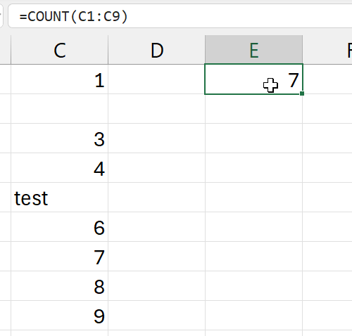
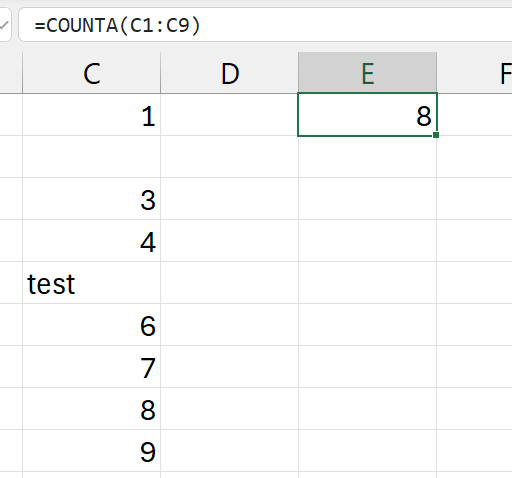
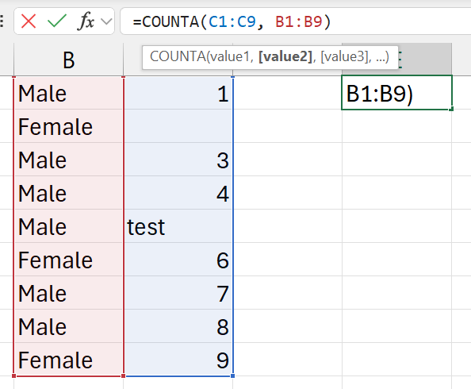
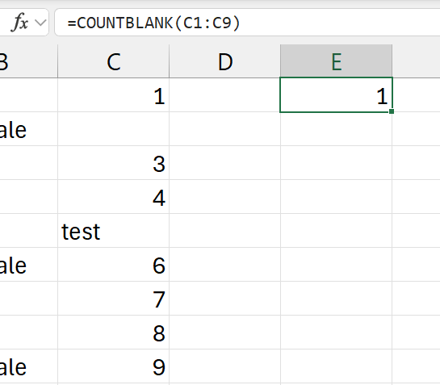

## SUM

### `SUM`

Syntax: `=SUM(cell1:cell2)`

Summary: Sum/total of everything in range from cell1 to cell2. 

Paramaters:

- `cell1:cell2` 
    - is called a cell reference.

### `SUMIF`

Syntax: `=SUMIF(range, criteria, [sum_range])`

Summary: Sum if the given one criteria is met. 

Paramaters:

- `range` 
    - where your criteria sits
- `criteria`
    - what to search for
    - eg: `32`, `"32"`, `">32"`, `"Sales"`
- `[sum_range]`
    - optional
        - not used if we are going to sum the criteria range
        - eg: when comparing numbers. 
    - numbers to sum if condition met, from same table.

Examples:

`=SUMIF(c1:c9, ">1500")`

- sum salaries
- if salary is more than `1500`

`=SUMIF(c1:c9, "<1500")`

- sum salaries
- if salary is less than `1500`

`=SUMIF(a1:a9, "Sales", c1:c9)`

- explanation 1
    - `a1:a9` is job descriptions
    - if job description is `"Sales"`
    - then, sum `c1:c9`
- explanation 2
    - `a1:a9` is job descriptions
    - `c1:c9` is their salaries
    - sum the salaries of people in Sales

### `SUMIFS`

Syntax: `=SUMIF(sum_range, criteria_range1, criteria1, [criteria_range2, criteria2], ...)`

Summary: Sum if multiple ranges are met

Paramaters:

- `sum_range`
    - range of cells to sum from 
    - if conditions are met
- `criteria_range1`
    - where to look for the first condition
- `criteria1`
    - first condition
- `criteria_range2`
    - where to look for the second condition
- `criteria2`
    - second condition
- can have as many `criteria_rangeX` and `criteriaX` as possible

Examples:

- `a1:a9` is job descriptions
- `b1:b9` is gender
- `c1:c9` is salary

`=SUMIFS(c1:c9, a1:a9, "Sales", b1:b9, "Female")`

- sum salaries: `c1:c9`
- if person in Sales (if "`Sales`" in `a1:a9`) and
- if person is Female (if "`Female`" in `b1:b9`)
- (sum of salaries of every female working in Sales)

`=SUMIFS(c1:c9, a1:a9, "Sales", b1:b9, "Female", c1:c9, ">1500")`

- sum salaries: `c1:c9`
- if person in Sales (if "`Sales`" in `a1:a9`) and
- if person is Female (if "`Female`" in `b1:b9`) and
- if person's salary is greater than 1500 (if `c1:c9` is `>1500`)
- (sum of salaries of every female working in Sales who earns more than 1500)

## COUNT

### `COUNT`

Syntax: `=COUNT(range, [range2], ...)`

Summary: Count the number of cells with numbers only

Parameters:

- `range`
    - a cell range reference
    - eg: `c1:c9`
- `[range2]`
    - other ranges to count from

Examples:

`=COUNT(c1:c9)`

- the number of cells with numbers in range `c1:c9`
- 
- not 9, its 7
- two cells are not counted
    - 2nd cell: empty
    - 5th cell: has text (not a number)

### `COUNTA`

Syntax: `=COUNTA(range, [range2], ...)`

Summary: Count the number of cells with both numbers and letters (alpha characters) only. Bascially alpha-numeric.

Parameters:

- `range`
    - a cell range reference
    - eg: `c1:c9`
- `[range2]`
    - other ranges to count from

Examples:

`=COUNTA(c1:c9)`

- the number of cells with both numbers and letters 
    - in range `c1:c9`

- only one cell is not counted
    - 2nd cell: empty
- the 5th cell is counter, because its alpha-numeric (has letters).

`=COUNTA(c1:c9, b1:b9)`

- the number of cells with both numbers and letters 
    - in ranges `c1:c9`
    - and range `b1:b9`

- answer is `17`
    - `9` (from `b1:b9`)
        - everything is counted
    - \+ `8` (from `c1:c9`)
        - only the empty cell is not counted
        - everything else is counted
    - `9 + 8 = 17`  

### `COUNTBLANK`

Syntax: `=COUNTBLANK(range)`

Summary: Count the number of empty/blank cells.

Parameters:

- `range`
    - a cell range reference
    - eg: `c1:c9`

Examples:

`=COUNTBLANK(c1:c9)`

- the number of blank cells
    - in range: `c1:c9`

- only the cell is 2nd row is empty

### `COUNTIF`

Syntax: `=COUNTIF(range, criteria)`

Summary: Count the number of cells that meets the given condition from the given range

Parameters:

- `range`
    - a cell range reference
    - eg: `c1:c9`
- `criteria`
    - the condition to meet to count

Examples:

- `a1:a9` is job descriptions
- `b1:b9` is gender
- `c1:c9` is salary

`=COUNTIF(c1:c9, ">1500")`

- count number of cells (people)
- that earns more than "`>1500`"

`=COUNTIF(b1:b9, "Female")`

- count the number of cells (people)
- if gender is "Female"
- basically, the number of female employees

### `COUNTIFS`

Syntax: `=COUNTIFS(range, criteria, [range2, criteria2], ...)`

Summary: Count the number of cells that meets the given condition from the given range

Parameters:

- `range`
    - a cell range reference
    - eg: `c1:c9`
- `criteria`
    - the condition to meet for `range`
- `range2`
    - a cell range reference
    - eg: `b1:b9`
- `criteria2`
    - the condition to meet for `range2`
- can have as many `rangeX` and `criteriaX` as possible

Examples:

- `a1:a9` is job descriptions
- `b1:b9` is gender
- `c1:c9` is salary

`=COUNTIFS(b1:b9, "Female", c1:c9, ">1500")`

- count of cells (people)
- where gender is Female
- where salary is greater than 1500 
- basically, females who earn more than 1500

`=COUNTIFS(a1:a9, "Sales", b1:b9, "Female", c1:c9, ">1500")`

- count of cells (people)
- where job description is Sales
- where gender is Female
- where salary is greater than 1500 
- basically, females working in Sales who earn more than 1500

## AVERAGE

### `AVERAGE`

Syntax: `=AVERAGE(range, [range2], ...)`

Summary: Average of everything in the selected range(s). 

Paramaters:

- `range` 
    - is called a cell reference.
    - eg: `c1:c9`
- `[range2]`
    - other ranges to calculate average of

Examples:

- `a1:a9` is job descriptions
- `b1:b9` is gender
- `c1:c9` is salary
- `d1:d9` is bonus

`=AVERAGE(c1:c9)`

- average of all numerical values in range `c1:c9`

`=AVERAGE(c1:c9, d1:d9)`

- average of all numerical values 
    - in range `c1:c9`
    - and range `d1:d9`

### `AVERAGEIF`

Syntax: `=AVERAGEIF(range, criteria, [average_range])`

Summary: Average of everything in the selected range(s). 

Paramaters:

- `range` 
    - is called a cell reference.
    - eg: `c1:c9`
- `criteria`
    - condition to check in `range`
- `[average_range]`
    - optional
        - not used if we are going to sum the criteria range
        - when comparing numbers
    - numbers to average if condition is met, from same table.

Examples:

- `a1:a9` is job descriptions
- `b1:b9` is gender
- `c1:c9` is salary
- `d1:d9` is bonus

`=AVERAGEIF(c1:c9, ">1500")`

- calculate average of salaries
- if salary is greater than 1500

`=AVERAGEIF(c1:c9, ">1500", d1:d9)`

- calculate average of bonuses
- if person's salary is greater than 1500

`=AVERAGEIF(a1:a9, "Sales", c1:c9)`

- calculate average of salaries
- if person works in Sales

