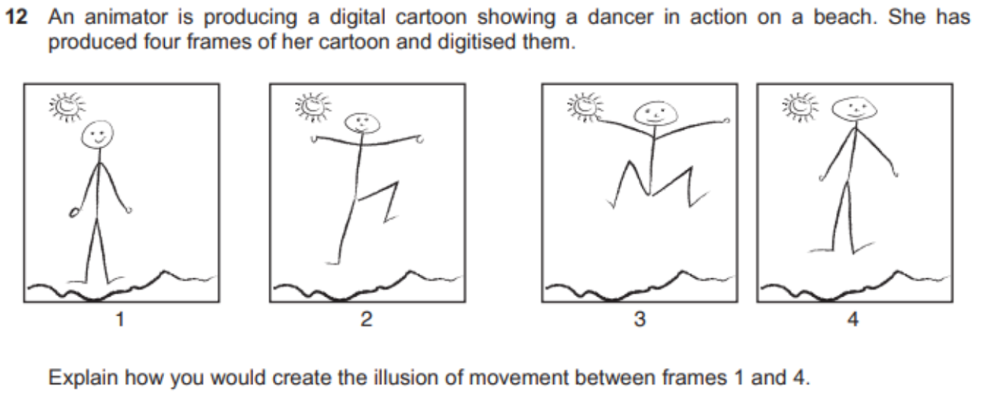

All Past Paper Questions: https://docs.google.com/document/d/1osDm8ZWYpGqo4qsB4ioe_5NMqt8prnXxOrlloWsXQ6c/edit?usp=sharing

## Audio

- bit-rate
    - changing bit-rate
        - Audio quality improves with increasing bit rate
            - 800 bit/s is minimum for speech to be recognised
            - 32 kbit/s — generally acceptable only for speech
            - 96 kbit/s — generally used for speech/low-quality streaming
            - 128 or 160 kbit/s — mid-range bit rate quality
            - 192 kbit/s — a commonly used high-quality bit rate
            - 320 kbit/s — highest bit rate level supported by the MP3 standard
        - lossy compression to reduce bit rate can introduce artefacts
            - caused by data/quantisation errors
        - distortion of sound
        - perceived/heard as 'bubbling'
        - stuttering/jerky/silences in sound.

## Computer Animations

### Key Frames

- why
    - to define start and end of movement of an object
    - to specify movement of objects
        - that the viewer will see
    - to define timing of movement
        - by position of key frame in sequence of frame

- property key frames
    - defines (one or more) properties of an object in a frame
        - (Objects properties) 
        - can be edited (within a property key frame)
    - to create in-between (tween) frames without the need to draw each frame individually
    - used as 'roving' (property key frames)
    - ensures speed of motion is consistent between frames
        - (throughout a tween)
    - to adjust the speed of motion 
        - at beginning and end of tween sequence so that it appears more realistic between frames/throughout a tween
    - to add properties of one object onto other
        - by copying property key frames in timelines

- how sequence of frames created
    - question 1
        - 
        - answer
            - Animator drew frames 1 and 5 and 8
            - Frame 8 created by flipping frame 1
            - These are used as key frames
            - Frame 1 was duplicated to create frames 2, 3 and 4
            - Frame 5 was duplicated to create frames 6 and 7
            - Key frames define the start and end point of transitions that can be used by a computer-based animation application
            - Tweening was used to create frames in between.

    - question 2
        - 
        - answer
            - Using the four frames as key frames
                - filling in of frames between frames 1, 2, 3 and 4
                - using variable frame frequency depending on content
                - fewer frames between frames 1 and 2 than e.g. between 2 and 3
                - as background is stationary then lower frame rate than foreground characters
            - May be low frame rate so makes motion jerky (+ unrealistic)
            - Need to add at least 8 frames in order to create smooth movement
            - Need to add enough frames so that frame rate is below 'flicker fusion' threshold
                - else movement will appear to flicker and illusion of movement is destroyed
            - Motion blurring of the figures between frames 1 and 2 etc. 
                - can simulate faster movement.

### Editing

- call animation
    - Background objects drawn on one cell and placed at bottom of stack of cells
    - Character to be moved drawn on transparent cell
        - placed on top of background and photographed
    - Character redrawn as moved (on transparent cell) and replaced
    - Re-photographed/digitised in next frame
    - Process repeated for subsequent frames.

- stop motion
    - Scene arranged and lighted
    - Camera app setup
    - Frame recorded
    - Frame checked for corrections
    - Frame deleted if not required
    - objects moved slightly and re-photographed into new frame
    - Use of 'onion-skinning'
        - faint outline of previous frame in app 
        - to show placement of objects
    - Frames duplicated
    - to slow the motion down 
    - e.g. when character changes direction suddenly.
    
- text animation
    - strokes
        - an outline around the text letters
        - animated to move around the letters
        - to fade in/out around the letters
        - to different formats/colours e.g. dotted/dashed/thickness
        - to different comer formats e.g. sharp/smooth/rounded
    - fill settings
        - changes the contents of the letter shapes
        - Change the colour of the letter/shape
        - gradients
            - types
                - (multicolour) colour gradients gradually change one colour into another
                - linear gradients change colour along a single axis (horizontal or vertical)
                - radial gradients change colour in an outwardfinward direction starting from/to a central focal point
            - direction/focal point of gradient can be changed.

## Animations

### Properties

- orientation
    - description 1
        - is a camera property that is set in a keyframe
        - Surface sets the target for the camera on the object surface
        - Provides a sense of gravity for the object
        - Space sets the target for the camera at the centre of the object.
    - description 2
        - Sets the x, y, and z rotation angles around a fixed point (the origin) in a layer
        - (Rotation) around the x-axis is the roll, yaw, angle.
        - (Rotation) around the y-axis is the inclination, pitch, angle.
        - (Rotation) around the z-axis is the azimuth, heading, angle.

- transparency
    - (Sets the visibility of the objects, so) other layers in the display can be seen underneath.
    - Can be set to different percentages (of transparency/opacity) to change the visibility of layers underneath
    - Adjusted in keyframes to affect following frames
    - Can be adjusted so that some colours are removed screen effects
    - Can set a 'transparency track' in keyframes so transparency/opacity percentage changes between keyframes.

- animation speed (in 24fps)
    - usually 24fps or 30fps
    - each frame
        - actions may need to be very active / fast
        - animation can include a flurry of acitivity
            - around the main object
        - can make very smooth animations
    - each two frames
        - animator only needs to draw on 12 fps, not 24fps
            - saves time
            - less animators needed
            - cheap
        - makes slow animations smoother to eye
        - less accuracy required 
            - (than drawing on each frame) 
        - animations appear more lively / active
    - each four frames
        - animation may appear jerky
        - flashing of objects (on/off)
        - objects move very fast

### Techniques

- tweening
    - stuff
        - usues location points
        - changes motion by creating intermeddiate frame
        - requires establishment of keyframes
        - moves points of location of object to new points
            - morphing doesn't do it
- morphing
    - stuff
        - changes one object into different object
        - smooth
        - overlays grid on images & uses it to remap new image
- tweening vs morphing
    - similarities
        - can change shape of an object
        - motion of object
        - can change size / color / location

### Dimentions

- 2D objects
    - drawn in 2 dimensional space 
    - measured in 2 axes/height and width/H x W/X and Y axes
    - based on (concept of) frames//
    - appear flat
    - cannot appear to rotate through 360 degrees
    - are only viewed from one/front angle
    - are only lit from one/front angle
    - lack texture/solidity
    - cannot/are not realistic in live scenes
    - examples
        - use in social media sites
        - presentations

- 3D objects
    - in 3 dimensional space 
    - measured in 3 axes/height, width and depth/H x W x D/X,Y and Z axes
    - can have (appearance of) volume/depth
    - based on (concept of) movement (of objects)
    - have (appearance of) rotating through 360 degrees
    - (appear to) be viewed from different camera angles
    - (appear to) be lit from different directions
    - (appear to) have texture/solidity
    - (appear to) be placed into live scenes/elements with more realistic appearance
    - examples
        - use in movies
        - cartoons
        - video games

### Other

- image editing, when making movies
    - Add visual special effects/CGI (computer-generated imagery) 
        - to video sequences 
        - show stuff that cannot exist in reality
    - Colourising monochrome film stock to increase acceptability
    - Images can be improved
        - eg: color grading
    Images can remove/include objects
    Images of impossible objects/situations can be created
    Altering photographic images to enhance 
        - sales of products (can mislead buyers)
        - appearance (can mislead fans)
