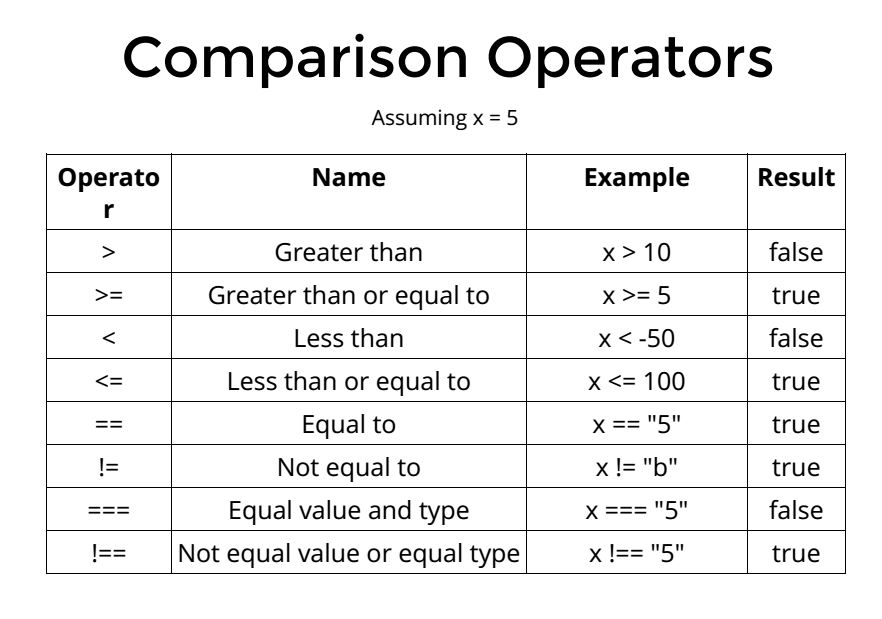
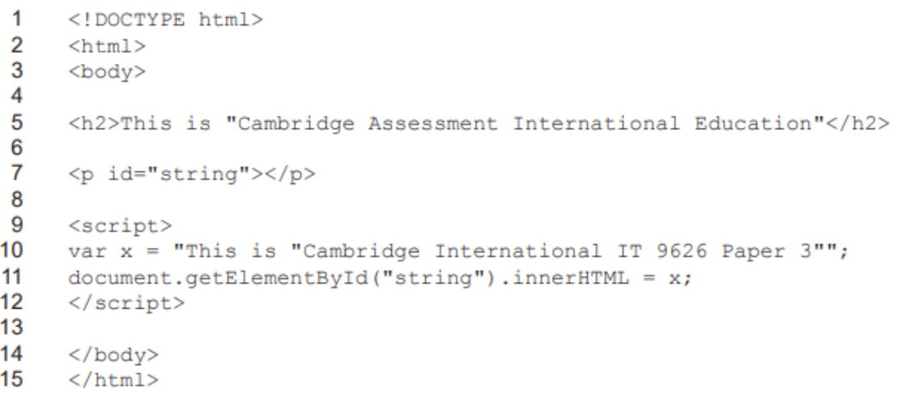

All Past Paper Questions: https://docs.google.com/document/d/1huzD3ywePF8riWc9sYnAZJBI1650B5WlNi45cHm9f9o/edit?usp=sharing

## Terms

- terms (general)
    - operand
        - numbers used in arithmetic operations
    - operator precedence
        - order of performing arithmetic operations
    - assignment operator
        - to give a value to a variable
    - literals
        - fixed values (/numbers/strings) assigned to a variable

- terms (javascript)
    - how object given a new property
        - new property added
        - by declaring a value
    - display properties using loop
        - JS code enclosed in HTML for use
        - use of `for...in` loop (JS)
        - define a variable (var/const) for storing (iterated) process
        - specify objects to be examined
        - enclose code within brackets - `{}`
        - include code to count iterations of loop
        - use code to pass results to HTML to display
            - eg: `document.getElementById("id").innerHTML = xxx`
        - use `console.log(...)` for debugging

- data types
    - string
        - purpose
            - to store and manipulate characters

- keywords
    - names of HTML 
        - objects / properties
        - event handlers
        - window handler objects
        - reserved terms  (used in other programming languages)

- iterations
    - `for` loop
        - how
            - loops through a block of code, given number of times
                - until condition is broken
            - requires 3 expressions
                - a declared variable
                - expression to evaluvated 
                    - at start maybe omitted
                    - at end, increment value ( of declared variable)
            - incrementing variable at end is optional
            - loop continues 
                - until condition is met
                - forever
            - if evaluvate statement omitted
                - `break` must be included
                - to exit the loop 
    - `while`
        - test condition at beginning
        - executes block if condition is true
        - may never be executed
    - `do ... while`
        - test condition at end
        - executes block even if condition is false
        - always executed, atleast once (first time, before checking condition)

- operators
    - logical operators
        - 
        - description
            - Used in if-else/switch statements 
            - to test if conditions are true
            - Compare the logic between variables
            - Can be used 
                - with any data type
                - in a more complex manner 
                - \- complex conditions \-
        - detailed explanations
            - `==`
                - converts characters to same type if necessary
                - compares value to determine if strictly equal
                - return `true` if same
                - return `false` if not same
            - `===`
                - compares both type and value
                - return `true` if
                    - same type AND same value 
                - return `false` if 
                    - same value
                    - different types
                - return `false` if
                    - same type
                    - different value
            - `!==`
                - compares both type and value
                - return `true` if 
                    - same value
                    - different types
                - return `true` if
                    - same type
                    - different value
                - return `false` if
                    - same type AND same value 

- conditionals
    - types
        - `if...else`
            - explain
                - If ... else allows different actions to occur as a condition
                - condition produces a Boolean result
                - If TRUE an action is taken
                - If FALSE another (different) action is taken
                - Number is stored in variable
                - Comparison operators to test valuewith variable
        - ternary operator
            - Reduces code to a single statement to make code small
            - take up less storage space
            - Code is less complex to understand
            - easier to wite
            - less repetitive coding
            - Code is easier to debug
            - Can run multiple operations with code that is easier to follow
        - `switch...case`
            - Variable declared to store a specified condition
            - `switch(...)` used to gather data to be tested against the variable
            - Use of case to create blocks of code that may be executed
            - Variable with the condition listed for testing (against case)
            - Use of break to end out of `switch(...)` when variable matches case
            - Use of default at end of code block to specify code to be executed if no match found

- inbuilt functions
    - `setTimeout()`
        - stuff
            - delays execution of code
                - which runs only once
            - minimum time is 0 miliseconds
    - `setInterval()`
        - stuff
            - allows repeated code execution
            - at pre-set intervals
            - minimum time is 10 miliseconds
            - can stop the timeout timer
                - so, `setTimeout()` won't be executed
    - `confirm()`
        - a dialog box with two elements appear
            - OK button
                - indicates acceptance
            - Cancel button
                - indicated rejection (of user choice)
            - Message
                - ask question
                - or explains the choices available 
            - a Close button (in some browsers)
                - to give no answer and close the question
        - why it may cause problems
            - User's attention drawn away from main web page 
                - lose concentration (on page content)
            - Input focus is taken away from the web site/pages until box is closed 
                - no other interaction is possible
            - Other codes may stop functioning until the dialogue box is closed
            - Position of dialog box cannot be controlled 
                - (may block information on page)
            - some browsers may badly support it
        - result returned back
            - Return value 
                - is Boolean
                - stored in a declared variable
            - If user clicks OK then `true` is returned to variable
            - if cancel, `false` is returned
            - value in variable used to display stuff (with if-else)
    - `prompt()`
        - how to collect input
            - variables declared to store values
            - box pops up on screen
            - can display default/sample entry in input box
            - user must input value
            - user presses OK
            - if no value is entered, `NULL` is returned
            - if cancel is pressed, `NULL` is returned
        - limitations
            - position cannot be specified
                - determines by browser
                - may not be ideal for user
            - appearance chosen by browser
            - script is paused until box is closed
            - additional code required to validate data
            - some browsers support a default value feature

    - comparisons
        - `setTimeout()` vs `setInterval()`
            - similarities
                - both are part of DOM (Document Object Model)
                    - (HTML Window Object)
                - both takes two parameters
                    - first parameter: function to be executed
                    - second parameter: a time in miliseconds
                - both can be interrupted using `clearInterval()` function

- debugging / finding errors
    - questions
        - question 1
            - 
            - answer
                - it does not work
                - syntax error
                    - how the string `x` is designed
                - strings must be enclosed in matching quotes
                - quotes inside cannot be same as quotes outside
                    - either `'` or `"`
                - or use a backslash `\` to escape it

- exception handling
    - pg20
