All Past Paper Questions: https://docs.google.com/document/d/1huzD3ywePF8riWc9sYnAZJBI1650B5WlNi45cHm9f9o/edit?usp=sharing


## Terms

- terms (general)
    - operand
        - numbers used in arithmetic operations
    - operator precedence
        - order of performing arithmetic operations
    - assignment operator
        - to give a value to a variable
    - literals
        - fixed values (/numbers/strings) assigned to a variable
    - string
        - text/characters within double/single quotes
    - global
        - variable declared outside function
        - used throughout script
        - value assigned to an undeclared variable
    - regular expression
        - sequence of characters to search from
        - character patterns used with functions to search strings
        - a description of whats being searched for
    - operator
        - arithmatic operators
            - to perform (arithmatic) calculations
        - or logical operators
            - to compare values
    - statement
        - instructions to be executed by interpreter
    - array
        - stores multiple values in a single variable
        - why?
            - suitable for storing a large number of items
            - reduced complexity of code
            - easy to understand
            - increases code execution speed
            - can loop through
                - using an iterative function
    - variable
        - containers for storing data values
    - function
        - block of code to do a task
        - executed when 'call'ed
    - comment
        - types
            - single line comment
                - like: `// comment here`
            - multi line comment
                - like: `/* body of the comment  */`
        - description
            - used to explain code
            - ignored by interpreter
            - ?? used to halt execution of code ??
        - why
            - to explain what code does
            - to make code more readable
            - doesn't affect intepreter, its all neglected
        - accessing elements
            - example
                ```js
                var cities = ["London", "Cambridge", "Oxford", "Manchester"]
                ```
                - access single elemtn
                    ```js
                    var place = cities[2]
                    ```
                - access first 3 elements
                    ```js
                    for (i=0, i<=3, i++) {  // 0, 1, 2 -> then break
                        document.write( cities[i] )
                    }
                    ```
    - object
        - collection of variables and functions
        - represents attributes & behaviour of an 'item'
    - expression
        - any valid unit of code resolves to a value
        - types:
            - can have a value
            - can assign a value to a variable

- terms (javascript)
    - how object given a new property
        - new property added
        - by declaring a value
    - display properties using loop
        - JS code enclosed in HTML for use
        - use of `for...in` loop (JS)
        - define a variable (var/const) for storing (iterated) process
        - specify objects to be examined
        - enclose code within brackets - `{}`
        - include code to count iterations of loop
        - use code to pass results to HTML to display
            - eg: `document.getElementById("id").innerHTML = xxx`
        - use `console.log(...)` for debugging

- using javascript
    - embedded
        - example
            ```html
            <script>
                document.getElementById("text").innerHTML = "123"
            </script>
            ```
    - in a seperate file
        - example
            - index.html
                ```html
                <script language="JavaScript" src="index.js"></script>
                ```
            - index.js
                ```js
                document.getElementById("text").innerHTML = "123"
                ```
        - why?
            - separate html and JavaScript code so easier maintain.
            - Can re-use the code (from different pages)
            - No need to have several copies
            - Code only has to be tested once
            - JavaScript File is cached by web browser
            - reduced network usage
            - slow loading times
            - low browser performance
            - webpage dont work (as expected) until everything loads
            - Can separate code into different functional areas
                - provides modularity to code

- DOM
    - HTML element
        - Component of a HTML document
        - contained between tags.
        - starts with`<name of tag>` and ends with `</name of tag>`
        - Node which can have attributes.
        - Node can have 'child nodes'.
        - Part of the Document Object Model (DOM) when document is parsed (by browser)
    - how to change DOM
        - select element, by ID or by query Selector
        - use `.innerHTML` to change it's contents


- data types
    - string
        - purpose
            - to store and manipulate characters


- keywords
    - names of HTML 
        - objects / properties
        - event handlers
        - window handler objects
        - reserved terms  (used in other programming languages)


- iterations
    - what is an iteration method?
        - repeatedly executes a block of code
        - work through elements of array
        - performs operation on every element of array
        - works on element of array, one at a time
    - types
        - `for` loop
            - how
                - loops through a block of code, given number of times
                    - until condition is broken
                - requires 3 expressions
                    - a declared variable
                    - expression to evaluvated 
                        - at start maybe omitted
                        - at end, increment value ( of declared variable)
                - incrementing variable at end is optional
                - loop continues 
                    - until condition is met
                    - forever
                - if evaluvate statement omitted
                    - `break` must be included
                    - to exit the loop 
            - used when 
                - number of iterations known (beforehand)
            - number of iterations
                - pre-determined by iteration statement
                - uses a counter
        - `while`
            - test condition at beginning
            - executes block if condition is true
            - may never be executed
            - tested before code block is run
            - used when 
                - number of iterations is not known
            - runs until 
                - condition is true
                - until condition is met
        - `do ... while`
            - test condition at end
            - executes block even if condition is false
            - always executed, atleast once (first time, before checking condition)
            - tested after code block is run
    - `break` statements
        - to break about a loop / switch-case
        - the loop stops
        - code outside is then executed


- operators
    - logical operators
        - 
        - description
            - Used in if-else/switch statements 
            - to test if conditions are true
            - Compare the logic between variables
            - Can be used 
                - with any data type
                - in a more complex manner 
                - \- complex conditions \-
        - detailed explanations
            - `==`
                - converts characters to same type if necessary
                - compares value to determine if strictly equal
                - return `true` if same
                - return `false` if not same
            - `===`
                - compares both type and value
                - return `true` if
                    - same type AND same value 
                - return `false` if 
                    - same value
                    - different types
                - return `false` if
                    - same type
                    - different value
            - `!==`
                - compares both type and value
                - return `true` if 
                    - same value
                    - different types
                - return `true` if
                    - same type
                    - different value
                - return `false` if
                    - same type AND same value 


- conditionals
    - types
        - `if...else`
            - explain
                - If ... else allows different actions to occur as a condition
                - condition produces a Boolean result
                - If TRUE an action is taken
                - If FALSE another (different) action is taken
                - Number is stored in variable
                - Comparison operators to test valuewith variable
        - ternary operator
            - Reduces code to a single statement to make code small
            - take up less storage space
            - Code is less complex to understand
            - easier to wite
            - less repetitive coding
            - Code is easier to debug
            - Can run multiple operations with code that is easier to follow
        - `switch...case`
            - Variable declared to store a specified condition
            - `switch(...)` used to gather data to be tested against the variable
            - Use of case to create blocks of code that may be executed
            - Variable with the condition listed for testing (against case)
            - Use of break to end out of `switch(...)` when variable matches case
            - Use of default at end of code block to specify code to be executed if no match found

- functions
    - javascript objects with properties
    - declared by function statement
    - to save section of code for later use
    - set of statements
        - that performs a task
        - and returns a value
        - when valled
    - only invoked when called

- inbuilt functions
    - `setTimeout()`
        - stuff
            - delays execution of code
                - which runs only once
            - minimum time is 0 miliseconds
    - `setInterval()`
        - stuff
            - allows repeated code execution
            - at pre-set intervals
            - minimum time is 10 miliseconds
            - can stop the timeout timer
                - so, `setTimeout()` won't be executed
    - `confirm()`
        - a dialog box with two elements appear
            - OK button
                - indicates acceptance
            - Cancel button
                - indicated rejection (of user choice)
            - Message
                - ask question
                - or explains the choices available 
            - a Close button (in some browsers)
                - to give no answer and close the question
        - why it may cause problems
            - User's attention drawn away from main web page 
                - lose concentration (on page content)
            - Input focus is taken away from the web site/pages until box is closed 
                - no other interaction is possible
            - Other codes may stop functioning until the dialogue box is closed
            - Position of dialog box cannot be controlled 
                - (may block information on page)
            - some browsers may badly support it
        - result returned back
            - Return value 
                - is Boolean
                - stored in a declared variable
            - If user clicks OK then `true` is returned to variable
            - if cancel, `false` is returned
            - value in variable used to display stuff (with if-else)
    - `prompt()`
        - how to collect input
            - variables declared to store values
            - box pops up on screen
            - can display default/sample entry in input box
            - user must input value
            - user presses OK
            - if no value is entered, `NULL` is returned
            - if cancel is pressed, `NULL` is returned
        - limitations
            - position cannot be specified
                - determines by browser
                - may not be ideal for user
            - appearance chosen by browser
            - script is paused until box is closed
            - additional code required to validate data
            - some browsers support a default value feature
    - `eval()`
        - why not run string as code
            - allows inserted code to run
            - security issues
    - `console.log()`
        - writes message to browser console
        - need supporting browsers (new versions)
        - need to open console to see them
        - used for testing purposes
        - message within brackets will appear in console
            - is a string / object
            - is required
            - can have more than one object
                - objects can be variables
    - `sort()`
        - questions
            - question 1
                - 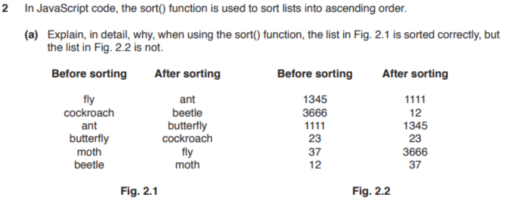 
                - answer
                    - treats values as strings not numbers
                    - Strings are sorted alphabetically
                    - Strings are not sorted numerically
                    - a is before  than b so list 1 is sorted alphabetically by the first letter
                    - and then by the second etc.
                    - because 2 is 'bigger' than 1
    - `reverse()`
        - reverses a string, a list, etc...
    
    - comparisons
        - `setTimeout()` vs `setInterval()`
            - similarities
                - both are part of DOM (Document Object Model)
                    - (HTML Window Object)
                - both takes two parameters
                    - first parameter: function to be executed
                    - second parameter: a time in miliseconds
                - both can be interrupted using `clearInterval()` function

- event handlers
    - `onload`
        - to run JS immediately
        - after web page is fully loaded
    - `onchange`
        - execute code when state of value changes
    - `onclick`
        - when user clicks an HTML element
    - `onmouseover`
        - when mouse moves over an element
        - (hover)
    - `onmouseout`
        - when mouse moves away from element
    - `onkeydown`
        - when a user presses a key / types
    - `onerror`
        - triggered when an exception occurs
        - eg: `window.onerror = function_name(msg, url, line);`
        - `onerror()`
            - only captures error
            - stores details for later
        - function passes event details to alter box
        - variables to pass paramaters of errors
        - parameters
            - `msg`
                - message that browser displays
            - `url`
                - file name of code in which error occured
            - `line`
                - line which contains the error


- debugging / finding errors
    - questions
        - question 1
            - 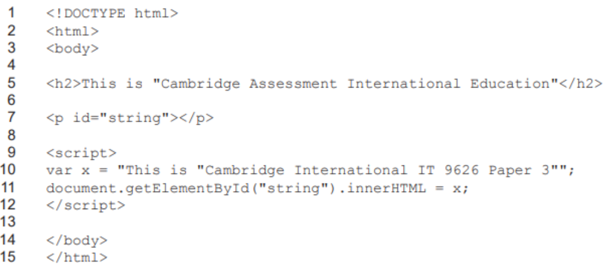
            - answer
                - it does not work
                - syntax error
                    - how the string `x` is designed
                - strings must be enclosed in matching quotes
                - quotes inside cannot be same as quotes outside
                    - either `'` or `"`
                - or use a backslash `\` to escape it

- exception handling
    - how
        - use '`throw`' to trap error
        - Use '`try`' to handle the error
        - Use '`catch`' to run code after if error
            - to show custom error message
            - eg: `message.innerHTML = "Error"`
        - Use '`finally`' to execute code regardless of error or not
        - Use '`error`' to provide information about the error, eg:
            - EvalError
            - RangeError
            - ReferenceError
            - SyntaxError
            - TypeError
            - URlError
    - how (2-old)
        - add code to deal with errors
            - without affecting web browser
        - specify code block to be executed
        - `try`
            - block of code to be executed
        - `catch`
            - to define error handling
        - `final`
            - to allow code to be executed
        - `throw`
            - to display information about error
            - specified message to display

- conventions
    - declarations at start
        - creates cleaner code
        - single place to look for all local variables
        - easier to avoid unwanted local variables
        - reduce unwanted re-declarations
    - initialize variables when first declared
        - avoids undefined values
        - create conside code, easier to follow
        - single place to initialize variables
    - always declare local variables
        - local variables declared with `var` keyword
        - otherwise, they become global variables

- program execution flow
    - questions
        - question 1
            - 
            - answer
                - Script embedded in HTML code
                - between` <script> </script>` tags
                - Variables `x` and `y` declared
                - vairables initialized with values
                    - x stores 12 and y stores 6
                - `window.alert(x + y);` 
                    - sums x and y to produce 18
                    - displays an alert box
                - Appears as popup
                - User must press OK to clear
        - question 2
            - 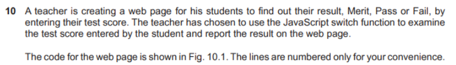
            - 
            - 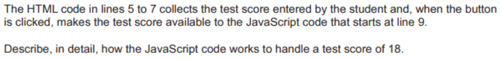
            - answer
                - Line 9 `<script>` declares the code to be JavaScript.
                - Line 10 declares a function called
                - Line 11 declares variable report.
                - Line 12 declares variable result.
                - Line 12 collects value/18 of 'myTScore' from user input into HTML code at line 5 and stores it in variable 'result
                - Line 14 'switch' function is used to compare the value in 'result' against pre- set 'case' values.
                - Line 15 checks value of 'result' to see if condition is TRUE.
                - Line 18 checks value of 'result' to see if condition is TRUE.
                - Line 21 checks value of 'result' to see if condition is TRUE.
                - Line 24 checks value of 'result' to see if condition is TRUE
                    - all of these are FALSE
                    - control moves to next case
                - Line 27 checks value of 'result to see if condition <20 is TRUE
                    - this is TRUE so control passes to Line 28 and FAIL comment is stored in variable `report`
                - Line 33 function displays contents of variable '`report`' on webpage/displays "Your result is a Fail";
                - '`break`' is included to exit/jump out of any case
                - '`default`' is included in case no preceding is TRUE
                - Including '`default`' is good coding practice even if not required.
        - question 3
            - 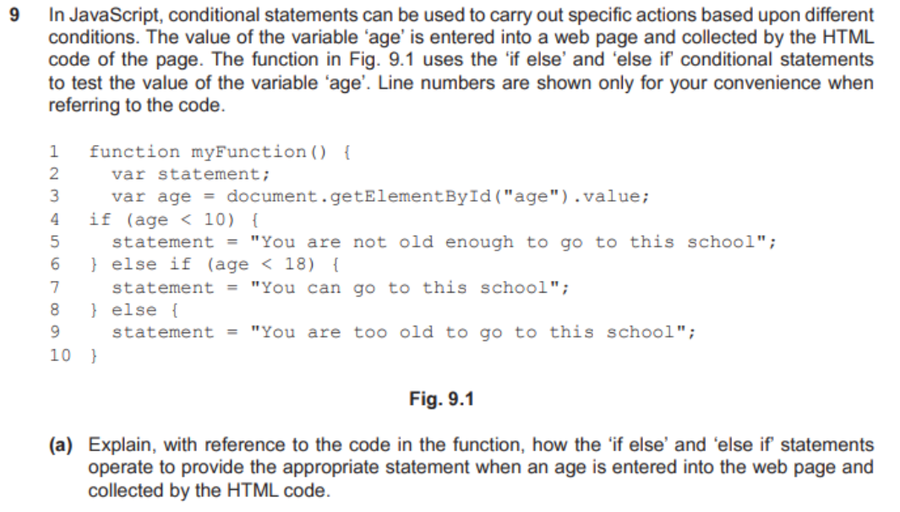
            - answer
                - If statement specifies block of code that is executed if a condition is TRUE
                - Line 4 if statement compares 'age' with condition <10
                - if TRUE 'You are not old enough...'is stored in variable 'statement'
                - if FALSE execution is passed to line 6
                - Else-if statement specifies a new condition to be checked if the first condition is FALSE
                - Line 6 else if statement compares 'age' with condition <18
                - if TRUE 'You can go to this is stored in variable 'statement'
                - if FALSE execution is passed to line 8 and "You are too old to go to this school" is stored in variable 'statement'
                - Else statement specifies the code to be executed if condition is FALSE.
        - question 4
            - 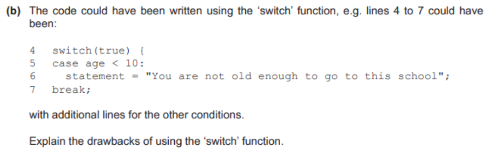
            - answer
                - The order of Case/conditions checks in code must be logically correct/perfect
                    - for correct lexpected comparisons to be made
                    - (Switch) syntax does not follow the usual rules/colons not semi-colons so
                    - code is difficult/confusing to write/read
                    - Code can be lengthy as each condition has to be individually stated
                        - this is repetitive and prone to error
                    - 'break' has to be manually inserted after every 'case'
                    - debugging problems/difficulties with 'nested' conditions
                    - 'default' condition should be included to catch/trap unexpected conditions.
        - question 5
            - 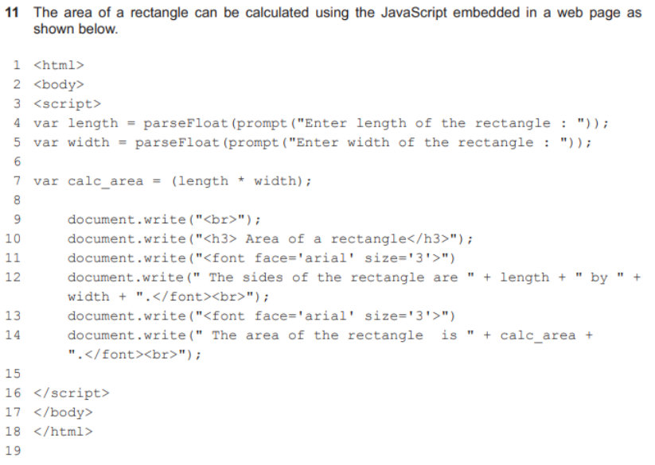
            - 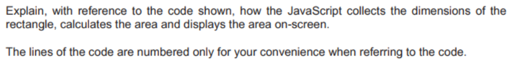
            - answer
                - Line 4 declares the variable/var length to hold one side of rectangle
                - Line 5 declares the variable/var width to hold other side of rectangle
                - parseFloat (prompt("")); used to display message
                - parseFloat (prompt("")); used to collect values for both sides of rectangle
                - parseFloat (prompt("")); used to create a (text) box for the user to enter the values
                - Variable/var calc area is declared to calculate the area
                - Holds result of calculation
                - document.write() is used to display the messages on screen about the
                - values/area of the rectangle
                - Displays the results of the calculation/contents of var calc_area.
        - question 6
            - 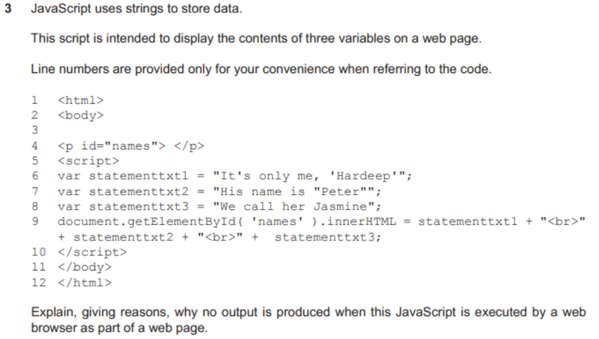
            - answer
                - Line 7 contains a syntax error
                - "Peter" is enclosed in quotes that are the same as the quotes for the string
                - (Strings in JavaScript can contain quotes but) the quotes in a string must not be the same as the enclosing quotes
                - Any syntax error causes the script to fail/not run
                - No error message is produced.
        - question 7
            - 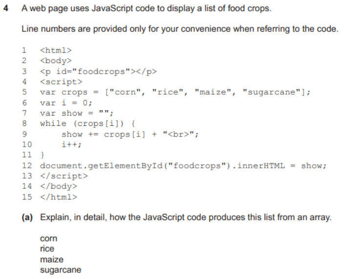
            - answer
                - Code is embedded in HTML code of the website by `<script>` and `</script>` delimiters/markers
                - The browser executes the JavaScript code within the delimiters
                - Variable crops is set to contain the list of crops
                - Variables i and show are initialised
                - While loop will continue looping as long as crops contains data/string
                - (var) i is incremented by 1 each time loop is executed
                - (var) show is set to the current value of show concatenated with next crop value
                - Loop terminates when array has no more items/final value in array is reached
                - Final values of (var) show are displayed on screen/web page
                - Values shown in vertical list as <br> code forces carriage return/line feed.
        - question 8
            - 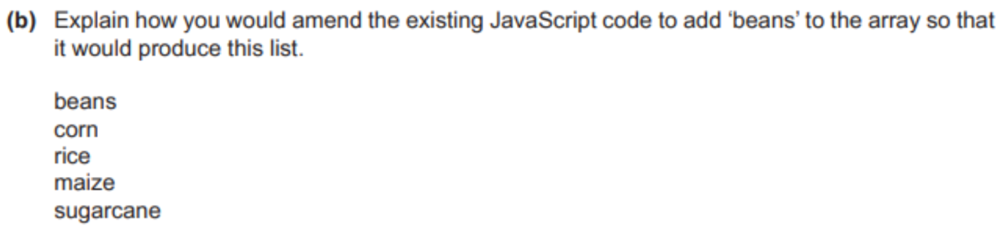
            - answer
                - 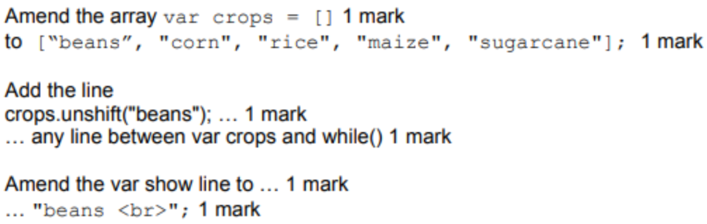
        - question 9
            - 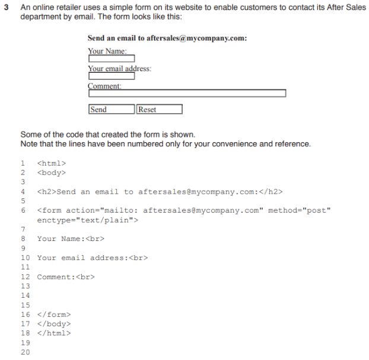
            - 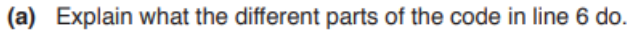
            - answer
                - `<form action="mailto: aftersales@mycompany.com"`
                    - Tells the page that this is a form 
                    - submitting form to a specified URL
                    - To send an email via mailto to the specified address
                - `method="post"`
                    - Specifies the HTTP method when submitting form
                    - In this case post means not to display the submitted data
                    - is not saved in browser history
                    - not passed in as GET request with URL parameters
                    - Post can send unlimited amounts of data
                        - no size restrictions
                - `enctype="text/plain"`
                    - Specifies the encoding of the data
                    - As plain text.
            - 
            - answer
                - 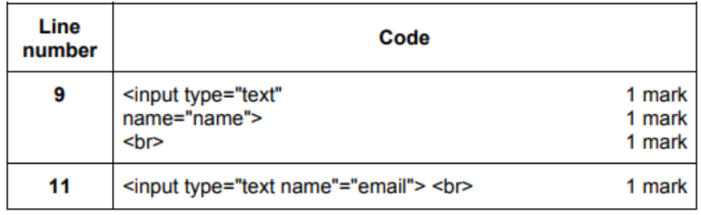
            - 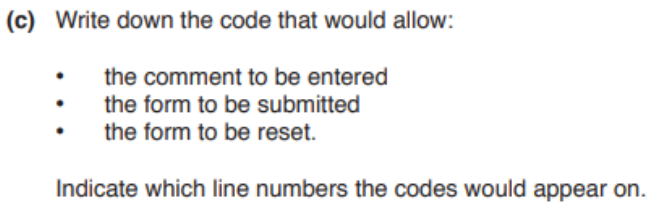
            - answer
                - 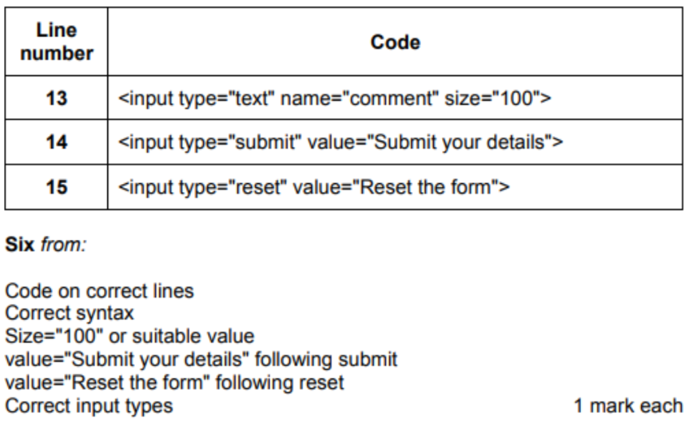 
        - question 10
            - 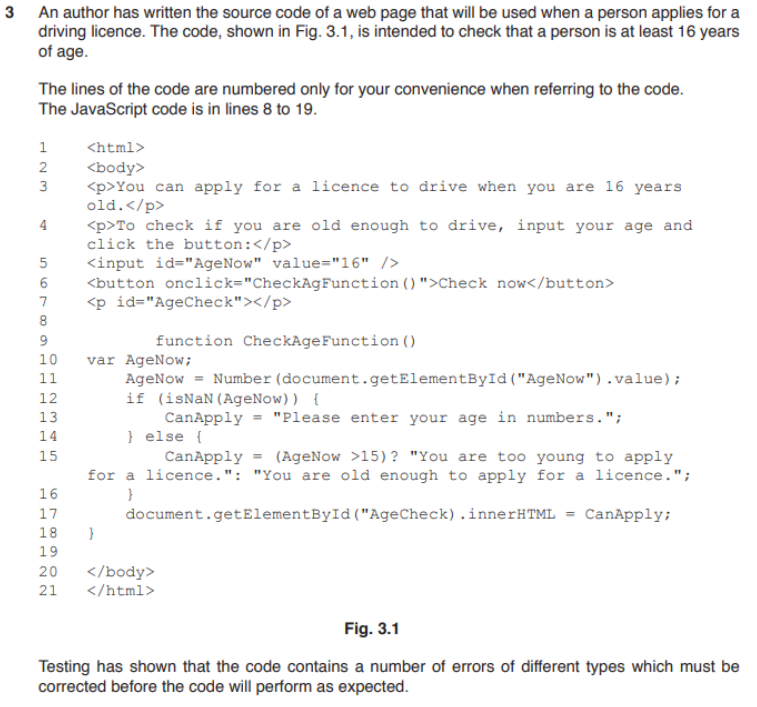
            - answer
                - 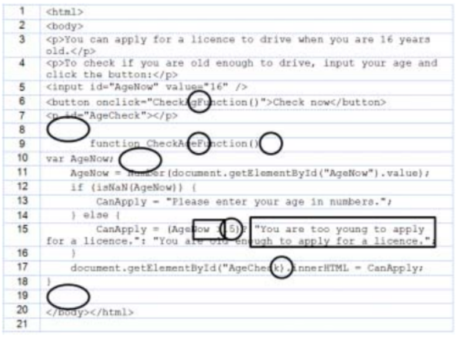
                - 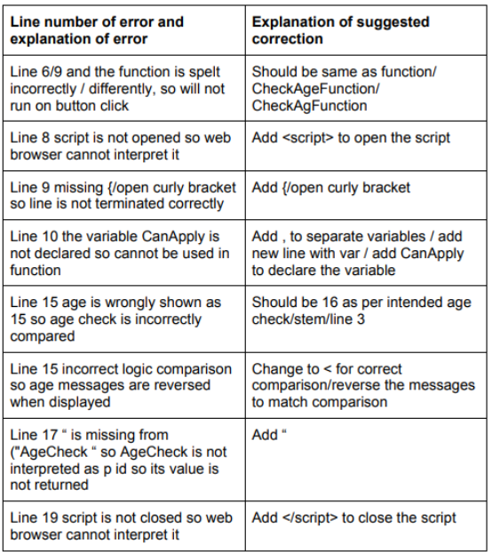
        - question 11
            - 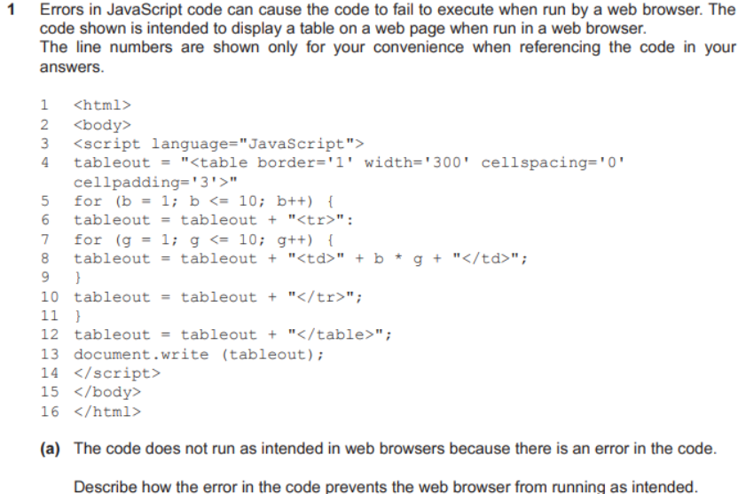
            - answer
                - A colon (:) is shown instead of a semi-colon (;) in line 6
                    - this is a syntax error
                - Syntax errors prevent JavaScript from being executed
                - The web browser displays nothing
                - The variable 'tableout' has not been declared before it is used
                    - Some browsers will ignore
                - Results can be different in different browsers.
        - question 12
            - 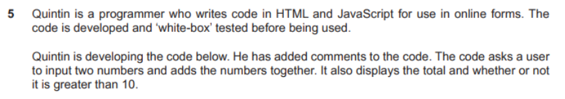
            - 
            - 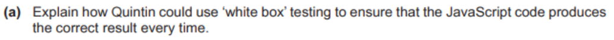
            - answer (tetsing)
                - Checking each line of code
                - Ensures that each line of code is executed at least once
                - Ensures that var y and z assign the collected numbers as required
                - Checks that the additon of y and z is correct
                - Ensures that the correct message is displayed when result assigned to A
                - Checking each branch/decision in the code
                - Checks that decisions are carried out correctly
                - So that values put in A can be compared
                - Ensures that result is checked against > 10
                - Ensures that the correct result is put in var x as required
                - Checks every possible pathway through the code
                - So that test values in var y and z cause each subsequent path to be followed
                - So that test values in x are assigned to A to produce both the messages "is greater than 10" and "is not greater than 10" depending on value in A.
            - 
            - answer
                - Can separate code into different functional
                    - for easy understanding, maintainance, testing
                - Separating HTML and JavaScript code provides modularity to code
                - Which is easier to maintain
                - Can re-use the code
                - No need to rewrite copies on each web page
                - Code only tested once once
                - JavaScript file gets cached by web browser
                - No need to reload/fetch it if need on other pages
                - Reduces network access cost
                - JavaScript code embedded reduce browser performance
                - Web page can slow down while browser executes code.
        - question 13
            - 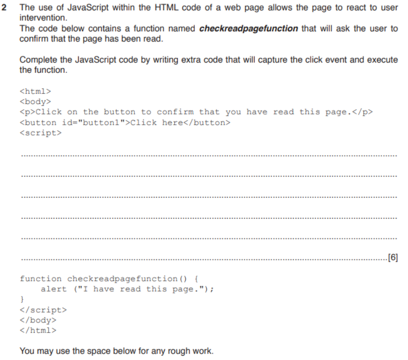
            - answer
                ```js
                const b1 = document.getElementById("button1");
                b1.addEventListener("click", checkreadpagefunction)

                // its better to single-line it
                document.getElementById("button1").addEventListener("click", checkreadpagefunction);
                ```
        - question 14
            - 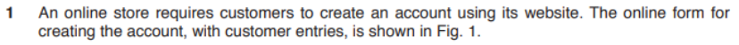
            - 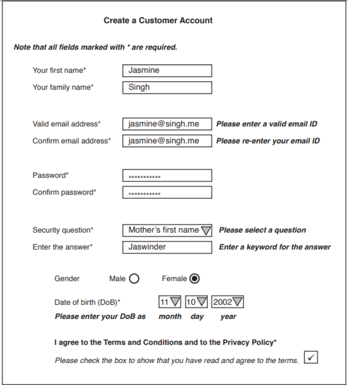
            - 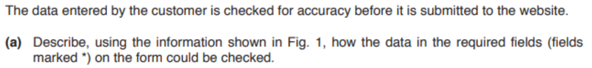
            - answer
                - Use validation to apply a format check to email address
                - Ensures email has @ symbol and domain name
                - Use drop-down list to select the security question
                - To select date numbers from drop down lists
                - range check for month/day/years allowed
                - Check if date is sensible
                - Use of radio buttons with Boolean choices
                - Select check box for terms and conditions
                - Check password for strength
                    - check length
                    - Compare the two password
                - presence check ensures that all required fields are completed
                - Customer visually reads form to check for possible errors
                - When submit button pressed
                    - data is checked and validated
                    - before sending to the backend

            - 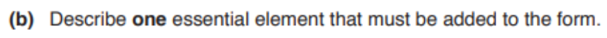
            - answer
                - submit button
                - to send data to backend
        - question 15
            - 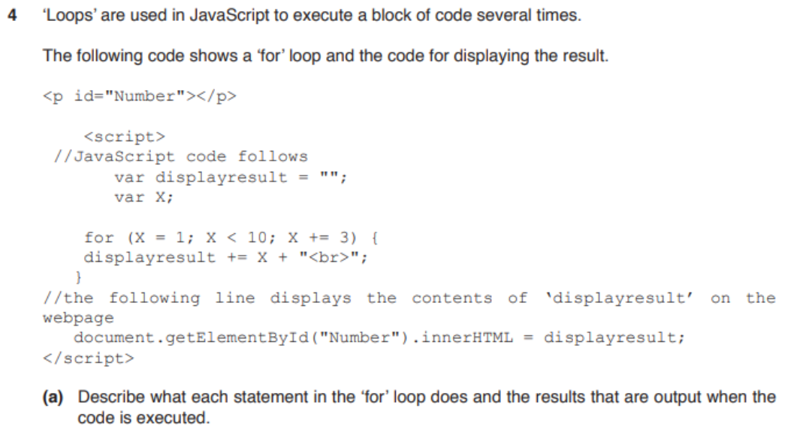
            - answer
                - Variables X and 'displayresult' are declared
                - and cleared before use by
                - Loop starts with X at 1
                - X is incremented by 3 each time it
                - Continues until X reaches 10/while X is less than 10
                - Displays result as 1, 4, 7
                - on separate lines
            - 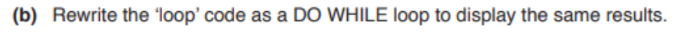
            - answer
                ```html
                <p id="Number"></p> 
                ```
                ```js
                var x = 1;
                const pNum = document.getElementById("Number");
                
                do {
                    pNum.innerHTML += x + "<br>";
                    x = x + 3
                    // with a stepping of 3
                } while (x < 10)

                ```
            - 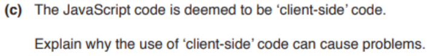
            - answer
                - The code is executed by the web browser
                - Not on the web server
                - Web browser may not support the code language
                - So the code may not execute property/at all/produce errors
                - Different browsers run code in different ways
                - Developers must test all code with all browsers
                - Same browsers on different operating systems behave differently
                - Code may produce different results
                - Code requires high processing power
                - So webpages may display slowly/not at all
                - Non-functioning code may deter viewers leading to loss of audience/sales
                - via the website.
        - question 16
            - 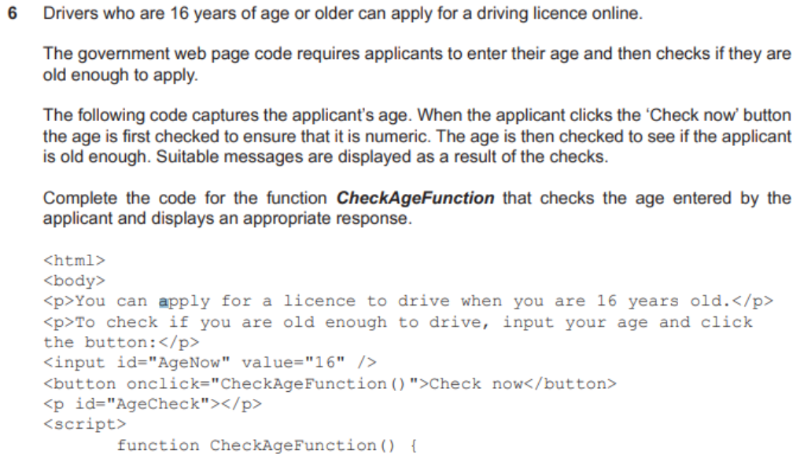
            - 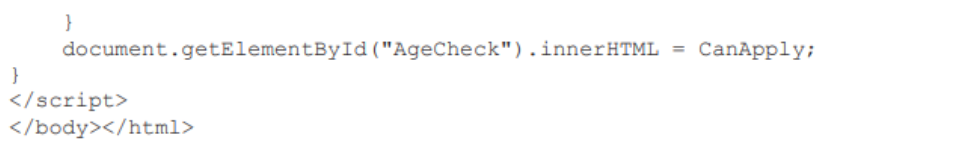
            - answer
                ```js
                var AgeNow, CanApply;
                
                const AgeNowElement = document.getElementById("AgeNow")
                AgeNow = Number(AgeNowElement.value);
                
                if (isNaN(AgeNow)) {
                    CanApply = "Please enter your age in numbers"
                } else {
                    // using ternary operator here
                    CanApply = (AgeNow < 16) ? "You are too young to apply" : "You are old enough to apply"
                }
                ```
        - question 17
            - 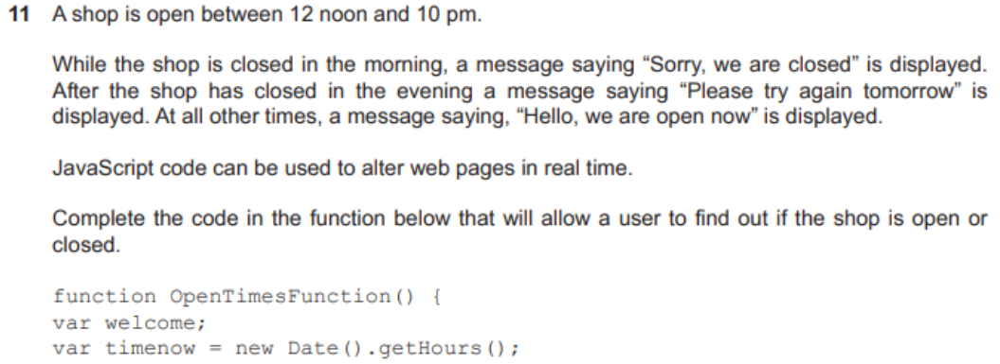
            - 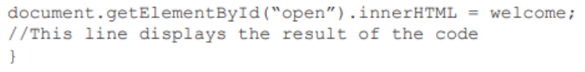
            - answer
                ```js
                if (timenow < 12) {
                    welcome = "Sorry, we are closed"
                } 
                else if (timenow < 22) {
                    welcome = "Hello, we are open now"
                } 
                else {
                    welcome = "Please try again tommorow"
                }
                ```
        - question 18
            - 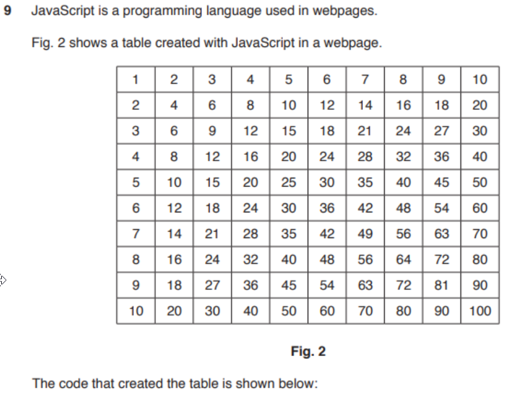
            - 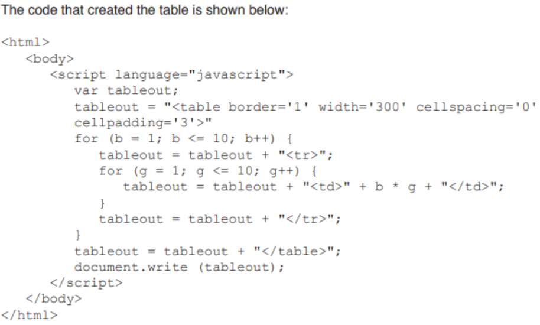
            - 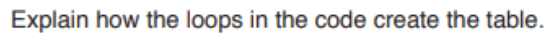
            - answer
                - Code is embedded to the `<body>` of document
                - (global) variable is declared
                - The HTML table values are placed within the variable
                - (first) outer loop (on 4th line of JS code) executes 10 times
                - to create each row (using `<tr>`)
                - (Second) inner loop is executed each time outer loop executes
                - to create 10 columns
                - First time inner loop executes, the cell contains 1+1=1
                - second time inner loop executes, the cell contains 1 *2=2
                - third time inner loop executes, the cell contains 1+3=3
                - up to cell that contains 1* 10=10
                - When inner loop reaches 10, first row of cells is complete...
                    - next row is started with ? 1=2, etc.
                    - up to 2'10=20
                - The process continues until outer loop reaches 10 
                - and all 10 rows have been created and filled.

- other
    - why javascript uses browser to display results?
        - lacks capability for displaying output
    - how JS interacts with user?
        - code required to collect user data/input
        - confirm(), prompt() to enable user interaction
        - code places within HTML web page
        - code stored in external scripts invoke when called

- css
    - colors
        - HSL (Hue-Saturation-Luminence)
            - syntax: `hsl()` used in CSS
            - to specify a color
            - creates gradients of colors from the RGB model
            - Hue
                - value/degree on standard color wheel
                - from 0 to 360
                    - 0: red
                    - 120: gren
                    - 240: blue
                - is brightness
                    - how much white is added to a color
            - Saturation
                - intensity of color
                    - from grey to full color
                - is a percentage
                    - must include `%` characters
            - Lightness / Luminence
                - from black to white 
                - is a percentage
                    - must include `%` characters
