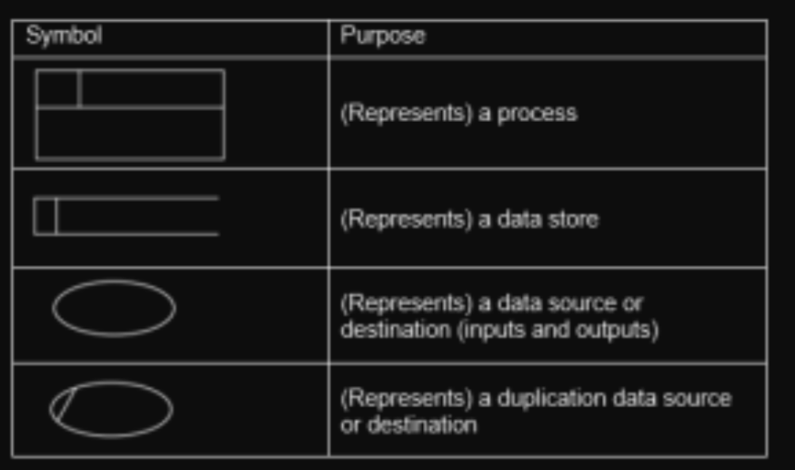

All Past Paper Questions: https://docs.google.com/document/d/1TIqAy1FT-xarYG0I5E4uOZ5TQ0qqKhIuBnwT46yZU9Y/edit?usp=sharing

Questions left out:

- p3-ch5-pg27
- p3-ch5-pg32
- p3-ch5-pg36
- p3-ch5-pg47
- p3-ch5-pg49
- p3-ch5-pg51

## Terms

- dependencies
    - reliying on one task upon another
    - link between tasks
    - can be 
        - resource based
            - where eg: not enough space to carry both tasks
        - logic based
            - where eg: one task has to be carried before another
    - due to preferences of project manager
        - for one task to be done before another
        - eg: create logo before slogan 
- deliverables
    - a tangible (physical) outcome
    - created as result of a project
    - created from work during a project
    - must be product agreed by stakeholders (both internal/external)
    - must help to achieve objectives of the project
- tasks
    - collection of activities
    - produces an outcome
    - definable component of a process
    - must be completed in a set time frame
    - related to single units of work
    - related (within a project)
    - defined by stated deliverables

## PMS

- project managment software
- types
    - new
        - Desktop:
            - for smaller projects
            - Only one person can use the PMS at any one time
            - Can be used on mobile devices
            - lacks all the features of full software
        - Collaborative:
            - multiple uses to edit sections of the project
            - Changes reflected to other users
            - areas unavailable while others are working on them
        - Visual:
            - Allows information to be filtered and presented in easier to understand
            - manner to avoid information overload
            - Used for fluctuating data
            - Details not instantly available.
    - old
        - desktop PMS
            - program runs on desktop
            - for a single user
        - web-based PMS
            - runs on web-browser
            - can use phone to access PMS
            - use a thin client via a web browser
        - personal PMS
            - used at home
                - to manage lifestyle and home projects
            - single user programmed
                - only one user will use it
        - collabarative PMS
            - programmed to support multiple users
            - web-based tools available
- software
    - advantages
        - tools can ease workflow
        - can collaborate with team members
        - each team member is kept upto date
            - using communication tools
            - in real time
        - can easily share documents
        - help manage risks
            - to enable project to continue without interruption
        - can create reports in different formats
            - to keep people informed
        - intuitive to use
            - has dashboard-based interfaces
        - simple to use and easy to install     
    - disadvantages
        - expensive
            - might outweight ROI (return of investment)
            - not economic to use
            - cant to specialized tasks
            - project may be simple
                - so, no need PMS software
                - might unnessacarily complicate things
            - automated alerts (may interrup workflow)

- web based
    - advantages
        - data stored on server (about project)
        - updates can be seen immediately
        - easy collaboration (even remotely)
            - dicussions & communications
            - updates
        - integrated mail servers (for quick notification)
        - most web based pms 
            - are intercompatible
            - user friendly
                - no steep learning curve
                - little training needed
        - access control lists 
            - to control who is allowed 
            - to access data 
        - providing company does backups (easy + cheap)
    - disadvantages
        - may not have features like (reduced functionality)
            - gnatt charts
            - resource levelling
        - need internet access
            - might distract employees
        - security issues
            - when transmissiting over internet
            - company data stored at third party service
        - often not compatible with local/offline PMS tools
        - most have a monthly subscription model
            - costly over long term 

- how to use
    - WBS technique to divide project into activities
    - Use of arrow diagrams showing connected activities
    - represent interdependencies of activities
    - represent order of activities
    - Show start date of activity
    - Show end date of activity
    - Use PERT
    - Use estimates of time taken for activities 
        - (to identify critical path)
    - Use of critical path 
        - to set out monitor
        - show progress
    - Use of critical path 
        - to calculate 'floats' 
    - Show longest time could be taken
    - Allow resource allocation (efficiently)
    - Allow to calculate costs
    - Gantt charts can be used to show activities
        - (different colours for activities)

- cost
    - costs from
        - human labor
        - pruchasing resources
        - required software 
        - contingency costs to cover unexpected activities
        - insurance (required to cover up failiures)
    - cost estimation (using PMS)
        - compare estimation with a similar project
        - estimate using statistical + historical data
            - parametric estimation
        - average costs of several estimates
            - 'three-point' estimating 
        - calculate cost of every activity in detail and calculate total
            - bottom up estimation
        - using PERT estimates by calculation (learn more [here](#stuff-1))
            - most likely cost estimate
                - when project has no difficulties
            - worst possible cost estimate
                - all tasks succeeding better than expected
            - PERT 'three-point' estimating  to eliminate bias
                - provides estimate time taken for each task
                - allowing costs to be calculated
    - cost management (using PMS)
        - records all transactions
        - shows direct costs
            - eg: cost of IT staff / team members
        - shows indirect costs
            - eg: rent / cooling costs / maintainance of equipment
        - import data from financial packages/spreadsheets
        - automatically calculates expenses
        - used by managers to calculate budget
        - can export data to graphs (during meetings)
        - link costs to be easily available
            - for decision makers to decide

- resource allocation
    - Use of critical path analysis
        - to show tasks that require resources.
        - identify the time required
        - to identify priority of tasks
    - Use of resource levelling (resolving resource conflicts) 
        - to allocate resources/deliverable task identification
        - to allocate identify demand for resources
    - Create PRAM (Project Resource Allocation Matrix) 
        - to show the allocation resources 
        - against tasks.
    - Use of Gantt charts 
        - to identify resource requirements.
    - Use of collaborative calendars 
        - to deploy staff.
    - SWOT analysis
        - (Strength, Weakness, Opportunities, Threats)
        - to identify where to deploy resources.

- schedule
    - tools
        - allows planning and executing a project
            - from inception 
            - to completion
        - provide tracking of workers
        - shows if anyone is missing deadlines
        - interchange tasks
        - Allows flexibility to cope with 
            - e.g. unforeseen problems
        - Can deliver resources at appropriate times
        - can make simple projects more complex 
            - than they need to be
        - tools expensive (for small projects).
    - tasks
        - Define scope of project
        - Create groups of activities 
            - e.g. conception/planning
        - Create list of milestones
        - Create list of sequence of activities
        - Create start and finish dates
        - Create lists of dependencies + milestones
        - Carry out critical path analysis 
            - to discover shortest/longest time of project
        - Allows regular updates of activities
        - Create charts (Gannt/PERT) charts to show project schedule visually
        - Use online calendars 
            - to organise meetings.
    - how it can be used
        - shows milestones
        - has tools to put to milestones
        - estimation of duration of activities
        - tracking of team members
        - automatic backups
        - visual representation

- decision making
    - use options to choose (among alternative options)
    - allows collaborative working
    - use of graphics to represent choices
    - use of IF-THEN logic to deal with 'partial choices'
    - use mind mapping software to show decision trees
    - exports data to other documents

- for small projects
    - not appropriate
    - expensive
        - may even cost more than the project
    - can be complex to use
    - may take too long to setup
    - need too much training
    - not worth the effort 

## Stuff 1

- WBS (work breakdown structure)
    - purpose
        - hierarchial description 
            - of a project scope
            - to show to shareholders
        - describes 
            - all work required 
            - in all stages of development
            - so everyone know what has to be done
        - each layer
            - describes what has to be done
            - to reach the end stage 
    - characteristics (of well designed WBS)
        - descriptions easily understandable
        - work can be dividable to managable units
            - to assign work to teams
            - to assign to individuals
        - can estimate duration of work
        - work is measurable
            - can calculate finishing time (estimate)
        - work units 
            - done by each one seperately
            - is put together
            - to create the whole project
        - adaptable to deal with changes to project scope

- PERT (performance evaluvation and review technique)

## Paths

- critical path
    - use
        - reduces risk of delays
        - as all are aware of project details
        - allows resources to be available when required
        - tasks can be scheduled in parallel
        - shows dependencies of tasks
            - so, can focus on critical ones
            - to improve chance of project success
        - use of 'floats'
            - in timings
            - can allow unexpected delays
        - complex acitivies difficult to represent on a diagram
            - \+ large diagrams are hard to understand  
        - external factors 
            - may change critical path analysis
            - will have to re-make / redo
        - pricing is estimates only, actual pricing may vary
        - resource details are limited 
            - so other methods need to be used
            - for charting
    - what to draw in diagram (to calculate critical path) ?
        - List of all the activities to finish
        - A breakdown of 
            - resource allocation
            - work schedules
        - Duration of each activity
        - Dependencies between activities
        - End points of each activity 
            - and what can be completed 
            - at that point
        - Measurable milestones
        - Duration of project including float variables.
    - outcomes that can be determined
        - A visual representation of the whole project
        - latest start dates for tasks
        - Longest time that taken
        - Expected end date
        - Shortest possible time to complete
        - ?? Any near/almost critical paths that may be possible altematives in project ??

## Charts

- gnatt chart
    - features
        - timeline to show progress of each tasks
        - timeline to show subtasks
        - time-scale to represent time intervals for charts (in days/weeks)
        - current date (shows today's date)
        - milestones shown as check points
        - gnatt bar shows task duration (a graphical representation)
        - bars show planned start & end dates
        - labels showing contingency (eg: slack time)
        - colors representing eg: finished tasks
        - annotations/lines representing critical path
    - components
        - timeline
            - show duration (eg: in hours/days/weeks/months)
        - milstone
            - show finish date
        - bars 
            - show full duration of tasks
        - arrows
            - show dependencies of tasks
        - crtical paths
            - show by arrows
        - dateline
            - shows current datetime
    - how to show overdue task
        - use percentage bar with task bar
        - use a red line on the chart
        - use different colors of bars

- data flow diagrams (DFD)
    - symbols
        - 
    - purpose
        - diagram to show how data flows
        - from input through processes to storage
        - give designers a visual representation
        - makes it easier to understand
        - documentation can be created
        - physical components can be created (to make the system work)
    - levels
        - level 0
            - only shows overview of system
            - has only 1 process
            - has no data storage
            - simple to draw
        - level 1
            - shows more details of processors
            - has more than one process
            - shows data storage
            - no technical knowledge required to draw