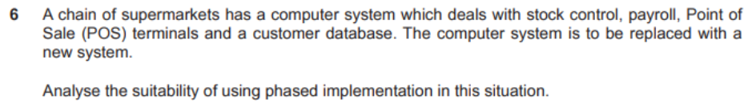
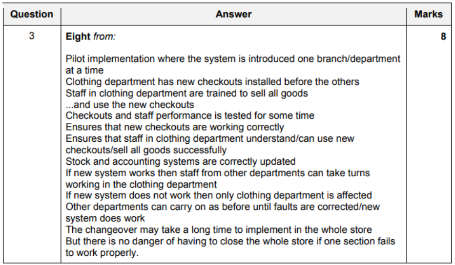

More in

p3-ch3-pg80
p3-ch6-pg69
p3-ch6-pg71
p3-ch6-pg75

## SDLC

- stages
    - list
        - analysis
        - design
        - development
        - testing
        - implementation
        - documentation
        - evaluvation
        - maintainance
    - how they are related
        - each stage has to be completed
            - before starting the next stage
        - deliverables 
            - from this stage is used in next stage
            - of one stage scan be used to revisit previous stage for alteration
        - process can be iterative with repeated movement
            - between adjescent stages
        - documentation from each stage  
            - used to produce System documentation
            - outcomes compared with initial requirements
        -  maintainance stage can result in revisiting the design stage to restart cycle

### RAD

- stages (summarized)
    - determine user reqiurements
    - create early prototypes (function, quickly)
    - gather feedback
    - use it to create high quality feedback
    - reapeat his until software is finished
    - test prototypes throughout development
    - crease user documentation
    - produce final product for rollout to users
- stages
    - requirements phase
        - define project in terms of what needs to be developed
        - gather user requirements
        - define data flow
        - plan processes for managing project
            - eg: risk assestment
        - planning tasks/activities
    - data modelling / requirements phase
        - analyze requirements
        - create sets of data objects
        - define relationships between data objects
        - define test plans
        - define training strategies where required
        - determine implementation method
    - process modelling / user design phase
        - define process for any changes
        - define process for adding a data object
        - users interact with System analysts to develop early prototypes
    - application creation / construction phase
        - making prototypes by experts
        - coding can be automated
        - can code many components simultaneously
        - user evaluvation of prototype
            - repeated testing by users
            - and suggests improvements
    - implementation / cut over phase
        - carrying out test plan by testing data flow
        - testing interfaces between components
        - testing the complete System
        - user training
        - rollout of 'app' to users 
- why (instead of waterfall)
    - project divided to small subtasks
        - (teams can work concurrently)
    - subtasks can make use of specialised teams
    - prototypes created quickly
    - development time is not wasted, 
        - prototype does not work as intended
    - (waterfall method) if project fails, start again 
    - can adapt changes in user requirement
    - can work well when developers telework
    - changes made before final product is created
    - client not surprised by unexpected end product

### Waterfall Model

- phases
    - create requirements
    - analyse to create models / schemes
    - design to create technical designs
    - implementing the code
        - integrating units of code
    - create techinical/user documentation
    - testing (using a test plan)
    - deploy software by 
        - installation
        - migration
        - support
        - maintainance

## Analysis

- data collection
    - online forms
        - explain
            - done by clerk
            - provides feedbkac + shows progress
            - ensures instructions understoof by clerk
            - ensures language is consistent
            - can prevent errors
                - validation techniques
            - can correct mistakes
                - suggest correction
            - shortcuts to maximise performance
            - reduce unnessesary information 
                - to not confuse the clerk
            - provides documentation when additional explanation is required
    - forms (/ details collected)
        - form checks
            - check
                - data entered to field
                - data within pre-set ranges
                    - eg: dates of bookings
                - data in required format
                    - eg: email address
                - data against pre-set values (lookup tables)
                    - eg: title of employee
                - data entered is of required type
        - form controls
            - data is lost in form and submitted to back end on form submit
            - buttons
                - clicked to activate a task
                - submit button
                    - send form data to backend
                - reset button
                    - clear form
                    - custom can re-enter data again
                - hidden buttons
                    - not rendered by web browsers
            - check boxes
                - (sharing the same name)
                - allow multiple choices
                    - eg: choices of food
                - when check, attribute set the switch is 'on'
                - only 'on' states submitted with form
            - radio buttons
                - mutually exclusive switches
                - (sharing the same name)
                - only one choice can be made
                    - eg: male or female
            - text input
                - single line input
                    - `<input>`
                    - eg: for name
                - multi line input
                    - `<textarea>`
                    - eg: additional requirements
            - (dropdown) menu
                - `<select>`, `<optgroup>`, `<option>`
                - provide pre-list of options
                    - eg: destination, departure
            - file select   
                - to select files to submit on form
        - characteristics of a well designed form
            - show only required info
            - simple sentence structure
                - no technical jargon
            - consistent format to find information
            - labels should 
                - be right-justified to left of input field
                - use a colon, capitalize maybe
            - compatibility with other input screens
            - information should be in logical order
            - should not be repeated 

- examining documents
    - preparing
        - identify documents to explore
        - consider how they will be accessed
            - language & cultural barriers
        - acknowledge and address biases in humans
        - consider relevance of document
        - be clear about what to searching
        - consider ethical documents
            - eg: confidential documents
        - consider alternative sources (if requested)
    - examining
        - gather relevant documents
        - develop organization and management
        - produce data flow diagram
        - determine src/dst of documents
        - make copies of originals for annotations
        - assess authenticity
        - examine
            - purposes
            - background information
            - the content
        - keep records of observations

## Design

- design specification (document)
    - why
        - specify criteria for development
        - give guidance for developers
        - specify how System will meet user requirement
        - form part of patent application (for the desing)
        - form basis of accurate costing
        - be a part of legal contract between client and developers
    - contents (for a DBMS)
        - document stating
            - purpose for design
        - description (for intended audience)
            - for purpose of calculations
            - of formulas and calculations
            - error handling requirements
            - backup/recovery procedures
            - System startup/shutdown procedures
            - validation performed
                - and error messages shown
            - layout of report
            - securitu design
                - access control mechanisms
                - audit log provision
                - user authentication
                - encryption process 
        - identify intended products
            - using names and references
        - summary (of contents)
        - overview of design
        - relationship between data elements
        - file requirement description
            - eg: file access methods 

- good designs
    - on screen input (form)
        - should be straight forward
            - to reduce misunderstanding
        - consistent
        - simple to use & obvious
        - clear design with enough space
        - keep necessary keystrokes to a minimum to reduce time
        - form should include validation routines
        - use input controls
        - provide immediate feedback
        - appropriate use of white space

## Development

- agile software development
    - for
        - customer satisfaction is highest priority
            - (from early to late stages of development)
        - can easily manage changes in requirement
        - produces working software for client in short period of time
        - devs must work together
        - face-to-face conversation (more efficient)
        - promotes constant pace of development
        - iterative testing, so
            - errors corrected quickly (constant testing)
        - teams are allowed to self-organize
            - leading in better wokring practices
    - against
        - face-to-face daily meetings means must be in same workplace
            - travel costs
        - cost estimates change over time
        - milstones difficult to set
            - uncertain about what they will address in the near future 

## Testing

- strategies
    - alpha testing
        - leads to beta testing
        - stuff
            - usues white box & black box testing
            - by employees
            - uses lab/testing environment
            - takes place under control of developers
            - does reliability testing 
            - does security testing
            - crtical issues fixed immediately
            - gets a more technical analysis report
        - features
            - type of acceptance testing
            - to identify erros before releasing to end users
            - uses both black & white box testing
            - usually work for the software developer
    - beta testing
        - stuff
            - involves black box testing (usually)
            - by third-parties
            - takes place under control of users
        - features
            - done by real end users
            - in real environment
            - final testing phase before release of product
    - other
        - comparisons
            - alpha vs beta
                - similarities
                    - last tests before release
                    - done by other (other than programmers)
                    - impacts final quality of product
        - for open source Operating System
            - ensure writer of test plan knows what he's doing
            - he should be able to
                - define aspects of OS to be tested
                - define test methods
                - use smartphone facilities
                    - assing tasks to ensure smartphone functionality
            - functionality of apps
                - specific / custom written apps
                - third party apps
            - ability to multi-task
            - test if sufficient memmory 
- test case
    - white box testing
    - black box testing
        - advantages
            - easy to use tested
                - dont need to know how it works
                - dont need programming knowledge
            - can walk through app, as a normal user
            - quicker development of test case
                - tester only needs to look at GUI
                - dont need to discover internal routes
                - tests dont from POV of user
                - can expose discrepencies in specification
            - tests can be done by independent personell
                - avoids developer bias
            - test cases can be designed as soon as specification is complete 
        - disadvantages
            - hard to design test cases
                - as no clear test specification
            - difficult script maintainance
            - user interface changing due to testing
            - scripts maybe fragile when working
                - not the same GUI (for different tests)
                - rendering may change
            - doesnt test all internal pathways
            - doesnt fully test software
            - many program paths left untested  
- tester reporting error (report)
    - should have
        - purpose of test
        - how it was carried out
    - special test environment that was created for the test
    - expected reults
    - actual results
    - whether or not the software passes
    - recommendations for testing the software
- test data
    - why
        - to find errors in logic / formulae
        - to show errors in logic formulae
        - confirm validation routines work as expected
        - confirm given input
            - gives expected output 
        - check error handling
            - eg: abnormal inputs 
- test plan
    - importance (new)
        - ensure requirements are met
        - acts as instructors for screen
        - allows management of any changes
            - needed during development
        - defines test to carry out
        - records results of test for later analysis
    - importance (old)
        - overview of all testing
            - Systematic outline of all features
            - continuously checked
        - prepare that all aspects of running a test are considered
        - train those who need to assist with the test
        - mechanism for outlining test needs
            - lists limitations
            - lists reasons for testing
        - Ensures legal issues are met
            - to show regulatory bodies 
            - that testing has been carried out

## Implementation

- pilot running
    - advantages
        - if System fails
            - only one part fails
        - easy to manage implentation at once
            - than a full direct change over
        - staff can be trained in small groups
        - staff can learn from mistakes (made by grouping)
        - trained staff can support training staff
        - only part of company is changed
            - implentation costs can be phased over a longer time period
            - saving company money (large costs at once)
    - disadvantages
        - full implementation takes time
            - eg: direct change over
        - can cause more disruption (to company)
        - IT staff has to support two teams at the same time
            - (unlike direct changeover) 
        - old and new Systems have to interact data
            - so, data is at risk of loss
        - data lost if System fails
- phased implentation
    - question
        - 
        - 
    - effectiveness
        - done part by part
        - implementation done in stages
        - time is available for adjustments
        - users have time to adjust
        - technical staff concentrates on one part
        - problems (that arise) at start are less critical
        - training confusin for users
            - used to old System
            - less productive
        - System delivery unclear
            - long duration of change over
            - users workflow disrupted
            - more disruption to bussiness
        - check integrity of data before adding new module
        - 'fall back' to each stage becomes more difficult
        - implementation unclear
            - increases complexity
            - lack of motivation
        - need several adjustments
        - at later stages
            - fall back to old System
            - becomes impossible
            - so, should use half-completed new System

- parallel running (during migration)
    - advantages
        - can compare results (to ensure there's no error)
        - can use existing System
            - while deploying new System
            - so, production is not stopped
        - can use existing System to rectify errors
        - staff can be trained on new System
            - so, staff is confident
    - disadvantages
        - expensive
            - need to pay for two sets of hardware
        - production slows down
            - staff needs to update both Systems at once
            - need to input data twice
            - increases data entry
            - to ensure accurate input to both Systems
        - high maintainance time
            - slow production
            - more expensive

- change over implementation
    - prepare
        - ensure management
            - to determine what needs to be done
            - after change over
        - train staff supports training staff
        - train technicians to maintain new System
        - prepare user manuals
        - ensure data is secure
        - confirm compatibility
        - ensure hardware availability before installation
        - transfer/migrate data from old to new System
        - test new System
    - advantages
        - can change System in convenient time
            - eg: after a shop is closed
        - benefits of new System are available immediately
        - can be carried out quickly
            - with minimal disruptions
    - disadvantages
        - if new System fails, old System is not available now
        - may loose data as old cannot be installed
        - staff has less time to learn System
            - so, maybe more errors

- examples
    - bank replacing their Systems. ensure it carries all the functions. without interruptions.
        - start both Systems at the same time
        - copy everything to the new System
        - new customers register to new System
        - switch all services (after System is installed and running)
        - compare speeds/results
        - long time period to test
        - still keep the old System running
        - ensure everything is duplicated in full
        - no difference to staff or customers
        - after new System tested successfull
        - complete the switch
        - run the old System as a backup (for a short period of time, incase of a sudden failiure)
    - example 2
        - 
        - 

## Documentation

- types
    - technical documentation
        - purpose
            - for use 
                - after delivery of software
                - by technicians 
                    - when maintaining the software
                    - when re-developing the app
            - allows completion of program 
                - (when the original programmer is no longer available)
        - why
            - so installer knows what hardware is required
            - data structures can be amended by analyst
            - programmer understands how data flows
            - to provide basis for technical writers
            - provide reference for programmers
        - information to include
            - comments explaining how code works
            - comments on use of variables
            - data structures used 
            - file naming conventions used
            - detailed of used validation routines
            - navigation layout
            - database details
                - tables & their purpose
                - relationships
            - explaining stages of macro script
            - records of test logs and test results
            - security method details
            - details on how software can be installed
            - details on how to backup + restore app
    - user documentation
        - describe
            - explains end-users the functions of software
            - and how to carry out tasks
    - requirements specification
        - describe
            - details user requirements
    - System specification
        - describe
            - details software and hardware needed
    - design specification
        - describe
            - details of what software will be able to do

## Evaluvation

- how
    - determine if now System is better (time saving)
    - if easy to use
        - (+ requires less training)
    - go through requirements one by one
        - compare with requirements specification to check that all requirements have been met
    - get user suggestions
    - identify issues/problems
    - SDLC to started again to correct the issues
- ease of use
    - could be examined
        - (to check if its easy to do stuff) 
        - installation procedures 
        - start-up procedures
        - end-users can access and use as required
        - user navigation
        - System producing required results
            - with less errors
        - are features easy to find
        - assesment of user acceptance (of new System)
        - well structured user documentation
        - trouble-shooting advice to help users 
    - purpose
        - to check whether or not the new System
            - meets specifications set by analyst/designer
            - meets the designs
            - has expected behaviour
            - has problems
                - and how they might affect the funcationality
        - determine opportunies for adding new feature 

## Maintainance

- meaning
    - correcting a problem in the System
    - after System is broken
    - restoring functionality
- steps
    - diagnose the problem
        - (by testing System modules and components)
    - gather information (logs and users)
    - identify the problem
    - isolate faulty code/component
    - replace it with a new component
    - test it
    - check and remove viruses
    - re-format storage devices
    - perform a System restore
    - refer to technical documentation
    - make a report for reference
    - re-test System at the end
- why
    - ensure the System works
    - for its expected life time (until bussiness requires it)
- types
    - corrective maintainance
        - why
            - correct errors in program code
            - so, System works properly
    - perfective maintaince
        - why
            - improve functionality in System
            - remove unwanted functions 
            - to make it more suites to needs
    - adaptive maintainance
        - why
            - System remains compatible
            - with changes to maintainance
    - preventive maintainance
        - why
            - prevent problems caused by
                - eg: security vulnerabilities

### Corrective

- description
    - modifies software to correct problems 
    - that have been identified in error reports from users

### Adaptive

- description
    - updates software after delivery to the users
    - In response to
        -  new environment
        - changes in industry
        - business requirements
        - changes to regulations & legislation.

### Preventative

- description
    - updates software after delivery to the users
    - To avoid possible errors 
        - that might occur in the future
    - To fix errors that do not affect function
        - (eg: CSS issues) 
        - (but may become significant in the future)

### Perfective

- description
    - Enhances 
        - performance after delivery
            - (during the lifetime of the software)
        - user experience
        - reliability + security  
            - (to increase its life span)
        - the ease of maintenance of software

## Unknown / Uncategorized

- new UI for doctors to access patient records
    - meaning
        - implementating the change in one center
        - before implementing the change in remaining centres
    - for
        - issues in one facility can be fixed 
            - (before addressing the other)
            - reducing the overall problems
        - users have access to new System + docs
            - they can assist others in its use
        - workload can be spread out over time
        - technicians required to fully implement new System
        - disruption caused in less
            - so, less danger to patients
        - user feedbacks to assist training
        - improving user experience at centers 
            - less impact to patient care
    - against
        - more time taken
            - to be available at all centers
        - more expensive
            - ?? IT staff will have to be relocated multiple times ??  
        - other staff moving between centers
            - should be familiar with both new and old UI
        - motivation of staff may decrease over time
            - slow work 

- feedback
    - focus groups
        - interview with smaller people
        - members often have similiar ideas
        - stake holders can suggest ideas
        - moderator discusses a conclusion 
        - gives accurate information in a short time
        - cheap
            - but expensive if carried from wide range of people
        - results affected by (presence of) interested parties
        - validity of outcomes maybe questionable (in front of stake holders)
        - outcomes not confidential
            - participants often from external sources

- prototyping
    - advnatages
        - customers need changes
            - so, high costs
        - quality can be improved by testing prototypes
        - prevents disasters at end
            - discovered in early prototypes
            - saves money
        - need more client involvement
            - show working model first
            - means clients are more aware
        - customers provides immediate feedback
        - meeting expected results
        - reduces miscommunications
            - end product more closely meets requirements
        - avoids later changes (saving time)
    - disadvnatages
        - insufficient analysis (deviated focus)
            - may overlook problems
            - overlooking better solutions, so, poor specification
            - so, bad engineering
                - hard to maintain
        - users might confuse prototype with actual product
            - (might assume the final product is incomplete)
        - user might need all features in prototype
            - slowed development
        - prototypes take time to develop (so, more expensive)
    - use
        - issues detected during development
        - users involved at all stages of development
        - users can interact with app
            - and give feedback
            - incooperated during development
        - users get a better understand of the product
        - to investigate potential market for the app 
    - types
        - incremental
            - characteristics
                - project broken to sub projects
                - product partially built on previous iterations
                - requirements produced first and completed
                - testing at each iteration
                - requirement -> development -> testing -> stop
            - advantages
                - whole System clearly defined and understood
                - early user feedback
                - minor details allowed with time
                - allows additional features to be added
                - builds on a basic foundation
                - divides final product into parts
                - parts developed seperately
                - easy to identify errors
                    - testing and debugging can be done
                - product must sell early
                - new technology being used
                - required skills not available yet
            - disadvantages
                - affects functionality of earlier versions
                - may be not all requirements produced
                - high overall costs
        - throw away
            - stuff
                - discarded at any stage
                - produced quickly and cheaply
                - maybe non functional
                - more user involvement
                - easy to measure progress
                - easy to set time-scale
            - reason to use
                - to ensure System requirements are valid
                        - and understoof by all
                - quickest method to obtain feedback
            - disadvantages
                - developers might be pressured to developing unfinished products
                - prototype may not work well
                - lot of time wasted
        - evolutionary
            - stuff
                - becomes a part of the final product
                - developed over time
                - functional from the inception (from start)
            - stuff (compared to throw-off)
                - client may decide that the early version is all that is needed
                - Developers can focus on developing parts of System
                - Instead of developing a whole System which might be beyond their comprehension
                - Improvements to the System can be created later
                - First prototype is not discarded so time is not wasted
                - Throw-away prototypes may not work at all
                - Can be used in interim until final System is complete.

        - comparisons
            - throw away vs evolutionary
                - similarities
                    - develop early prototypes
                    - no full requirement
                    - devs and users interact frequently
                    - end users can add/request features
                    - use interactive reviews
