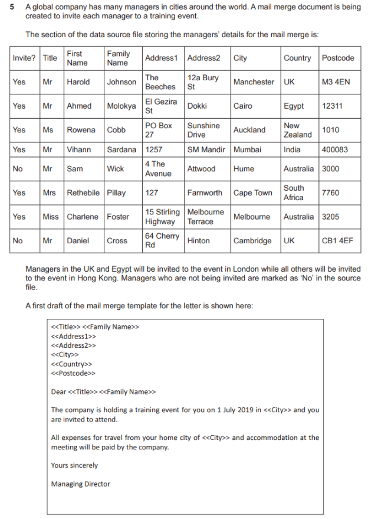
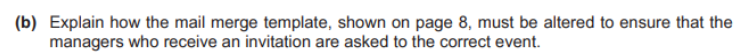
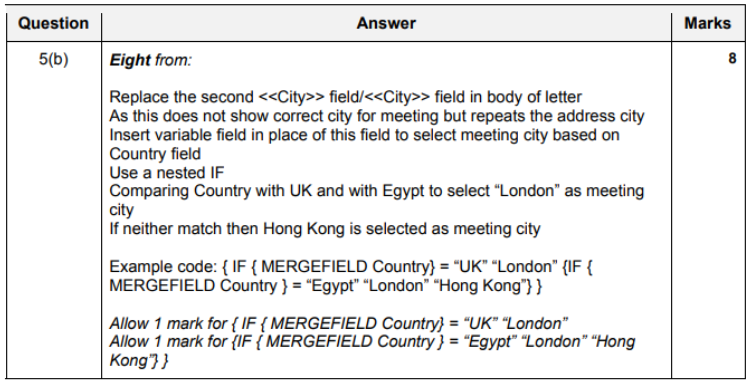

All Past Paper Questions: https://docs.google.com/document/d/1p6zdtykNDrZA5Sp1qgBNfhbCnVpn8Ho6l8tciGi13IM/edit?usp=sharing

## Chapter 1 -like

- proof reading
    - why (source documents -> final version)
        - software tools do not check for artistic / author styles errors
        - for content issues
        - check that all necessary content is present
        - no unnecessary content is included
        - confusion between homophones
        - correct use of definite articles (prepositions)
        - misplaced punctuations/commas/hyphens/apostrophes
        - consistency in styles / conventions
            - eg: date format
        - correct formatting of quotations and citations
        - inconsistent paragraph indentation and spacing
        - missing or misplaced page numbers, headers and footers
        - no unnecessary duplication of content
        - correct regional spelling is being used
        - correct context

## Mail Merge

- error prevention + elimination
    - Use of tools in WP/DTP/applications to check for 
        - spelling errors.
        - grammatical/punctuation errors.
    - Use of tool 
        - e.g. select text and check then correct errors.
    - (Proof)read the documents to check if all information is present.
    - use verification to check for accuracy of data entry.
    - validation to ensure data is sensible/acceptable.
    - Check if 
        - source document is correct
        - correct merge fields in the correct place.
        - merge fields rules/code works
    - Check correct spacing when document is merged.
    - Check merge fields for correct formatting and fits to final document

- merge field 
    - how (insert date when inviting)
        - Use of fill-in field in the location of required date data
        - set up to prompt for input of date
            - only once
        - Syntax is `{ FILLIN ["Prompt] [Optional switches] }`
        - Prompt shows text to appear to user as merge proceeds
        - 'Optional switches' determine how the typed in text is used
        - `\d ""` provides a default text within the quotes if no user input is provided
        - `\o` request prompt only once 
            - and then appears in all subsequent merged invitations.

## Questions

### Examples

Mostly about sending to specific people only.

- create letters to invited people only
    - approach 1
        - Filter the records in the data source on Invite? field
        - To remove the "No" ryes" are selected
        - Create new data source of "Yes" invites
        - Use new source file for the mail merge.
    - approach 2
        - Use `SKIPIF` function in a merge field
        - To skip "No" in Invite? field so that these are not used in the merge
        - Example code: `{ SKIPIF "{ MERGEFIELD Invite? }" = "No" }`
        - Place the `SKIPIF` field at beginning of the template
        - So the record is ignored early in process

- to automatically select from chosen managers for month (and place them into invitations)
    - use source file / database
        - (linked to master document)
    - master document with body of iniviation 
        - has fields placed
        - in appropriate locations
    - select data
        - approach 1 (using SQL)
            - can be selected with SQL `SELECT` from source file
        - approach 2 (normal)
            - use nested `IF` to match names with condition
                - eg: `{ IF { MERGEFIELD Manager_Type } = "Month" }`
            - use `SKIPIF` to move over records that are not managers
                - eg: `{ SKIPIF <<Manager_Type>> } <> { =<<Month>> }`
            - use `NEXT RECORD IF` to compare manager type and move on

### Past Paper Questions

- question 1
    - 
    - 
    - 
