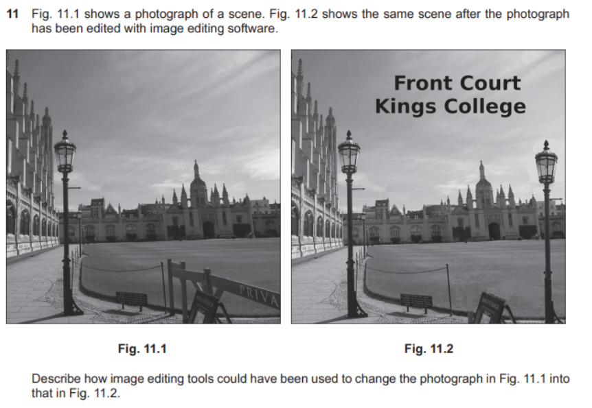

All Past Paper Questions: https://docs.google.com/document/d/1Wx551YT0F35Ca0DI4uQ0bNIO0xf0-jFKEjCNY9tOkkE/edit?usp=sharing

## Bitmap Images

- how its stored
    - Made up of pixels
    - Each pixel represented by bits
    - 1 to 64 bits per pixel
    - Number of pixels depending on colour depth
    - Bits representing pixels packed in rows for bmp
    - Rows rounded to 32 bit words
    - Padding needed for loading into memory locations
    - (Usually) stored from bottom left up to top right of image.

### Compression

- compression
    - why
        - reduce file size
            - use less storage
            - faster file transmission
                - emails
                - loading web pages
            - low image resolution for small screens
            - glitch art can make use lossy compression artefacts to alter images
                - JPEG (lossy) might have artefacts 
    - methods
        - lossy
            - how (1)
                - Images are reduced in quality
                - Information is lost forever
                    - cannot be restored
                - algorithm removes areas with low detail more than areas of high detail
                - so image is changed from original
                - compression artefacts may appear
                - Image quality reduced with repeated compression
                - because at each compression, more image information is lost
            - analysis / how (2)
                - Loss of image data
                    - has visible effect
                    - image quality is reduced
                - Compression artefacts 
                    - produced during compression
                    - can be visible
                        - so, reduce image quality
                - Sudden changes in colour in an image can cause rings near the edges
                - Conversion of a gradation in tone by loss of data into fewer tones causes posterisation
                - False edges created
                    - contouring 
                    - because reduction of grey levels
                - Loss of data in curves
                - low quality due to 
                    - low colour depth
                    - Reduction in resolution
                - might can mistake text in images and change the meaning 
                    - e.g. 6 mistaken for 8.
            - justify the use (of lossy compression)
                - (basically the same thing as above)
                - reduces data needed to represent images (& reconstruct)
                - reduces file size
                - can store more images in same disk space
                - can transfer files quickly
                - reduced load time
                    - better user experience
                - can attacth to emails, without exceeding file sizes
                - can post on social media (optimized)
                - comprehension artifacts can be used by artists to enhance visual impacts on images
        - lossless
            - no information is lost
            - Image is recreated with no difference from the original
            - Works well with images with blocks of similar pixels
            - because only need to store data for one pixel and number of pixels
            - No loss of quality
            - algorithms can reconstuct original pixels lost by compression

### Editing

#### Editing Techniques

- editing techniques
    - Cropping of images to remove unwanted areas
        - use of rule of thirds to keep image visual balance
        - can lose important detail if poorly used
    - Colour balance adjustment to change 'feel' of image
        - whiter to create warm mood
        - bluer to create cooler feel
        - restore natural colour to flesh tones
    - Brightness changes to change of image
        - increase in contrast for photos taken on dull days can show more detail
        - decrease in contrast for photos taken in bright sun can increase detail in shadows
    - replacing an object in the image
        - combining elements of different photos to create a new photo.
        - covering part of the image with another object
    - Creating a digital illustration (of original photo)
    - Changing to a different background
    - Create an illusion of depth
    - Create special effects
    - Adjusting the image itself
        - change the transparency of an image
        - resizing of photos
        - reducing noise in the image
        - correcting lens distortion/perspective.

#### Editing Tools

- edtiting tools
    - morphing (sad face -> happy face)
        - Uses forward mapping of pixels from one image into next
        - sad face mapped to new position in smiling face
        - Setting of control points in start image to map exactly to points in final image
        - Pixels in start image mapped to points in final image that are determined by 'weighting'
            - Gaussian function in software
        - Pixels next to control point move more than those further away/
            - less than control points
        - Pixels further away from control point are less affected by software algorithm so move less.
    - morphing (bird flying)
        - question
            - 
        - answer
            - Warping (deforming) from the original images so final image has same shape
                - use of forward mapping
                - each pixel in original image is mapped to an appropriate
                - pixel in final image
                - use of reverse mapping
                - each pixel in the final image is sampled for an usable pixel in the original
                - all final image pixels are mapped to an original image pixel
            - Cross-dissolving the images
                - a sequence of images shows a gradual fade from one to the other
                - via a (series of) transition images
                - original image is gradually distorted and faded out
                - final image starts out totally warped to the first and is faded in.

    - examples
        - question 1
            - 
            - answer
                - Photographs opened in image editor
                - Person image cut out from photograph 1
                - Mask around person is created to cover background
                - Selection to be cut is highlighted/drawn
                - Selection is modified around edges to ensure accuracy
                - Using of adjustable nib for drawing tool
                - Cut unwanted parts of image of woman
                - Background of cut image changed to transparent
                - Copy cut out (to clipboard)
                - Create new layer for image of woman
                - Import/paste cut out into image of office/photograph of office/Fig. 10.2
                - Place new image in correct
                - Resize image of woman (as required to fit in image of office)
                - Bring to front/back as necessary
                - Flatten/merge layers (if required)
                - Correct new image for overlap/misplaced parts/pixels of imported image
                - Crop area of new image/photograph 2 as required.
        - question 2
            - 
            - answer
                - Removal of Private barrier structure:
                    - Freehand selection tool to select structure
                    - Cut tool to remove object from the image
                    - Colour picker tool to select background behind barrier
                    - Paint tool to fill in area where barrier removed
                        - "content aware fill" or use the spot healing brush tool
                    - blend backgrounds where
                    - select and copy and paste to disguise where shadow of barrier was on path
                - Addition of new lamp post:
                    - Freehand select tool to select lamp post
                    - Copy tools to copy lamp post to clipboard (leaving existing in place)
                    - paste new lamp post into new layer
                    - Position new lamp post as required
                - Clean up pasted image:
                    - Colour picker tool to select colour to be painted into edges of added image
                    - paint tool used to fill pixels around image to make it 'blend' in
                    - Use of appropriate brush size
                - Adding text for title:
                    - Create new layers for text and path
                    - Type text and create path for the text
                    - Use text to path to create shaped text
                    - Position text
                    - Remove temporary layers 
                        - (used to construct title)
                - Finalising image:
                    - Merge layers to 'flatten' image.
        - question 3
            - 
            - answer
                - Perspective tool has been used (to correct perspective) 
                    - by 'stretching' the image across the top 
                    - to align the sides of the stores 
                - Rotate right tool used to an building infrotn
                - Curtains (in left windows) 
                    - inserted by copy & paste
                    - using right-hand set (as source)
                - cropped to remove some building
                - resized to improve aspect ratio.
        - question 4
            - part 1
                - 
                - answer
                    - Crop tool to show the face only
                    - Border line added to the whole image
                    - Resize tool to make image larger
                    - Saved as compressed (JPEG) format
            - part 2
                - 
                - answer
                    - both 1 & 2 - are saved as a bitmap
                    - Bitmaps are made of pixels
                    - 2 - is a compressed image with too much compression
                        - Loss of pixels
                        - details in face are lost
                        - compression artefacts visible to the human eye
                    - 2 - large to be seen by human eye
                    - When enlarged, it becomes more visible
                    - The face now looks unrealistic(/blocky) 
        - question 5
            - 
            - answer
                - reate new canvas/image on whic to compose the na imageo e sna
                - Copy and paste/scan all components into the new canvas so that they are ready for editing
                - Ensure that all backgrounds of all shapes are set to transparent to allow overlap of
                - Shape 1 has part of the image cut out/erased to produce the eye shape
                - Shape 1 is copied and pasted to produce two images for the eyes of the snail
                - Shape 2 is inverted/fiipped horizontally (across the vertical plane) and resized larger/enlarged for the shell
                - Shape 3 is rotated by 90 degrees and inverted horizontally to form one of the antennae
                    - resulting shape is copied and pasted and stretched horizontally to form the second antenna
                - Shape 4 is resized, filled with black to form the body of the snail
                - All the shapes are positioned/aligned together/grouped to form the composite cartoon snail
                - Brush tool with size is used to ensure that the join between shape 2/shell and shape 31body is complete/no gaps are left
                    - used to add dotted line at base of shell/shape 2
                - Text is added and rotated left by 90/right by 270 degrees
                    - text is positioned as shown
                - Conwnents are grouped and resized together to form final image.

#### Impacts of Editing

- impacts of editing
    - politics
        - fake news 
            - altering photos
            - adding peopl to unrelated places
                - to make people beleive he participated
            - removing people
                - to make them beleive he did not participate
        - retouching images
            - to make them more attractive
        - viewers unaware if image if manipulated
    - fashion magazines
        - enhance appearance of items/models
        - attract attention of viewer
            - to compensate for 
            - reduction in attention span (in recent years)
        - make poor photos appear neat 
            - (to increase sales)
        - cheap than taking perfect photos
        - making models look nice
            - Removing blemishes, wrinkles, flabby parts
            - altering body shape 
            - A unrealistic body image (is created)
        - models can lower viewers self-esteem
            - cause eating disorders
            - cause unnecessary pressure 
                - to confirm to unrealistic ideals
        - takes time
            - so, slows down production

### Uses

- uses
    - photography (website)
        - use thumbnails of large image to show photograph
        - terms
            - bitmaps
                - made of pixels
                - created from existing pixel data
                - stored in an array in memmory
            - thumbnail
                - are smaller verions
                    - to load/display quickly
                - contain links to larger versions of same file
        - evaluvation
            - Pixel values may be modified individually
            - Photographic quality achieved by increasing the data about each pixel
                - or number of pixels
                - (in vectors, whole image must change)
            - use compression to reduce file size
            - Bitmap files translate well (eg: when printing)
            - large file size, when large no. of colors
            - techniques to view image quickly
            - Data compression 
                - introduce artefacts that 'spoil' images
                - slow down the reading
                    - (decompression should happen)
            - enlarging causes pixellation
            - support transparency so can be used on any background.
    - for the web
        - can be stored in many formats
        - easy to produce
            - can be output from many apps
        - created from 2 dimentional arrays of pixels
        - can display many colors
            - depending on bits per pixel
        - can display gradients / grayscales
        - photo realistic
        - can edit to be more attractive
        - can easily translate to dot format
            - printers / CRTs
        - can be used in simple animations
            - eg: animated GIFs
        - can compress to reduce loading times

### File Formats

- file formats
    - files
        - contains pixels and metadata
        - pixel has color depth (number of colors)
        - metadata is data about the file
            - image source
            - copyright information
            - device information (which phot was taken from)
        - file format may allow compression
        - compression maybe lossless
            - or lossy
    - why?
        - some software may not support all file types
            - so, have different export options
        - - some are compressed
            - eg: JPEG (lossy)
        - most universally supported are: 
            - JPEG
                - no transparency support
                - no animation support
                - supports more colors (high color depth) than GIF
            - GIF
                - supports transparency
                - supports animations
        - some other types
            - TIFF 
                - highest quality
                - gives largest file size
            - BMP
                - only supports windows OS
    - types
        - jpeg
            - both lossy and lossless compression
            - used for web
                - supported by web browsers
            - suffers image degradation
                - (when repeatedly edited and saved)
            - need more processing power (to compress)
            - no transparency support (easily)
            - doesnt encode large uniform areas of colors well
        - png
            - lossless compression
            - FOSS
            - works in web
            - performs well with large uniform colors
            - works well when progressively downloaded
        - bmp
            - large file size
            - used by microsoft tools
        - gif
            - works in web
            - supports animation
                - allows several images in one file
            - no color management (in different devices)
                - so, colors may alter
            - only limited number of colors
                - 256 colors
        - tiff
            - stores 24-bit colors by using 48-bits per color
            - uses lossless compression
                - LZW Algorithm - no data loss
            - not supported by web
            - large file size
            - doesnt support interlacing
            - doesnt support animations

## Vector Images

- advantages
    - easier to edit
    - Editing does not affect the quality
        - does not pixelate on enlarging
    - have smaller file size
        - saves storage
    - download faster than bitmap image
    - so can be displayed on low-power devices
    - Edges are smoother
        - well defined (in SVG)
    - producing a higher quality image
    - supports transparency
- disadvantages
    - Photographs are not realistic
    - surfaces are unrealistic
    - Small editing errors are more visible
    - reduces the image quality
    - hard to add special effects is more difficult
    - hard to add color graients
    - need powerful devices
        - to carry out calculations
        - when editing
    - may vary on software being used to view
    - converted to raster/bitmap images before displayed on screen/monitor
        - [Click here](#conversions) to learn more

### Structure

- structure
    - node
        - what
            - Control point for paths in image
            - Has defined positions on the x- and y- axes
            - Determines direction/vector of path
            - Defines/shows the start and end points of paths.
        - node editing
            - (related to ['Vectors Images - Editing'](#) section)
            - nodes can be joined together
            - moved to change the path direction
            - Add a new nodes (to change shape)
            - Delete a node
            - symmetrical nodes 
                - to create smooth flowing curves
            - asymmetrical nodes 
                - to obtain a different amount of curve on each side
                - of the node (keeping a smooth flow through the node)
            - cusp nodes to create extreme changes in direction
                - change the length and direction 
                - of each control arm independently
            - smooth nodes 
                - for smooth transitions between straight line segments

### Tools

- tools (/ techniques)
    - to change appearance of objects
        - Use of Bezier handles to change angle of line / control-point
        - Moving node to change the start/end points of
            - Bezier curves (that make up rounded shape)
        - Moving node from one position to another
        - Adding node to line to divide line into two and moving new node
        - Deleting nodes to join lines and remove curves
        - Group shapes to allow for movement of parts of images
        - Changing the colour/transparency/size/rotation of shape
        - Manually editing the code in the SVG XML file.

### File Formats

- files
    - svg (scalable vector graphics)
        - why
            - open-source
            - a W3C standard (World Wide Web Consortium)
            - based on XML which is standardized
            - can be imported into many graphics software
            - Format is scripting, so can be used with CCS
            - supported by web & print systems
            - No compression applied
            - Use of XML + mathematical calculations 
                - image can be scaled without quality loss
        - information stored
            - The font to be used.
            - shapes
                - dimensions
                - position on screen
                - style
                - colors to fill shape
            - lines
                - dimensions
                - position on screen
                - colors to draw line

- how it resizes without quality loss?
    - vector images are mathematical expressions of shapes/paths (to create images)    
    - Shapes include lines/polygons
    - Points defined with x-y axes and direction of path
    - Shapes and positions are recalculated every time the image is resized 
    - so quality is retained
    - Lines in vector images do NOT change proportionately when resized
    - bitmaps
        - consist of a set number of pixels
        - when resized
            - number of pixels change
            - lines change proportionately
            - so, quality is altered 

### Uses

- uses
    - outline fonts to describe printable characters
    - as svg on web pages (HTML5)
    - used by pen plotters to draw shapes on paper

## Common

### Stuff

- resolutions
    - basics
        - Resolution is measured in PPI (pixels per inch)
        - Low resolution images 
            - few pixels
        - High resolution mages 
            - many pixels
            - have higher quality
            - looks crisper
    - why different resoltions needed
        - for (professional) printing
            - need high resolution
            - 600ppi or more
        - images for magazines
            - 300ppi
        - Poster images on bill boards 
            - 150ppi
            - low, cuz viewed from far distance
        - viewing on screen
            - matches PPI of screen/monitor
        - for web
            - mid: 72ppi or 100ppi (modern retina screens)
            - for fast loading
            - but enough quality to view
            - use pixel dimensions
                - (not resolution)
                - can have differing resolutions
                - but display at same size
                - (and looks the same)
        - for presentations 
            - standard: 1024x768 + 72ppi
            - (projectors, large TVs)

### Colors

- color systems
    - RGB
        - stuff
            - use additive colors (to create color ranges)
            - adding all colors together -> white
            - used in computer screens
    - CMYK
        - stuff
            - use subtractive colors (to create color ranges)
            - adding all colors together -> black
            - used for printing
                - black has to be added
                    - CMY is muddy brown color
                    - so, most printers use black catridge when printing CMYK
                    - (inkjet printers, both catridges being used)
    - comparisons
        - RGB vs CMYK
            - similarities
                - color codes for defining colors
                - can produce many colors
                    - from white -> black
                - highly supported by many apps
                - affected by differences in display media 

### Editing

#### Components

- components
    - layer
        - level at which an object is placed in an image
        - represents part of graphic (as pixels in bitmaps)

#### Editing Tools

- tools
    - layer tool
        - what it does
            - To separate elements of image
                - to worked on independently
            - To overlay elements onto others 
                - each element can be moved independently of the others
            - allows editing of elements while leaving other elements untouched
            - do stuff to one element/layer (without affecting others)
            - allows transparency effects (of objects)
            - To insert text 
                - writing can be placed anywhere on the image
        - how to use it
            - adjust transparency to allow other layers to be seen
            - can overlap to create composite image
            - can replicate to show copies (of same thing)
            - can replicate to mask parts of image
            - to ajdust brightness / saturation
    - flatten tool
        - To merge all layers into one layer
        - To discard hidden layers 
            - make all layers are visible
        - To fill any transparent areas with white 'background colour'
        - to create pdf to print easily
        - To reduce the file size

    - color gradients
        - types
            - linear 
                - fills evenly across image
            - radial 
                - (center -> outwards (along radii))
                - fills with single line path
                - fill starts at centre
                - to outwards along all radii
                - fills evenly along all radii
            - elliptical
                - fills with two line paths
                - fill starts at center
                - fills outwards
                - along two directions away from the center
                - can be skewed along one line or another
            - conical 
                illusion that image is cone shaped
            - square fills
                - produce a start like view in color
            - three color fills
                - merge from one color into two (across the image)
            - four color fills
                - merge from one color into three (across the image)
            - X color fills
                - merge from one color into `X-1` colors (across the image)
        - what to change of a filled shape?
            - opacity
                - from opaque to transparent
            - fade color from one color into another

### Conversions

- bitmap to vector
    - how
        - (Clearly defined) areas in the bitmap are automatically traced to create objects in the vector image
        - Nodes are added to the objects
        - Object manually corrected by user to merge shapes
        - Colour resolution (number of bits) reduced by user

- converted to raster/bitmap images before displayed on screen/monitor
    - why?
        - Vector images are stored as co-ordinates
            - geometric descriptions of shapes and colours
        - Digital monitors cannot display co-ordinate-based graphics
        - Because all digital monitors are pixel-based
        - Graphics card converts the co-ordinates into pixels before sending to digital monitor
        - Uses an ADC-type action
        - Resizes the image to suit the monitor.

### Comparisons

- bitmap vs vector (for web)
    - photo realism
        - Bitmaps are comprised of small pixels so the bitmap is the most suitable format for photo- realistic images or images with high amounts of fine detail. 
        - The vector image, on the other hand, does not possess the same kinds of photo-realistic capabilities because it is comprised of larger objects and cannot achieve the kind of fine detail that is necessary for photo-realism.
    - scalability
        - Vector images are made of mathematically defined objects so sizes can be easily manipulated with little to no loss in the quality of the image. 
        - The objects within a vector image are re- rendered at a greater or smaller scale to provide consistently smooth edges.
        - Bitmaps are more difficult to scale because changing the size of a bitmap requires a complete rearrangement of the pixels. 
        - An enlarged bitmap is likely to appear blurry, or "pixelated," meaning that the different pixels of the image have become visible.
    - shape
        - A bitmap image always has four straight edges while vector images can be any shape
    - file size
        - Complex vector images can have a very large file size due to the complex instructions needed to create them; 
        - the size of the file is not dependant on the size of the image: 
            - small complex images can have a large file size; 
        - bitmap images can be large but can be compressed.
    - conversions between file types
        - The most common file type for bitmap web images are jpeg or gif, and conversion to these is simple without loss of quality; 
        - conversion of vector images often results in more loss of quality.
