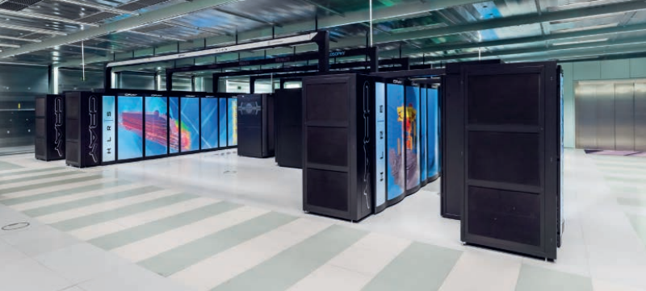

## Mainframe computers and super computers

### Mainframe Computers

-   used by large organizations for bulk data processing
-   applications:
    -   censuses,
    -   statistics,
    -   transaction processing
-   Larger and more powerful than personal computers, laptops, or tablets.
-   Cost at least $75,000 in 2020.
-   Originated with large CPUs housed in steel cabinets ("main frame" or "big iron").
-   Evolved significantly despite the rise of PCs.
-   Notable feature: Reliability, Availability, and Serviceability (RAS).
-   Modern PCs have multi-core CPUs for parallel processing.
-   Mainframes have hundreds of processor cores for multitasking and multi-user operations.
-   Size has decreased from room-sized to large cupboard-sized.
-   Resistant to viruses and Trojan horses.
-   Used mainly in commercial organizations, less known to the general public.
-   example:
    -   most advanced mainframe so far is: IBM z15 (the capinet itself is taller than the average person)
    -   has 190 cores
        

#### Characteristics

-   Longevity
    -   Great longevity, can run continuously for long periods.
    -   Used by governments, banks, and telecom companies.
    -   Expensive to shut down and dispose of hardware securely.
    -   COBOL language still in use, but fewer professionals trained in it.
    -   Threats: Lack of skilled professionals, rise of Cloud computing.
    -   Solution: Combine mainframes with Cloud computing.
    -   Efficiency and dependability maintain popularity.
-   RAS (Reliability, Availability, Serviceability)
    -   Reliability: Processors self-check for errors and recover without impact.
    -   Availability: High availability with long MTBF (Mean time between failures) and quick recovery from failures.
    -   Serviceability: Can identify failure causes and replace components with minimal impact (with least/no downtime).
-   Security
    -   High level of data security, crucial for handling large volumes of personal data.
    -   Security features:
        -   Multi-factor authentication,
        -   levels of access,
        -   data encryption,
        -   secure operating systems,
        -   continual monitoring
-   Performance Metrics
    -   Speed measured in **MIPS (Millions of Instructions Per Second)**.
    -   Benchmark tests used to compare performance.
    -   Cost often linked to MIPS.
-   Volume of Input, Output, and Throughput
    -   Specialized hardware for input/output operations.
    -   Handles very large data volumes (terabytes).
    -   High throughput with billions of transactions per day.
-   Fault Tolerance
    -   Can continue operating despite component failures.
    -   Hardware and software redundancy ensures minimal disruption.
-   Operating System
    -   Can run multiple OS simultaneously **(z/OS, z/VM®, Linux®)**.
    -   Efficient parallel processing with task division among processor cores.
-   Type of Processor
    -   Hundreds of processor cores.
    -   Term 'CPU complexes' is used to describe multiple processors by some manufacturers.
-   Heat Maintenance
    -   Historically used liquid cooling, now a mix of air and water cooling.
    -   More powerful systems require effective heat management.

#### Uses

-   Banking Sector
    -   Process billions of transactions daily.
    -   Handle large volumes of data for batch processing (e.g., overnight bank statements, backups).
-   Census Data Processing
    -   Manage enormous data from population surveys.
    -   Historically used since the 1950s (e.g., UNIVAC 1).
    -   Some countries still rely on mainframes despite advances in PC processing power.
-   Industry Statistics
    -   Process data on businesses, employees, and wages.
    -   Help companies understand market trends and competitors.
-   Consumer Statistics
    -   Analyze demand for products, household incomes, and employment status.
    -   Assist in pricing, marketing, and understanding market saturation.
-   Transaction Processing
    -   Execute multiple operations to complete single transactions (e.g., bank transfers).
    -   Ensure error-free operations, maintaining data integrity.
    -   Designed for continuous availability and fault tolerance.

#### Advantages

-   High Reliability
    -   Rarely experience system downtime.
    -   Can handle hardware and software upgrades without shutting down.
-   Performance
    -   Continuously improving in speed and power.
    -   Outperform PCs, laptops, and other devices.
-   Data Handling
    -   Capable of storing and processing vast amounts of data.
    -   Can run different operating systems and handle data in various formats.
-   Security
    -   Equipped with strong encryption systems and complex authorization procedures

#### Diadvantages

-   Cost
    -   Very expensive to purchase.
    -   High costs for personnel required to run and maintain them.
-   Physical Space
    -   Require large rooms for housing.
    -   Advanced cooling systems needed, increasing installation and running costs.
-   Cloud Migration
    -   Many organizations are moving to Cloud-based services to avoid buying their own systems.
    -   Mainframe software is more expensive compared to Cloud services.

### Super Computers

-   More powerful than mainframes.
-   Can have over 100,000 processing cores.
-   Capable of massive parallel processing.
-   Example: Summit supercomputer at Oak Ridge National Laboratory (2018).
-   Summit's performance: Can perform tasks in 1 second that would take the world population 305 days.
-   Size: Fills a room the size of two tennis courts.
-   example:
    -   Cray XC40 supercomputer
        -   172 000 processor cores.
        -   Several countries have one of these for weather forecasting, scientific research, computational modelling
            

#### Characteristics

-   Longevity
    -   Short lifespan of about five years.
    -   Constantly replaced by faster models in research institutions and meteorology.
-   RAS (Reliability, Availability, Serviceability)
    -   **Not typically associated with supercomputers.**
-   Security
    -   High level of security, often with end-to-end encryption.
    -   Used for sensitive data storage like DNA profiles.
-   Performance Metrics
    -   Speed measured in **FLOPS (Floating Point Operations Per Second)**.
    -   Speeds now measured in petaflops (PFLOPS), with future targets of exaflops (EFLOPS).
-   Volume of Input, Output, and Throughput
    -   Designed for maximum processing power and speed.
    -   **Throughput is a characteristic of mainframes, not supercomputers.**
-   Fault Tolerance
    -   High likelihood of component failures due to the large number of processors.
    -   Similar fault tolerance approaches as mainframes but more prone to interruptions.
-   Operating System
    -   Typically runs **one OS, usually Linux**.
    -   Uses massively parallel processing with many processor cores, each with its own OS.
-   Type of Processor
    -   Hundreds of thousands of processor cores.
    -   Uses multiple GPUs (Graphics Processing Units).
-   Heat Maintenance
    -   Significant overheating issues due to high power consumption.
    -   Requires direct liquid cooling to manage heat.

#### Uses

-   National Defense and Data Encryption
    -   Design nuclear weapons.
    -   Encrypt sensitive data.
-   Scientific Research and Quantum Mechanics
    -   Perform calculations for atomic and subatomic particle behavior.
    -   Example: Juqueen and Juwels supercomputers in Germany.
-   Weather Forecasting
    -   Process data from weather stations, satellites, etc.
    -   Create models to predict future weather patterns.
    -   Example: UK Meteorological Office uses Cray XC40 supercomputers.
-   Climate Research
    -   Analyze long-term environmental data.
    -   Predict climate change impacts.
    -   Use models like the Community Earth System Model (CESM).
-   Drug Research
    -   Develop new medications by comparing new compounds with past research.
    -   Monitor ingredient interactions and predict drug efficacy and side effects.
-   Genetic Analysis
    -   Identify genes linked to diseases.
    -   Reduce research time from months to minutes.

#### Advantages

-   Processing Speed
    -   The fastest data processing computers available
-   Massively Parallel Processing
    -   Utilizes massively parallel processing, making them more powerful than mainframes and PCs.

#### Diadvantages

-   Cost
    -   Extremely expensive to buy and install (e.g., Summit supercomputer costs $200 million).
-   Operating Systems
    -   Typically have one operating system, unlike mainframes which can support multiple.
-   Fault Tolerance
    -   Less fault-tolerant than mainframes.
    -   More downtime compared to mainframes, though less than other systems.

### Comparison

#### Advantages vs Disadvantages of Mainframe Computers and Supercomputers

<table>
    <tr>
        <th>Category</th>
        <th>Advantages</th>
        <th>Disadvantages</th>
    </tr>
    <tr>
        <td>Mainframe Computers</td>
        <td>
            <ul>
                <li>High reliability</li>
                <li>Continuous operation during upgrades</li>
                <li>Increasing speed and power</li>
                <li>Handles vast amounts of data</li>
                <li>Runs different operating systems</li>
                <li>Strong security</li>
            </ul>
        </td>
        <td>
            <ul>
                <li>High purchase cost</li>
                <li>Expensive maintenance and personnel</li>
                <li>Requires large physical space</li>
                <li>High cooling system costs</li>
                <li>Cloud migration preferred</li>
                <li>Expensive software</li>
            </ul>
        </td>
    </tr>
    <tr>
        <td>Supercomputers</td>
        <td>
            <ul>
                <li>Fastest data processing</li>
                <li>Massively parallel processing</li>
            </ul>
        </td>
        <td>
            <ul>
                <li>Extremely expensive</li>
                <li>Typically one operating system</li>
                <li>Less fault-tolerant</li>
                <li>More downtime than mainframes</li>
            </ul>
        </td>
    </tr>
</table>

#### Mainframe Computers vs. Supercomputers

<table>
    <tr>
        <th>Aspect</th>
        <th>Mainframe Computers</th>
        <th>Supercomputers</th>
    </tr>
    <tr>
        <td>Primary Use</td>
        <td>Transaction processing, batch processing, large-scale data handling</td>
        <td>Scientific research, simulations, complex calculations</td>
    </tr>
    <tr>
        <td>Speed</td>
        <td>High speed, optimized for throughput</td>
        <td>Extreme speed, optimized for parallel processing</td>
    </tr>
    <tr>
        <td>Cost</td>
        <td>Expensive to purchase and maintain</td>
        <td>Extremely expensive to purchase and install</td>
    </tr>
    <tr>
        <td>Reliability</td>
        <td>Very high reliability, minimal downtime</td>
        <td>Reliable, but less fault-tolerant than mainframes</td>
    </tr>
    <tr>
        <td>Security</td>
        <td>Strong security features, complex encryption</td>
        <td>High security, but focused more on processing power than encryption</td>
    </tr>
    <tr>
        <td>Operating Systems</td>
        <td>Supports multiple operating systems</td>
        <td>Usually runs on a single operating system</td>
    </tr>
    <tr>
        <td>Usage Examples</td>
        <td>
            <ul>
                <li>Banking transactions</li>
                <li>Census data processing</li>
                <li>Industry statistics</li>
            </ul>
        </td>
        <td>
            <ul>
                <li>Weather forecasting</li>
                <li>Climate research</li>
                <li>Drug research and simulations</li>
            </ul>
        </td>
    </tr>
</table>

## System Software

-   refers to programs that control a computer's hardware and application software.

### Compilers

-   Translate high-level programming languages into machine code (binary form) that the processor can execute.
-   Process:
    -   Translate source code (high-level language) into object code (machine code)
    -   Often requires multiple passes through the program for error checking and resolving references.
    -   Produces a list of error messages **after translation**.
-   Output:
    -   Compiled programs are executable files
    -   that run directly without needing the compiler present
    -   (will sometimes need a runtime environment with all the DLLs (Dynamic Link Libraries) to link to)
-   Languages:
    -   Early examples include FORTRAN, COBOL, and LISP;
    -   modern examples are C++, C#, Visual Basic, Pascal.

### Interpreters

-   Translate and execute high-level language programs one statement at a time.
-   Process:
    -   Converts source code into an intermediate form and executes it immediately.
    -   Stops translation at the first error encountered,
        -   allowing for immediate debugging.
    -   Each statement is translated every time it is executed,
        -   requiring the interpreter to be in memory during execution.
-   Advantages:
    -   Portable between different operating systems.
    -   Useful for program development with immediate execution and error feedback.
    -   Saves memory as only a few lines need to be in memory at a time.
-   Examples:
    -   Python often uses a combination of compilation (to bytecode) and interpretation (via a virtual machine).
    -   Same story with Java, compiled to Java Bytecode and intepreted in Java Virtual Machine (JVM).

### Compilers vs Intepreters

<table>
    <tr>
        <th></th>
        <th>Compilers</th>
        <th>Interpreters</th>
    </tr>
    <tr>
        <th>Advantages</th>
        <td class="advantage">
            <ul>
                <li>Faster execution after compilation.</li>
                <li>Does not require source code at runtime, enhancing security.</li>
                <li>Once compiled, does not need to be translated again.</li>
            </ul>
        </td>
        <td class="advantage">
            <ul>
                <li>Easier debugging with immediate error feedback.</li>
                <li>Cross-platform compatibility with the appropriate interpreter.</li>
                <li>Requires less memory as only parts of the program are loaded at a time.</li>
            </ul>
        </td>
    </tr>
    <tr>
        <th>Disadvantages</th>
        <td class="disadvantage">
            <ul>
                <li>More memory-intensive during compilation.</li>
                <li>Error messages are provided after the whole program is compiled, making debugging harder.</li>
                <li>Compiled programs are OS-specific and need recompilation for different systems.</li>
            </ul>
        </td>
        <td class="disadvantage">
            <ul>
                <li>Slower execution as each statement is translated before execution.</li>
                <li>Requires source code to be present at runtime, risking copyright infringement.</li>
                <li>Translation needed every time the program runs, making it less efficient.</li>
            </ul>
        </td>
    </tr>
</table>

### Linkers

-   Linker is short for 'link editor'
-   Combine object files or modules created by a compiler into a single executable file.
-   Process:
    -   Modules are written separately and then linked together.
    -   Allows large programs to be compiled in smaller parts, conserving RAM.
    -   Object code from different modules is saved on storage and combined later.
-   Advantages:
    -   Facilitates modular programming, reducing memory requirements.
    -   Simplifies error correction as only the faulty module needs fixing.
-   Challenges:
    -   Variable name conflicts.
    -   Requires detailed documentation for module integration.

### Device Drivers

-   Enable the OS and application software to communicate with hardware devices.
-   Role:
    -   Acts as an interface between software and hardware.
    -   Translates software commands into hardware-specific instructions.
-   Importance:
    -   Essential for the operation of hardware devices.
    -   Many drivers are included with the OS for basic functionality.
    -   Specialized features of hardware require specific drivers.
    -   Drivers are OS-specific; a driver for one OS may not work on another.
-   Examples:
    -   Printer drivers,
    -   sound cards,
    -   monitors,
    -   mice,
    -   SSDs,
    -   network cards,
    -   keyboards,
    -   disk drives.

### Operating Systems (OS)

-   Manage computer hardware and software resources, acting as an interface between the user and the computer.

#### Features

-   Memory Management:
    -   Allocates RAM for each program and ensures data integrity.
    -   Prevents data corruption by managing program memory allocation.
-   Input/Output Management:
    -   Handles data input and output via device drivers.
    -   Communicates with input devices and sends data to output devices like printers.
-   File Management:
    -   Manages file storage and retrieval.
    -   Keeps track of file locations and available storage space.
-   Multitasking:
    -   Allocates CPU time to multiple tasks/programs.
    -   Manages task execution to ensure fair resource distribution.
-   Error Handling:
    -   Displays error messages and requires user intervention for resolution.
-   Security:
    -   Manages user login and password encryption.
    -   Controls file permissions and access rights.
-   System Shutdown:
    -   Closes running software safely.
    -   Gradually shuts down the OS and signals the hardware to power off.

#### Boot Process

-   BIOS: Basic Input/Output System stored in ROM, executes during boot-up.
-   OS Loading: Instructions for loading the OS are in ROM; the main OS is loaded from the hard disk.

---

-   Sequence of steps that a computer system goes through when it is powered on or restarted
-   Involves several stages, including hardware checks, loading the BIOS, initializing hardware components, and finally loading the operating system

-   Steps:
    -   Power On
        -   The power supply sends a signal to the motherboard and the processor
    -   POST (Power On Self Test)
        -   The BIOS (Basic Input/Output System) or UEFI (Unified Extensible Firmware Interface) firmware is activated.
        -   The BIOS performs a POST to check if the essential hardware components (memory, keyboard, storage devices, etc.) are functioning correctly.
        -   If the POST is successful, the BIOS continues the boot process. If not, it generates error messages or beep codes.
    -   Load BIOS/UEFI Settings
        -   The BIOS/UEFI initializes and configures the hardware components.
        -   The BIOS/UEFI settings can be configured by the user to manage hardware configurations and boot priorities.
    -   Locate and Load Boot Loader
        -   The BIOS/UEFI looks for a boot loader in the bootable device (usually specified in the BIOS settings).
        -   The boot loader is a small program that loads the operating system. Common boot loaders include GRUB (for Linux) and Windows Boot Manager.
    -   Load Operating System
        -   The boot loader loads the kernel of the operating system into memory.
        -   The operating system initializes its components, drivers, and services.
    -   Initialize User Interface
        -   Once the OS is fully loaded, it initializes the user interface, allowing the user to interact with the system.
        -   This includes loading the login screen or directly presenting the desktop environment.

import './custom.css';

    
1. Power On

    
↓

    
2. Power-On Self-Test (POST)

    
↓

    
3. Load BIOS/UEFI Settings

    
↓

    
4. Locate and Load Boot Loader

    
↓

    
5. Load Operating System

    
↓

    
6. Initialize User Interface

---

## Utility Software

- I probably wont complete this.