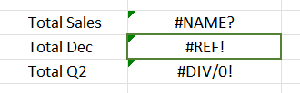
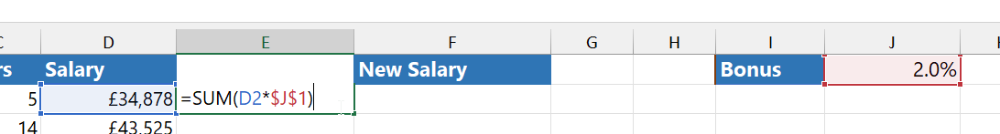
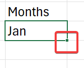

:::warning

The full note is not available here, refer to the scanned copies for the other half of this note...

:::

Youtube Tutorial: https://www.youtube.com/watch?v=fODnNDNMXiI

## Components

Title Bar

- `CTRL+W` to close the currently file
- `CTRL+N` to mak new file

Quick Access Boolbar

- commands categorized logically into different ribbons
- ribbon? eg: Home, Insert, Draw, etc..
- File tab takes you to the backstage area, no ribbon

Other thing

- has Name Bar (show the cell reference)
- has the formula bar

Work Sheet

Work Book 

- helps to navigates to work sheet in the single workbook

Status Bar

## Doing Stuff 1

Customize Quick Access toolbar

- File -> Options -> ...

- 

## Keyboard Shortcuts

- `ALT+Q`: show actions bar / search bar 
- `CTRL+N`: create new workbook
- `CTRL+S`: save workbook
- `CTRL+SHIFT+S`: save as (similiar to saving the first time, can save somewhere else)
- `CTRL+O`: open workbook page
- `CTRL+B`: bold
- `CTRL+I`: italic
- `CTRL+U`: underline
- `CTRL+Z`: undo
- `CTRL+Y`: redo
- `CTRL+X`: cut
- `CTRL+C`: copy
- `CTRL+P`: print
- `F1`: show help
    - come here and search stuff if you want detailed help

View clipboard

- `CTRL+SHIFT+<down-arrow>` / `CTRL+SHIFT+<up-arrow>`: select all data in a column / selected column (not all cells)
- `CTRL+SHIFT+<left-arrow>` / `CTRL+SHIFT+<right-arrow>`: select all data in a row / select rows (not all cells)
- `CTRL+A`: select all cells with data
- `Alt` will show custom shortcuts to navigate the UI
- `CTRL+<down-arrow>` / `CTRL+<up-arrow>`: go to last vertical cell (not data)
- `CTRL+<right-arrow>` / `CTRL+<left-arrow>`: go to last horizontal cell (not data)

## Exercise 1

in my version, the quick access toolbar is at the top

## Templates

dont think its in the syllabus - just not gonna follow this

it has basic stuff that a monkey with a keyboard and mouse do

just use common sense if you encounter this

## Workbook and Worksheets

- columns use english letters
- rows use numbers
- intersection is called a cell
- can type numbers to cells
- cells identified by cell reference

- manage worksheets from bottom

- can also double-click to rename the sheet 
- can also copy/move worksheet to seperate workbook
- change tab color to group stuff easilu

- `SHIFT+F11`: creates a new worksheet

Incase of an unexpected shutdown, you can try to recover

- File -> Info -> Manage Workbook -> Recover Unsaved Workbooks

## Entering and Editing Data
- arrow keys to navigrate through cells

- resize cells incase of overflow

## Navigating and Selecting Cells, Rows and Columns

`CTRL+<arrow-keys>`

`CTRL+SHIFT+<arrow-keys>`

## Formulas

- has over 500
- `=SUM(C3:C14)` - sums everything from cell C3 to C14 
- normal BODMAS order
    - so, `=10+2/2` is 11, not 6 
    - for 6, do `=(10+2)/2`

- `ALT+=`: sum (autosum for SUM)
- `=COUNT` function counts numbers, not letters

- so, use `=COUNTA`
    - count all of everything, except empty cells
- can also drag and fill (autocomplete) for functions

- `=AVERAGE`
- `=MIN`
- `=MAX`

## Errors

`#NAME?`

- comes from incorrect function names and invalid usages of functions, in this case `=SUMX` typo instead of `=SUM`
- come to Formulas -> Trace Precedents to see what calls are being used in the formula
- 

- use this to see all the formulas in formula form: for auditing
- 

- error checking tools

`#REF!`

- when referencing cells are missing

- in the above example, its to caclulate Total of december sales, but december is missing from the table, so, we get that error

`#DIV/0!`

- zero division error
- easiest example is: `=1/0`

## Relative & Absolute cell referencing

relative is default

not always the best

since im dragging this formula down, 
excel has assumed that J1 also comes down
we always want even the autocmpleted formula to refer to cell  J1

pressing `F4` once means make the cell absolute (both row and column) - thats what the dollar sign mean

this means, D2 is taken and changed relatively, by J1 is absolute - lock to column J and row 1

now, after auto completion, it refers to it

mixed referencing is locking either the column or the row

## Autofill & Autosum

- can use autofill handle to fill stuff
    - click on this dot at the end of the cell (or double click to auto fill the full row automatically, instead of dragging)
    - 
    - and drag
    - 

- in very generic cases like these, choose atleast 3 things

- similiarly, you can just type 3 things and drag it to even change autofilled stuff

can also come here to auto fill, First, select the cells. Then, Home -> Fill -> Down

or select the cells to autofill and press `CTRL+D` to complete the autofilling

or

right click (and slightly drag down and then drag up) on the auto fill cross of the cell

in here, select the last `Series` option

when autofilling dates

click on this special menu that appears to customize whats being autofilled

so, excel identifies these lists and then autofills

go to Files -> Options -> Advanced -> Edit Custom Lists (at the bottom)

this is where those lists are stored

we can edit them or add new lists / patterns

select NEW LIST, enter wanted values seperated by commas. press Add and press OK

we should now have a list item list like this now

now, if we type something in the list, excel will recognize it and we can simply drag down

## Flash fill

split or combine data easily ? 

keyboard shortcut is `CTRL+E`, select either a row and column and press `CTRL+E`

back then (before office 2013) - we should use `Text to Columns` feature or a formula

located in Data ribbon, in the Data Tools section

epic pattern detection

in new versions, it suggests automatically
    

so, just press enter

the email will have the initials of the employee

and press `CTRL+E` to autofill it

in this example,

fill one, select cells vertically, and flash fill

epic

